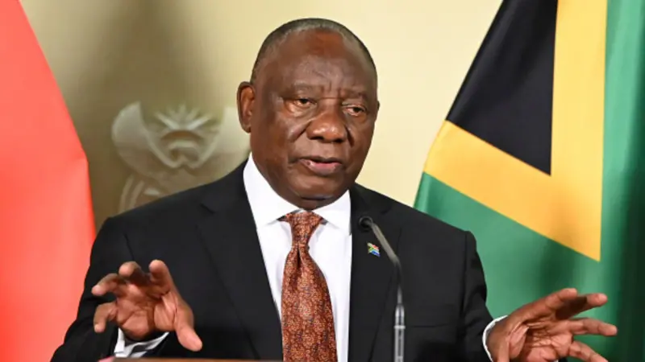

South African President Cyril Ramaphosa has called for unity and constructive engagement in addressing the country's social and economic challenges, emphasizing that cooperation and shared responsibility are key to building a stronger nation. Speaking during Youth Day commemorations marking the 1976 Soweto uprising, Ramaphosa honored the students who played a pivotal role in South Africa’s struggle for freedom and democracy. The annual event remembers the young people who stood up against apartheid-era education policies and helped shape the country's future. During his address, Ramaphosa encouraged South Africans to work together in addressing concerns related to unemployment, poverty and inequality, while promoting social cohesion and national unity. "We are not going to allow the grievances and concerns of our people to be misused and abused," the president said, stressing the importance of finding solutions that benefit all communities. His remarks came as migration and economic development continue to be part of national discussions across South Africa, reflecting broader global conversations taking place in many countries around the world. Ramaphosa also highlighted South Africa’s longstanding tradition of openness and diversity, rejecting narratives that seek to portray the country negatively on the international stage. "There is a lot of disinformation aimed at tarnishing the image of South Africa," he said, noting that migration management remains a challenge faced by many nations. The president used the occasion to reflect on the aspirations of South Africa’s youth, nearly five decades after the historic Soweto uprising. While acknowledging ongoing economic challenges, he emphasized the importance of expanding opportunities for young people through education, skills development and job creation. Youth Day remains one of South Africa’s most significant national commemorations, serving as both a tribute to the courage of past generations and a reminder of the work that continues to build a more inclusive and prosperous future.  **African Updates**
