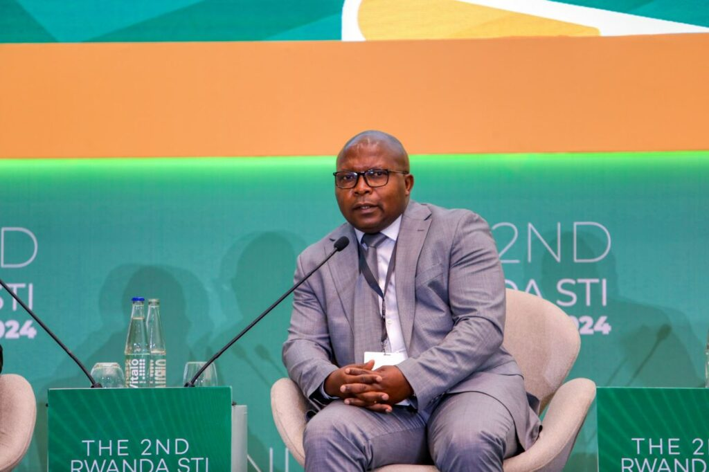
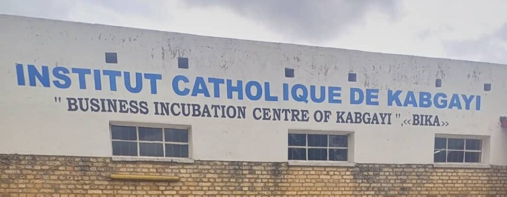

Kigali, On September 23, 2024, the 2nd Rwanda Science, Technology, and Innovation (STI) Conference took place at the Kigali Convention Center.

The two-day event brought together industry leaders, researchers, and policymakers to explore technological innovations in agriculture under the theme, “Promoting Climate-Resilient Agriculture through Science, Technology, and Innovation for Improved Food Security and Nutrition.”

<figure>

<figcaption>

_**Minister of Agriculture and Animal Resources, Dr. Ildephonse Musafiri addressing participants at the 2nd STI Conference**_

</figcaption>

</figure>

In his opening address, Dr. Ildephonse Musafiri, Minister of Agriculture and Animal Resources, emphasized the urgent need to boost food production while reducing waste.

He called for advancements in cost-effective irrigation and post-harvest handling systems to meet Rwanda’s growing food demands sustainably.

One of the key sessions focused on “Policy Integration and Effectiveness for Climate-Resilient Agriculture.”

<figure>

<figcaption>

_**Dr. Telesphore Ndabamenye, Director General of the Rwanda Agriculture and Animal Resources Board (RAB)**_

</figcaption>

</figure>

During this discussion, Dr. Telesphore Ndabamenye, Director General of the Rwanda Agriculture and Animal Resources Board (RAB), voiced concerns about the high rate of food waste in the country.

Highlighting technological solutions, keynote speaker Dr. Hakizumwami Birali Runesham from the University of Chicago explained how AI-driven models can help farmers make real-time decisions on harvest timing and storage, reducing food losses.

Similarly, Prof. Alfred Bizoza from the University of Rwanda advocated for climate-smart agriculture, noting that precision farming ‘enhanced by technology’ can improve soil health monitoring, moisture assessment, and pest control.

The event underscored the importance of collaboration between the public and private sectors, as well as academic institutions.

<figure>

<figcaption>

**_Dr. Canisius Kanangire, Executive Director of the African Agriculture Technology Foundation (AATF)_**

</figcaption>

</figure>

Dr. Canisius Kanangire, Executive Director of the African Agriculture Technology Foundation (AATF), urged for more investment in food processing and storage technologies to curb losses throughout the supply chain.

**ICK’s Commitment to Sustainability and Food Security**

The Institut Catholique de Kabgayi (ICK) actively contributed to the conference through its Business Incubation Center of Kabgayi (BIKA), showcasing sustainable agricultural practices.

BIKA’s _“From Waste to Wealth”_ initiative focuses on converting agricultural by-products into valuable resources, aligning with the global shift towards a circular economy.

One of BIKA’s major innovations lies in the banana value chain.

The center transforms every part of the banana plant into useful products, such as organic fertilizers, banana juice, and even paper made from banana stems.

Through these eco-friendly initiatives, BIKA not only enhances soil health but also introduces sustainable alternatives to everyday products like envelopes and boxes.

BIKA also promotes community education on maximizing agricultural yields, including the preparation of banana buds and other previously underutilized plant parts.

By extending their efforts to horticulture, BIKA offers training on post-harvest techniques and food processing technologies, empowering local communities with new skills and income-generating opportunities.

Currently, the World loses an estimated 40% of its agricultural production before it reaches the market due to inadequate post-harvest handling and storage. The conference reiterated the need for climate-resilient agricultural policies to reduce losses caused by drought, pests, and soil erosion, helping to secure the country’s food future.
