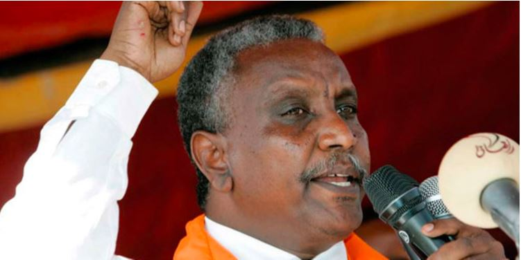
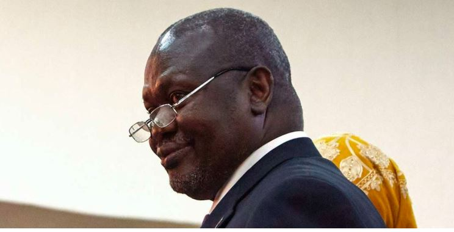

Political tensions have surged across East Africa, with incidents in both Sudan and South Sudan threatening regional stability. In Nairobi, Sudanese opposition figure Yasir Arman, chairman of the SPLM-DRC, was briefly detained under an Interpol Red Notice issued by Sudan's military government, highlighting the ongoing political strife within the nation.

Arman, who arrived for a meeting, protested his innocence, claiming the notice was politically motivated and aimed at silencing opposition to the Sudanese junta.

Arman, a leader in the "Taqaddum" coalition, which advocates for a neutral political solution in Sudan's ongoing conflict, was released after Kenyan officials intervened. However, the incident underscores the deepening political divisions within Sudan, where the Taqaddum coalition recently splintered due to differing views on the conflict between the Sudan Armed Forces and the Rapid Support Forces.

\[caption id="attachment\_31830" align="alignnone" width="751"\] Yasir Arman, chairman of the Sudan People's Liberation Movement-Democratic Revolutionary Current (SPLM-DRC).  
File/Nation\[/caption\]

Meanwhile, in South Sudan, the fragile peace agreement is under severe strain as tensions escalate between the government and allies of First Vice President Riek Machar. The government has confirmed the arrest of several officials, including a senior military commander and a government minister, accusing them of arming the White Army, a militia linked to Machar's party, the SPLM-IO.

The arrests followed clashes in Upper Nile State, with the government accusing the SPLM-IO of orchestrating attacks despite initially distancing themselves from the White Army. The situation further deteriorated when troops were deployed at Machar's residence, effectively placing him under house arrest.

Diplomats from the Intergovernmental Authority on Development (Igad), the regional body that brokered the 2018 peace deal, have expressed deep concern over the escalating violence. They have called for an immediate ceasefire and urged all parties to adhere to the Revitalised Peace Agreement, warning that the clashes in Nasir County are undermining the hard-won gains of the peace process.

"We are particularly alarmed by the recent reports of escalating tensions and armed clashes in Nasir County, which threaten the hard-won gains achieved in the implementation of the peace accord and exacerbate the already dire humanitarian situation in the region," Igad diplomats stated.

The SPLM-IO has condemned the arrests and the deployment of troops around Machar's residence, warning of imminent war if he is not released. They accuse the government of violating the peace agreement and crippling vital institutions responsible for maintaining stability.

The White Army has claimed control of the strategic town of Nasir, further complicating the situation. The recent fighting has raised fears of escalating violence, as Upper Nile State has been unstable since 2013. Tensions flared after the government announced plans to replace local troops with newly deployed forces, sparking concerns among local armed youth and community leaders.

Civil society activist Edmund Yakani has called for de-escalation and urged dialogue to address grievances. He warned that further delays could lead to an intensification of the conflict, jeopardizing the fragile peace process.

\[caption id="attachment\_31831" align="alignnone" width="744"\] First Vice President of South Sudan Riek Machar. File/AFP\[/caption\]

The events in Sudan and South Sudan highlight the challenges facing the region, where political divisions and armed conflicts continue to threaten stability. The international community is closely monitoring the situation, urging all parties to prioritize dialogue and adhere to peace agreements to prevent further escalation and humanitarian crises.

**African Updates**
