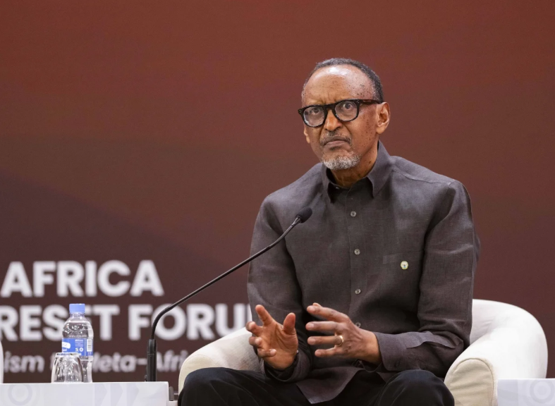
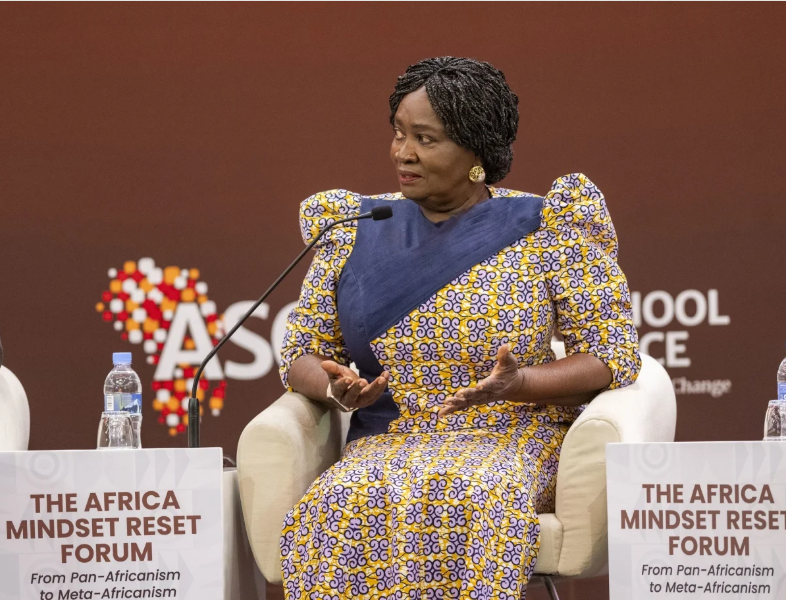
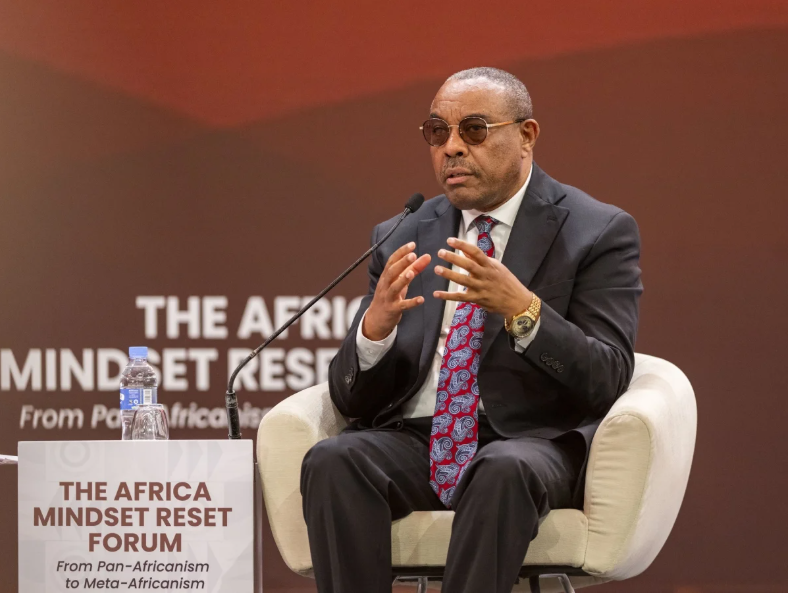
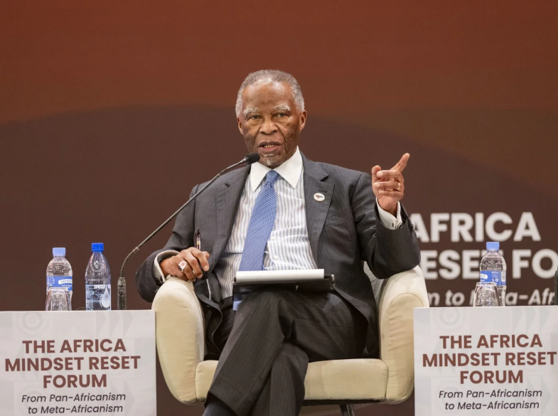
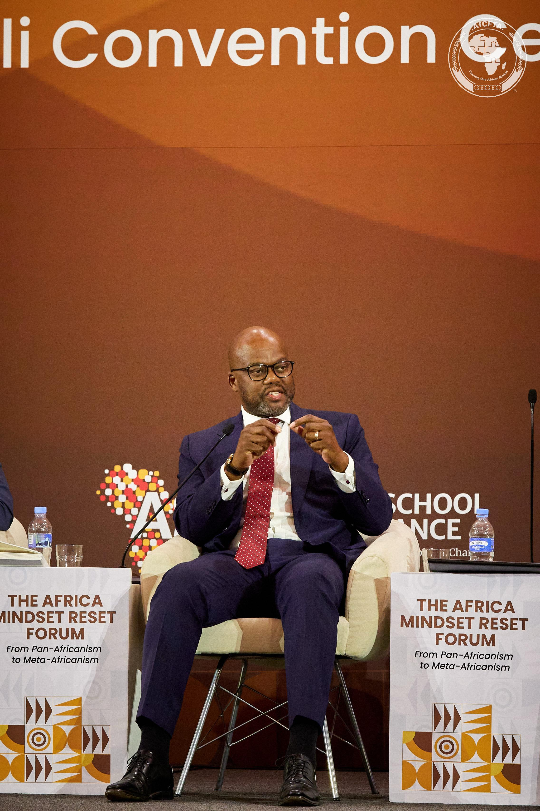
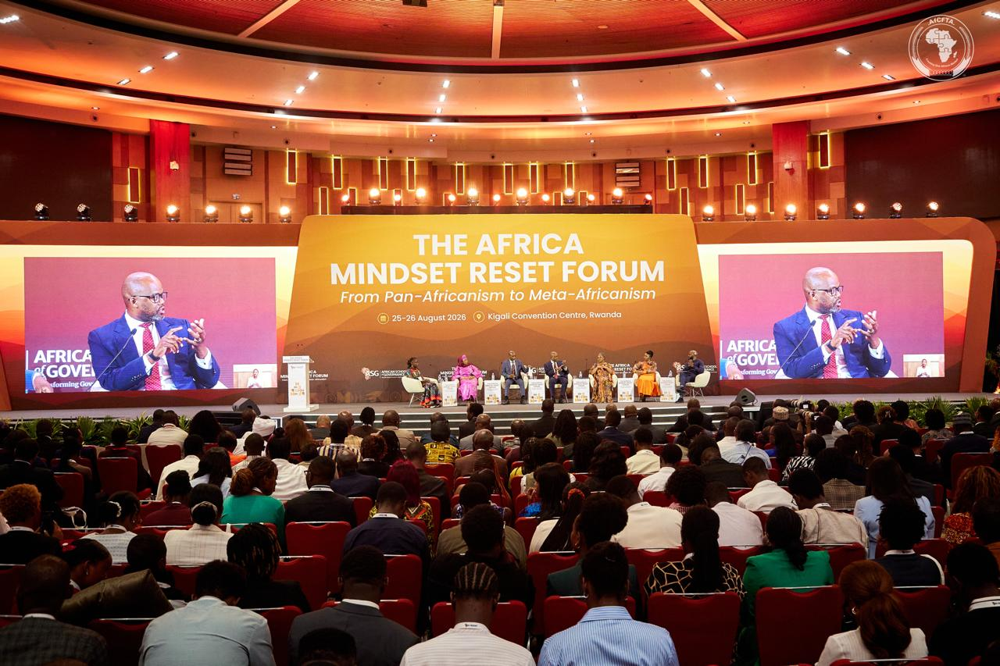

African leaders and former heads of state have called for changes in leadership, institutions and attitudes, saying the continent has spent decades developing policies without doing enough to turn them into results.

The message came during a presidential panel at the Africa Mindset Reset Forum in Kigali, which brought together President Paul Kagame, former Ethiopian Prime Minister Hailemariam Desalegn, former South African President Thabo Mbeki and Ghana’s Vice President Jane Naana Opoku-Agyemang.

President Kagame said Africa has the people and resources needed to succeed, but continues to fall short of its ambitions.

“We can’t change our Africa without changing our behaviour, way of doing things and attitudes,” President Kagame said.

Opoku-Agyemang said Africa does not lack policies or development plans. The problem, she argued, is turning those plans into action and taking greater control of the continent's future.

“Africa needs to move towards greater agency and action, with Africans taking charge of defining their future rather than allowing external actors to determine the continent’s direction,” she said.

Hailemariam Desalegn linked the problem to the type of political leadership produced in many African countries. He said governments need to move away from systems where political power is used mainly to gain access to resources.

“The shift should be towards a development-oriented political economy supported by a new generation of leaders,” he said.

Thabo Mbeki said leadership should not be expected to appear simply when someone enters political office. African societies, he said, must help develop leaders who can serve the public interest.

“We must look at ordinary people who have no power. That’s where the leader comes from,” Mbeki said.

The debate on leadership also extended to Africa's economic integration.

AfCFTA Secretary-General Wamkele Mene said Africa has made major progress in creating the legal framework for a single market. Fifty countries have ratified the agreement, while intra-African trade reached about $220 billion in 2024, according to figures he cited at the forum.

But businesses still face barriers when trading across borders, including expensive transport, limited trade finance and infrastructure costs.

“We have made progress politically and at law, but we also have very deep challenges of fragmentation,” Mene said.

Wamkele Mene said Africa also needs to change how it views goods produced on the continent. He pointed to Uganda's reported surplus of about 1 billion litres of milk a year, while some African countries continue to import milk from outside the continent.

“We as Africans have got to change our mindset,” he said.

The message running through the forum was that Africa's challenge is no longer simply writing policies or signing agreements. The harder task is building leaders and institutions capable of making those decisions work for ordinary people.

The forum is being held in Kigali on August 25–26 and is hosted by the African School of Governance. More than 600 delegates, including political leaders, former heads of state, policymakers and young leaders, are taking part.

**African Updates**
