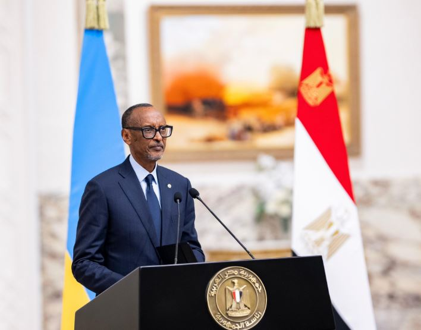
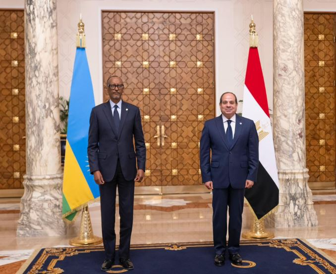
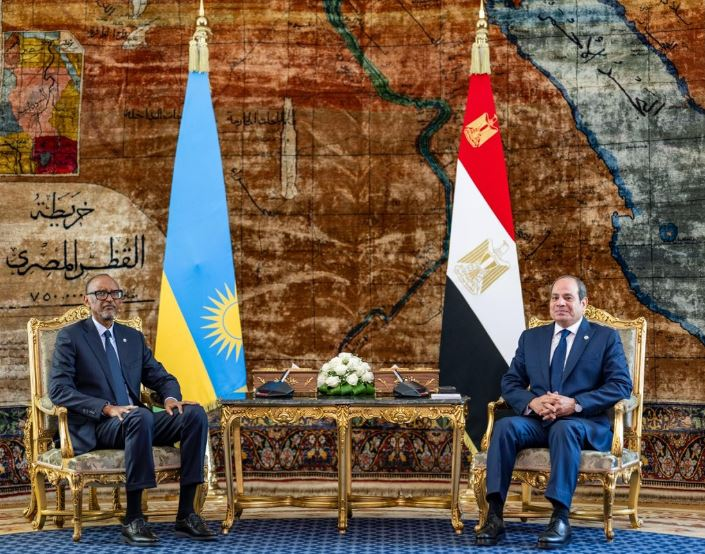
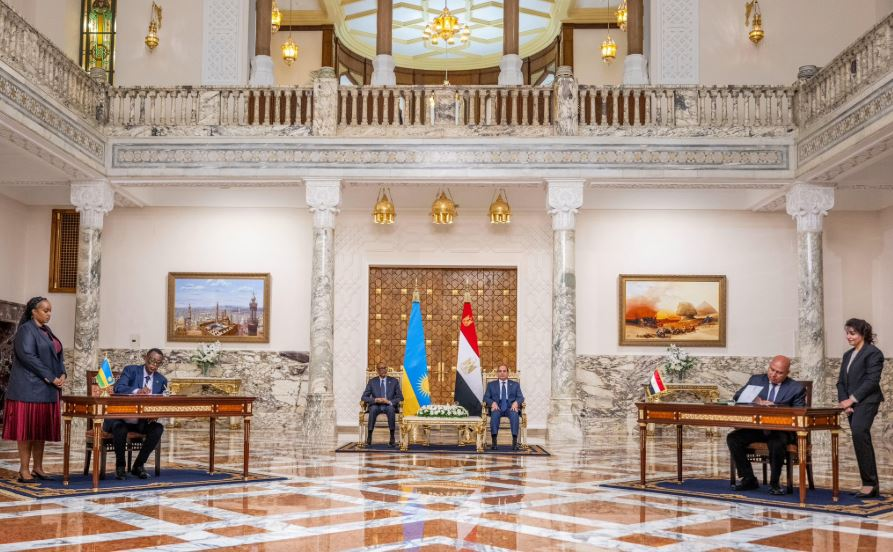
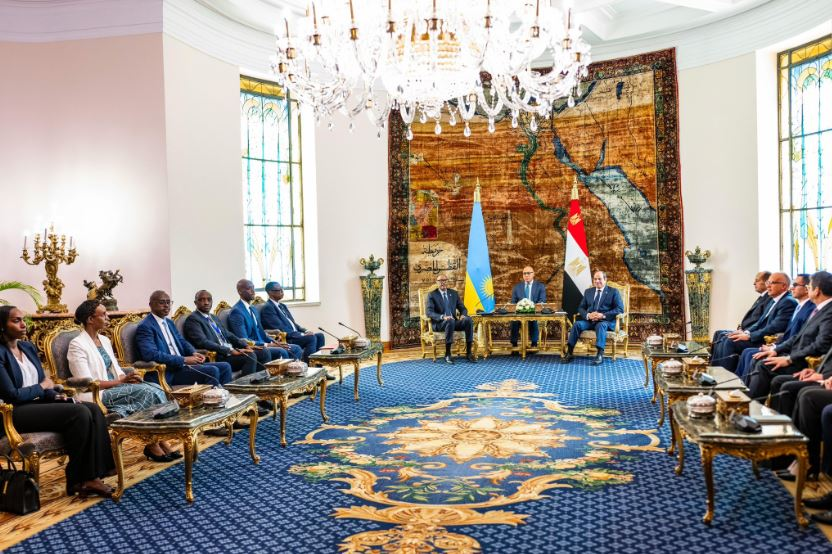

President Paul Kagame has praised Egypt as a strong partner for Rwanda, as the two countries signed new cooperation agreements during his official visit to Cairo on Tuesday 23rd September 2025.

President Kagame was received by his host, President Abdel Fattah Al-Sisi, before the two leaders presided over the signing of agreements covering investment promotion, water resource management, reciprocal land allocation, and urbanisation.

Speaking at a joint press conference, President Kagame said the new pacts represent another milestone in the growing partnership between Rwanda and Egypt.

“Rwanda regards Egypt as a strong partner and our cooperation is tangible and steadily growing. The agreements signed today build on the strong foundation we have already established,” President Kagame said.

One of the key projects highlighted by President Kagame is the ongoing construction of a modern heart care centre in Kigali, a facility that will provide advanced treatment for patients in Rwanda and the region.

“Together, we are building a modern heart care centre in Kigali, a landmark facility that will significantly enhance specialised cardiac treatment in Rwanda and beyond. This collaboration is reinforced by education and workforce development. Egypt continues to provide advanced training for Rwandan medical professionals,” President Kagame noted.

He also underscored Egypt’s role in supporting Rwanda’s pharmaceutical sector.

“I wish to take this opportunity to thank you for Egypt's support. When it comes to pharmaceuticals, Rwanda and Egypt have achieved mutual reliance and regulatory standards. In Rwanda, we have significantly expanded access to affordable and quality healthcare and initiated vaccine manufacturing together with partners,” President Kagame said.

“Egyptian health and pharma firms are already excellent partners in this regard and we want to do even more. Indeed, we believe there are numerous opportunities that our two countries can explore to strengthen our economic relations generally. That is why our private sector leaders met during this visit.”

The visit also featured the inaugural Egypt–Rwanda Business Forum, which brought together entrepreneurs and investors from both countries. The discussions focused on sectors such as real estate, agriculture, manufacturing, and construction.

President Kagame emphasised that Africa must reduce reliance on exporting raw materials and instead focus on value addition.

“The reciprocal allocation of land by Rwanda and Egypt will be instrumental for our countries to gain access for wider regional markets. Our continent has the advantage of being richly endowed with natural resources, but to generate real returns, we must transform our own materials into high-value added products,” he said.

Looking ahead, President Kagame stressed the importance of Rwanda and Egypt working closely together to tackle shared challenges while promoting sustainable development.

“We will continue building on this cooperation and good political understanding of the context in which our two countries live, not only on our continent but also on the whole world. Ultimately, what we both want is to create a system of development that is sustainable, pragmatic and brings prosperity to our people. Mr President, you have good momentum and I am confident that we will see even more tangible results very soon.”

The Rwanda–Egypt partnership also ties into Africa’s wider development goals under the African Continental Free Trade Area (AfCFTA), which aims to boost trade and industrialisation across the continent. Africa currently spends close to $60 billion annually on food imports, despite having vast agricultural potential. Experts say greater investment in food processing, health industries, and technology areas highlighted by Rwanda and Egypt will be vital for reducing such dependence.

Rwanda and Egypt have long-standing bilateral ties spanning health, defence, education, infrastructure, and trade. The latest agreements, observers say, mark another step toward stronger economic integration and cooperation across Africa.

 

**African Updates**
