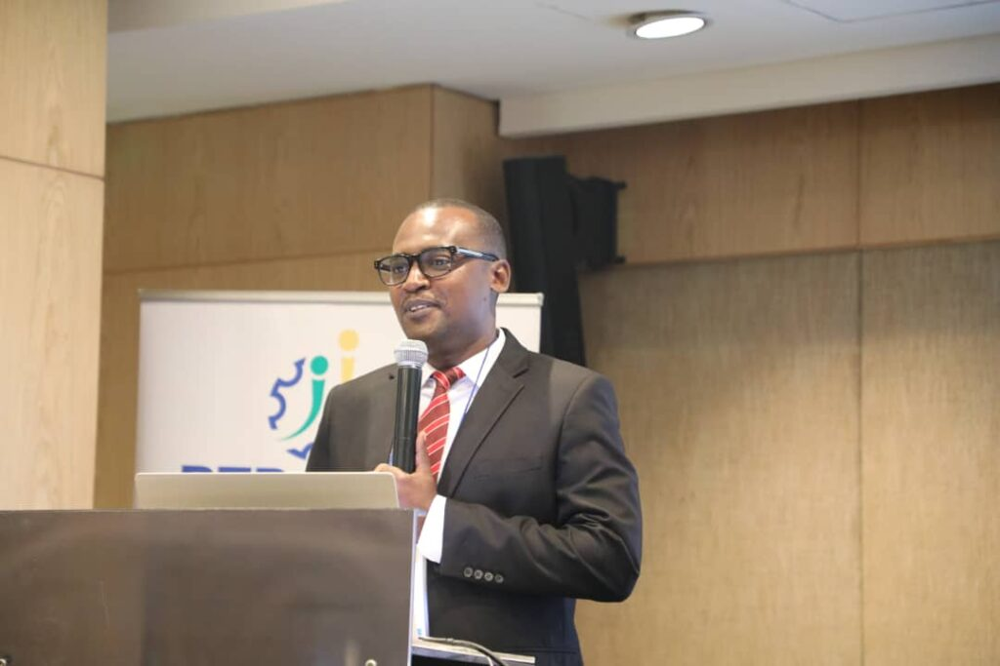
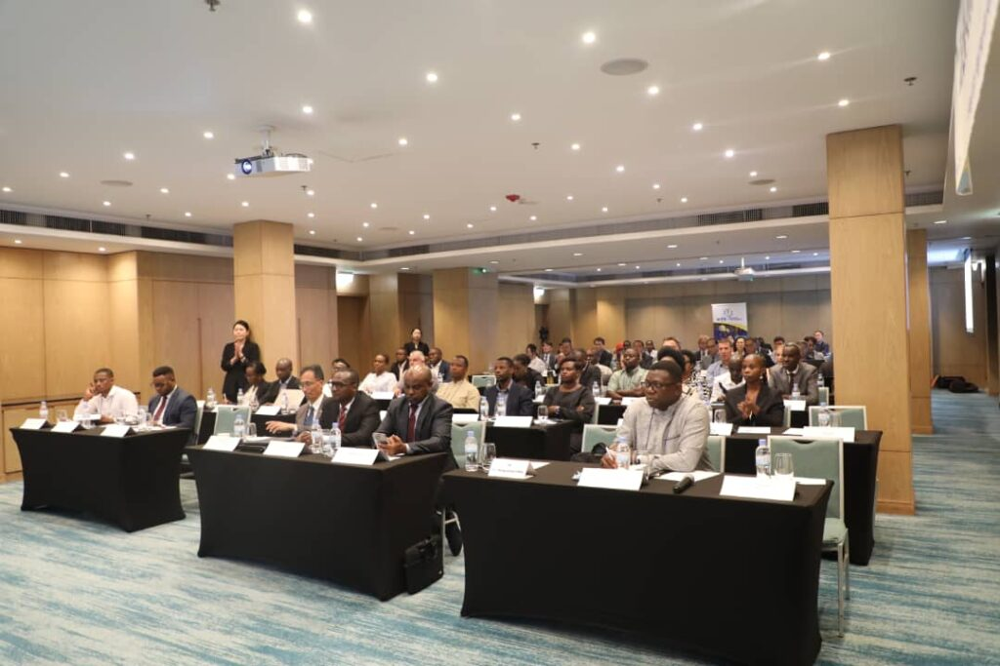
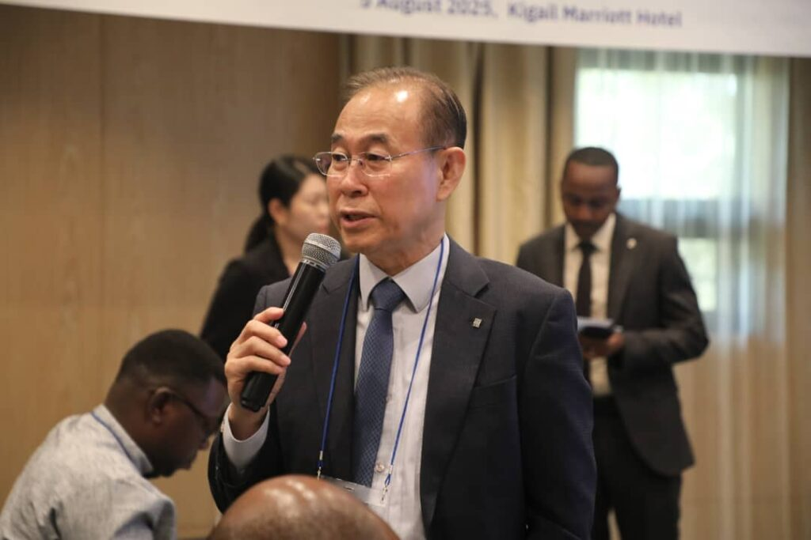
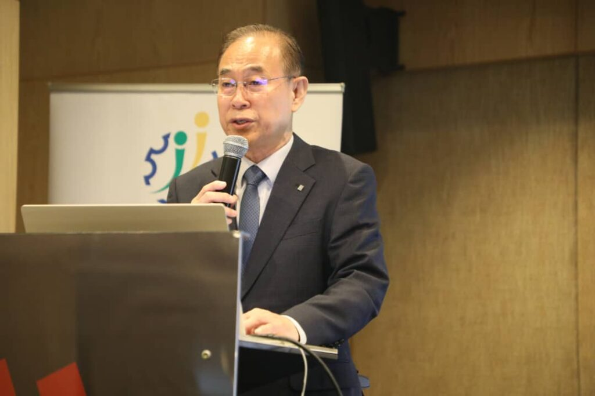
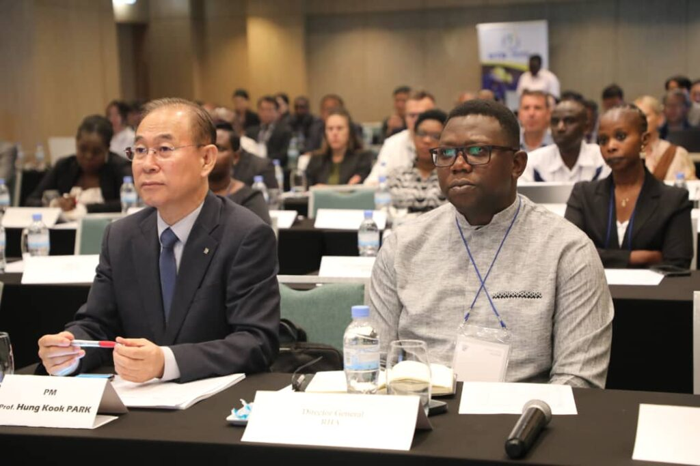
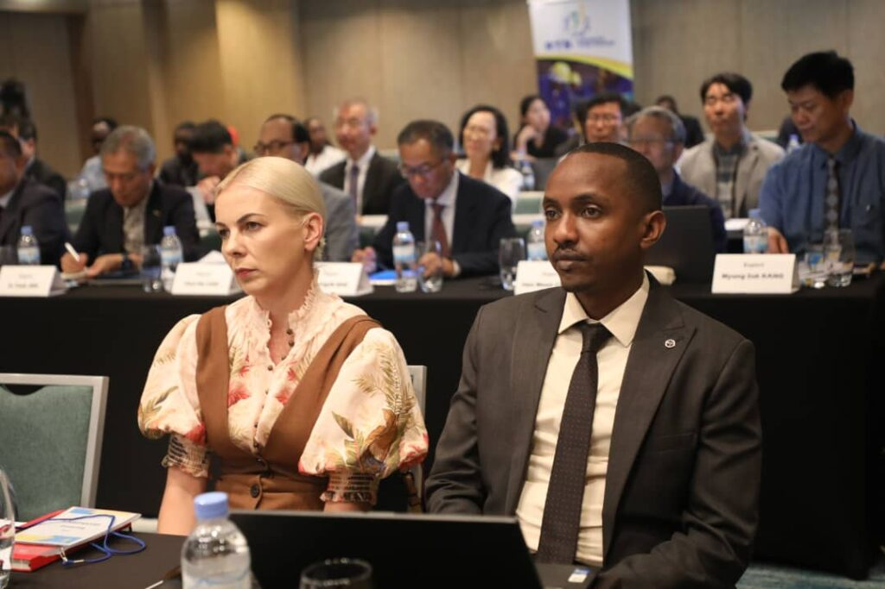
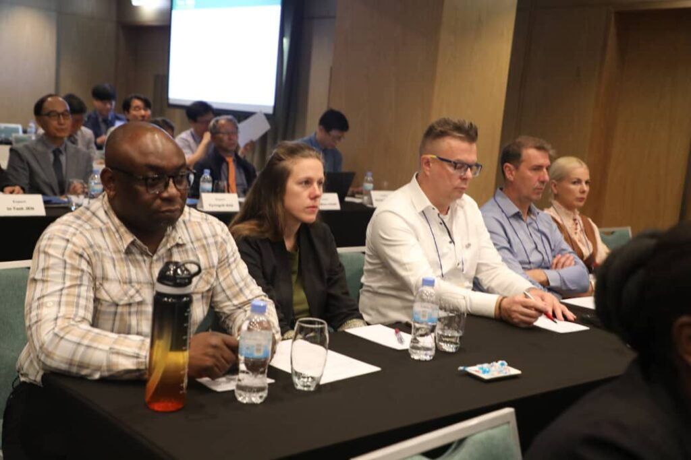
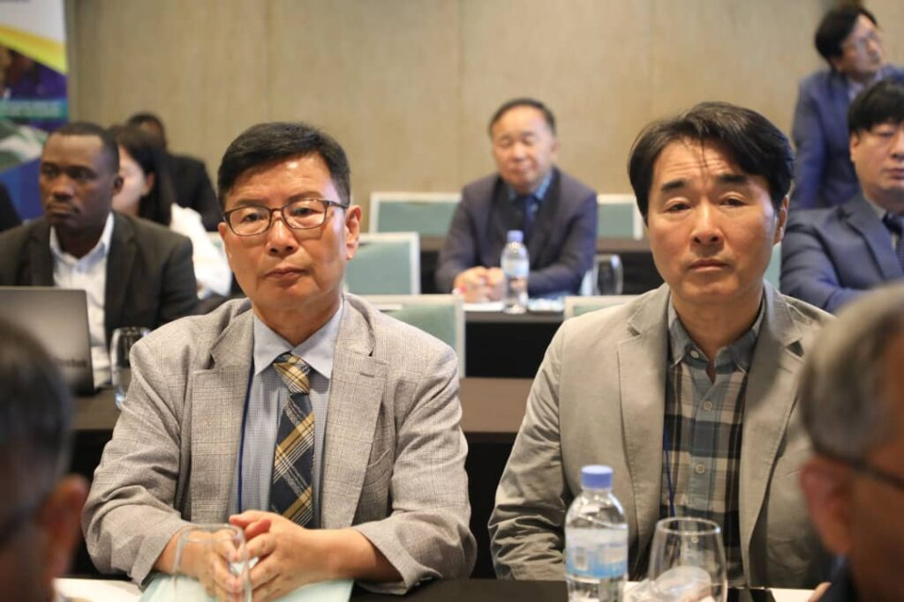
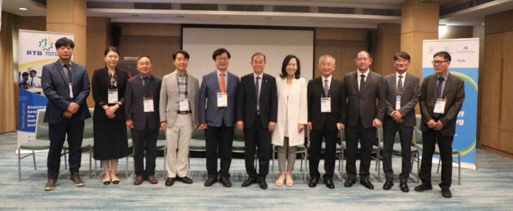
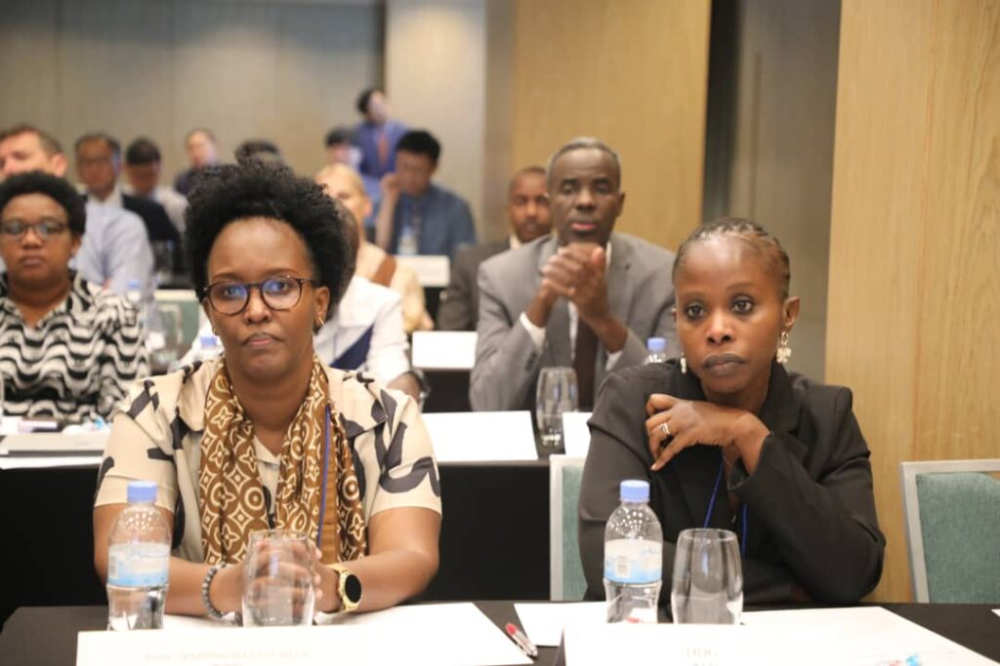

A new partnership between the Government of Rwanda and the Republic of Korea is set to launch eight technical training centers across the country. The initiative, known as the "Centers of Excellence for TVET," aims to build a skilled workforce and combat youth unemployment.

The project officially launched today, on August 5, 2025. It is a 57 month plan funded by Korea's Economic Development Cooperation Fund (EDCF). This project builds on a long history of cooperation between the two nations, which includes a 2014 agreement to finance a University of Rwanda infrastructure development project.

Mr. Paul Umukunzi, Director General of the Rwanda TVET Board (RTB), highlighted the project's purpose. He said the new schools will produce a qualified workforce. This workforce will meet the needs of a rapidly changing job market.

"We aspire to produce a highly qualified workforce meeting the requirements of the current and future labor market." Mr. Umukunzi said.

\[caption id="attachment\_38286" align="alignnone" width="1024"\] Mr. Paul Umukunzi, Director General of the Rwanda TVET Board (RTB)\[/caption\]

The new centers are strategically designed to support Rwanda's National Strategy for Transformation (NST2). This five-year plan aims to create 1.25 million decent jobs and boost key economic sectors. The centers will focus on training in three vital areas; Technology where Programs will cover artificial intelligence (AI), coding, cybersecurity, and software development. This supports Rwanda's push to become a knowledge-based economy. Agriculture where Courses will teach modern and mechanized farming methods. Training will also include food processing to add value to local products before they reach the market. Manufacturing where The schools will train workers to increase productivity. This is essential for boosting the "Made in Rwanda" initiative and transforming raw materials into valuable goods.

The kickoff event was attended by various officials who will be key to the project's success. This included district mayors, vice mayors, and other local leaders. Their presence showed a strong commitment to implementing the program at a local level.

Professor Hung Kook Park, the Project Manager from Korea’s Sang Myung University, has worked in Rwanda for 15 years. He described the project as more than just construction.

"This is not simply about building schools, It is about preparation for the future." he said.

\[caption id="attachment\_38283" align="alignnone" width="1024"\] Professor Hung Kook Park, the Project Manager from Korea’s Sang Myung University\[/caption\]

The centers will serve as hubs for learning and innovation. They will help young Rwandans gain new skills and mindsets. Professor Park's team will also provide training for instructors and foster partnerships with industry. This ensures the curriculum stays relevant to market demands.

The new centers directly address the challenge of youth unemployment in Rwanda. Data from the National Institute of Statistics of Rwanda (NISR) shows a pressing need for skilled labor. In 2023, the youth unemployment rate was 20.8%. However, the data also shows that TVET graduates have a lower unemployment rate (21.7%) compared to those with general education (22.8%).

This project is a critical step toward achieving Rwanda's ambitious Vision 2050 goals. The nation aims to become an upper-middle-income country by 2035. By investing in high-quality technical education, Rwanda is preparing its young population to lead the country's economic growth. This model of skills development and industry partnership could serve as an example for other African countries facing similar challenges

\[caption id="attachment\_38280" align="alignnone" width="1024"\] Professor Hung Kook Park, the Project Manager from Korea’s Sang Myung University\[/caption\]

      

**African Updates**
