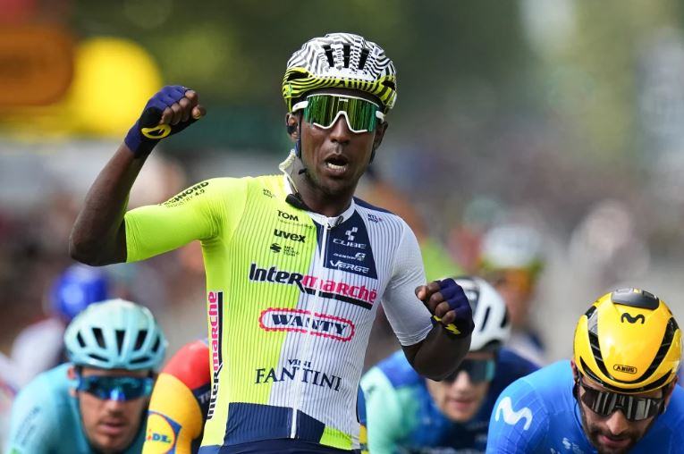

Biniam, a famous African cyclist, said that having the UCI Road World Championships in Rwanda is a special moment for all of Africa. The races took place in Kigali, a city known as the "Land of a Thousand Hills." This was the first time this event was ever held on the continent of Africa.

Biniam Girmay is a hero to many young riders. He has made history before. He was the first Black African to win a stage at the Giro d'Italia. He also won a stage and the Green Jersey at the Tour de France.

At a press conference on Thursday 26th September 2025, Biniam talked about the challenges for African riders. He said that cycling in Europe is very different. European teams have the best gear. A single bike can cost over $40,000. He said that most families in Africa cannot afford this.

Biniam believes that African riders need to have the basics. This means they need the right bike. They also need good training and food. He said that young riders sometimes use the wrong size bikes. This can hurt them and even end their careers.

He had a good idea. He said that European teams could help. They could give their old bikes to riders in Africa. This would give many young cyclists a chance to compete.

Biniam shared his own story. He was lucky. He got to train in Europe when he was 17. This helped him learn and get better. He said that this opportunity helped him become a professional. He believes other young Africans have the same talent. They just need the chance.

He said the championships in Rwanda were a great start. It shows that African cycling is growing. It gives hope. But he said it is only the beginning. The continent needs more help. Governments need to help. Sponsors need to help too.

The story of African cycling is about more than one hero. It is about a whole continent of riders with big dreams. The races in Kigali showed the world what they can do. Biniam Girmay is a symbol of this hope. He wants to make sure that the path to success is open to everyone.

**African Updates**
