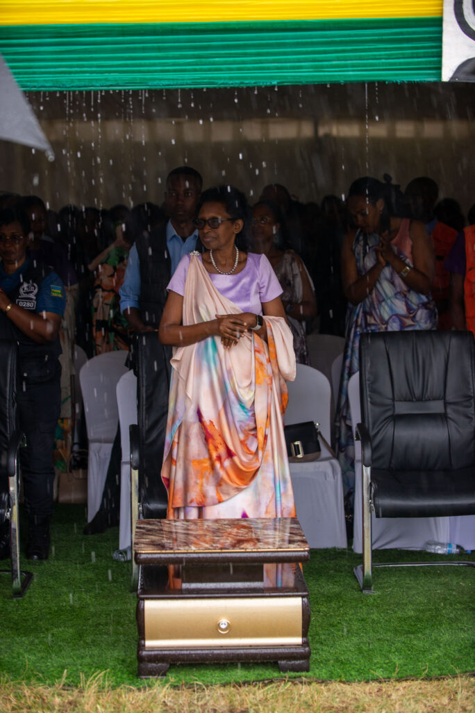

**Ngororero, Rwanda:** The vibrant hills of Ngororero district in Rwanda's Western Province, Hindiro sector, served as the backdrop for a powerful celebration of International Women's Day. This year, marking the 50th commemoration of the event in Rwanda.

The day was a testament to Rwanda's commitment to gender equality. Hon. Kazarwa Gertrude, the Speaker of the Chamber of Deputies of the Parliament of Rwanda, said; "Men, our brothers, support your wives, Build strong families together. Women and men, we thank you for your collective contributions to our nation. Continue working hand-in-hand across all sectors; economic, governance, and social."

Hon. Kazarwa also acknowledged the government's pivotal role in empowering women. "We are grateful for the opportunities provided," she stated, emphasizing the tangible progress made by women and girls. She called upon men to maintain respect for women and encouraged women to seize available opportunities, particularly the accessible loans offered by the Business Development Fund (BDF), where they only pay 50% of the loan.

\[caption id="attachment\_31841" align="alignnone" width="684"\] Hon. Kazarwa Gertrude, the Speaker of the Chamber of Deputies of the Parliament of Rwanda,\[/caption\]

Nyirajyambere Belancile, President of the National Women's Council, further fueled the spirit of empowerment. "Women, break free from limitations, Let us transcend the mindset that confines us. We are capable of achieving anything we set our minds to."

The importance of women's contributions was echoed by Nkusi Christopher, Mayor of Ngororero district. "Women are vital to our society, from the district level to the national level". However, he also acknowledged the challenges that persist. "We still have families experiencing internal conflicts," he noted, highlighting the negative impact on children when parents neglect their responsibilities.

Governor Jean Bosco Ntibitura of the Western Province expressed his gratitude to the women who have actively participated in national development.

Beyond the speeches, the celebration was marked by tangible acts of support. With the collaboration of various partners, the event saw the distribution of livestock and essential household items to families in need. The donations included 10 cows, 268 goats, 1,700 hens, 107 cooking stoves, and 106 water tanks.

These contributions underscore the practical approach taken in Rwanda to empower women and strengthen families. It is an approach that recognizes that empowerment is not just a concept, but a lived reality that requires concrete support.

This year's celebration, marking the 50th anniversary of International Women's Day in Rwanda, serves as a powerful reminder of the progress achieved and the work that remains. The event in Ngororero, with its blend of inspirational speeches and tangible support, exemplifies the spirit of unity and empowerment that defines Rwanda's approach to gender equality.

**African Updates**
