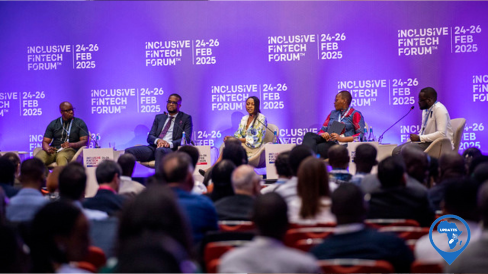
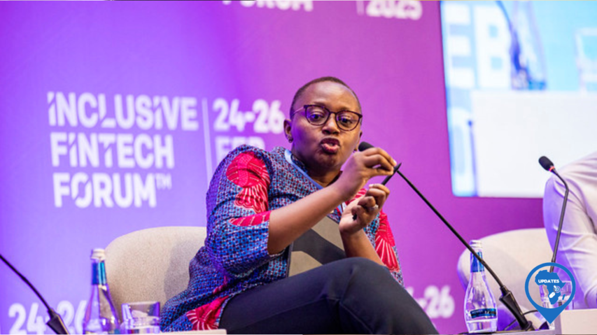
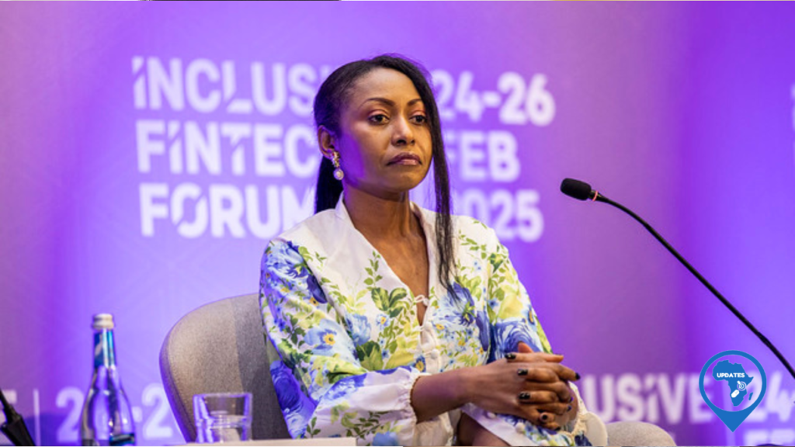
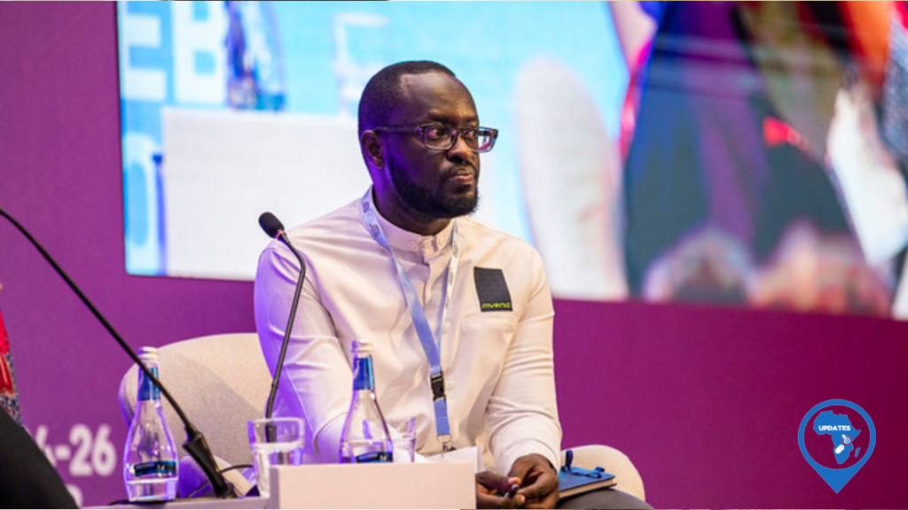
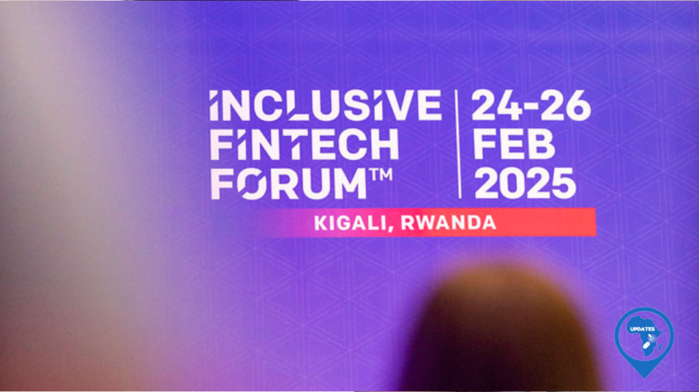

Kigali buzzed with global expertise this Monday, February 24th, as the Inclusive Fintech Forum convened to discuss the transformative power of inclusive technology. A central focus of the day was the panel session, "AfCFTA VISION FOR DIGITAL TRADE," where leaders from across the continent and beyond shared insights on the future of digital commerce in Africa.

Dr. Talkmore Chidede, Senior Digital Trade Expert at the AfCFTA Secretariat, emphasized the commitment of African leaders to facilitate seamless digital trade transactions. "We are ensuring digital trade happens, continent-wide," he declared. "This demonstrates a powerful political will." He outlined key elements of the AfCFTA's digital trade protocol, including rules of origin, digital identities for border crossing, cross-border digital payments, and online safety and security. "This protocol gives you a license to operate in all African markets. That's the essence of this digital market," Dr. Chidede explained. "But we need to do more. The next step is to ensure these commitments benefit everyone."

Addressing concerns about data transfer and security, Dr. Chidede highlighted the protocol's role in fostering innovation. "If your data is in one country, you can transfer it to another," he said. "But we have the issue of security. What the protocol does is create an environment for innovation, while addressing these crucial concerns." He reiterated the strong political will driving digital transformation, emphasizing the commitment to making the protocol a reality.   

Nshuti Mbabazi, Managing Director of the Better Than Cash Alliance, further explored the practicalities of digital trade, highlighting both its potential and the challenges that need to be addressed.

\[caption id="attachment\_31804" align="alignnone" width="1024"\] Nshuti Mbabazi, Managing Director of the Better Than Cash Alliance\[/caption\]

Michelle Nsanzumuco, Founder and CEO of Global Policy House & AfCFTA Digital Trade Expert, echoed the call for action. "We need to adopt the protocol, join forces, remove barriers, and implement it," she asserted. "We want to export final products to the market."

\[caption id="attachment\_31803" align="alignnone" width="1024"\] Michelle Nsanzumuco, Founder and CEO of Global Policy House & AfCFTA Digital Trade Expert\[/caption\]

Bobson Rugambwa, CEO of Mvend Limited, shared a firsthand account of the frustrations faced by businesses navigating the current landscape. "We can have digital payments, but only if we don't have to apply for licenses in all 54 African markets," he lamented. "I've experienced the pain of registering in different markets. It's incredibly frustrating. This should be the easiest thing."

\[caption id="attachment\_31802" align="alignnone" width="1024"\] Bobson Rugambwa, CEO of Mvend Limited\[/caption\]

Africa has a rapidly growing mobile phone penetration rate, which provides a strong foundation for digital financial services. According to GSMA, by 2025, mobile internet adoption in Sub-Saharan Africa is expected to increase significantly. Fintech investment in Africa has seen substantial growth in recent years, demonstrating the sector's potential. Reports indicate a rise in venture capital funding for African fintech startups.

The discussions at the Inclusive Fintech Forum underscored the urgency and opportunity surrounding digital trade in Africa. As stakeholders work together to implement AfCFTA's digital trade protocol and build robust financial market infrastructure, the continent is poised to unlock its vast economic potential and create a more inclusive and prosperous future.

African Continental Free Trade Area (AfCFTA) is projected to create a single market for goods and services, covering 1.3 billion people and a combined GDP of $3.4 trillion. Digital trade is crucial for realizing this potential.

**African Updates**
