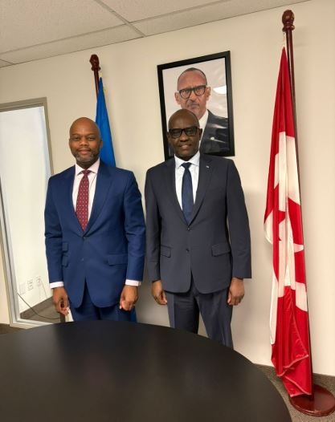

Rwanda is stepping up its role in shaping Africa’s global trade outlook following fresh engagement between the AfCFTA Secretariat and its diplomatic mission in Canada.

On May 5, Wamkele Mene met Prosper Higiro in Ottawa to review progress under the African Continental Free Trade Area and explore opportunities to strengthen Africa–Canada trade ties.

The AfCFTA, which brings together 54 African countries into a $3.4 trillion market of over 1.3 billion people, is increasingly being used as a platform to attract global investment not just boost intra-African trade.

Rwanda was among the first countries to ratify AfCFTA in 2018 and has since positioned itself as a trade and logistics hub in East Africa.

Rwanda’s exports reached over $1.5 billion in recent years, led by coffee, tea, minerals, and re-exports. Canada remains a growing but underutilized partner, with trade volumes still relatively low compared to potential. AfCFTA could increase intra-African trade by over 50% by 2030, according to projections by institutions like the World Bank

With Canada looking to diversify supply chains and invest in emerging markets, Rwanda is well placed to attract funding in agro-processing, manufacturing, and services.

Talks also focused on changing global economic dynamics, including Canada’s evolving trade policies that could support investment-led partnerships with Africa.

Both sides emphasized the need for better coordination between African diplomats and the AfCFTA Secretariat, including regular briefings to ensure a unified African position when engaging Canada.

Prosper Higiro who also serves as Dean of the African Diplomatic Corps in Canada plays a strategic role in aligning these efforts.

The meeting highlights a growing shift: AfCFTA is moving beyond internal trade to positioning Africa more competitively on the global stage.

For Rwanda, this creates an opening to expand exports, attract investment, and strengthen its position as a gateway to regional and continental markets.

\[caption id="attachment\_44590" align="alignnone" width="417"\] H.E Wamkele Mene meets Ambassador Prosper Higiro to discuss AfCFTA and Africa–Canada trade.\[/caption\]

**African Updates**
