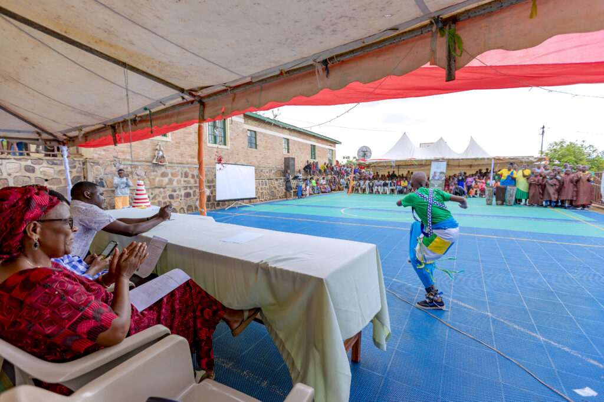
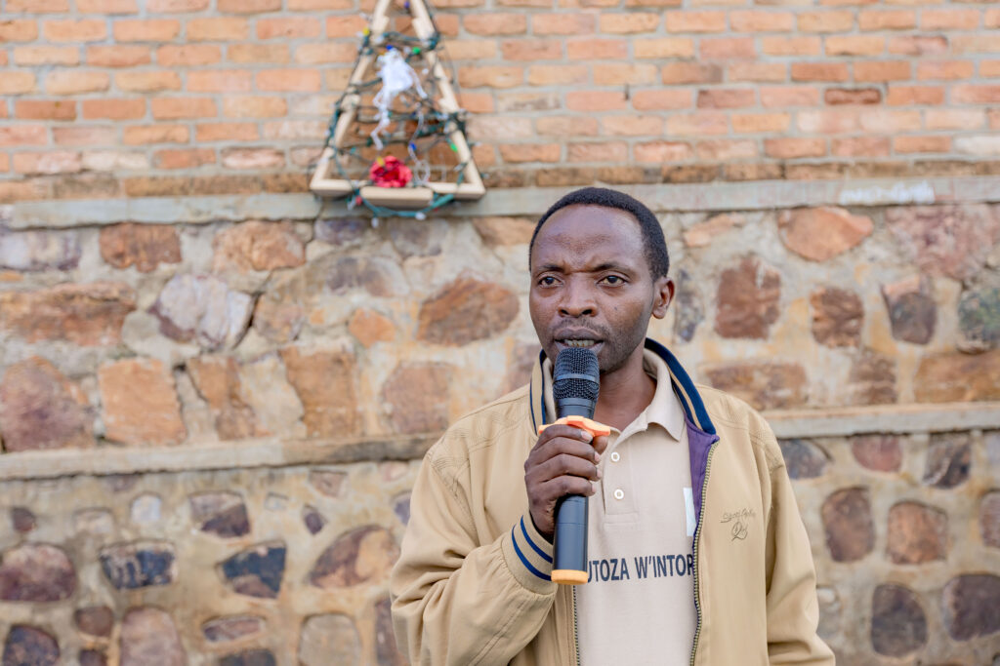
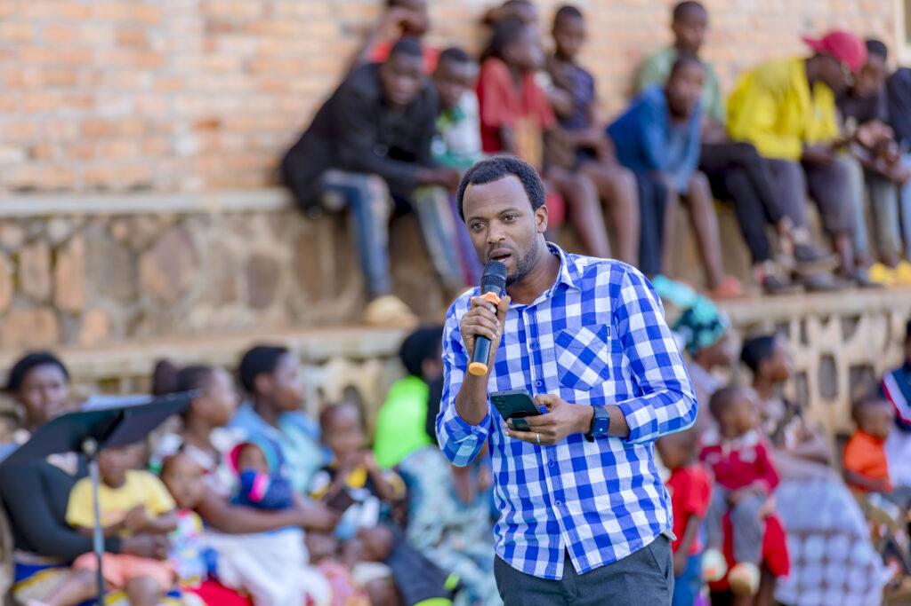
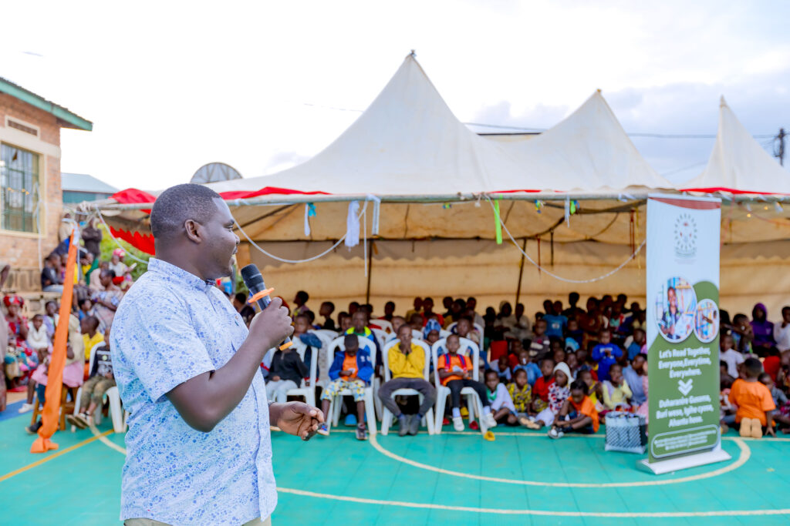
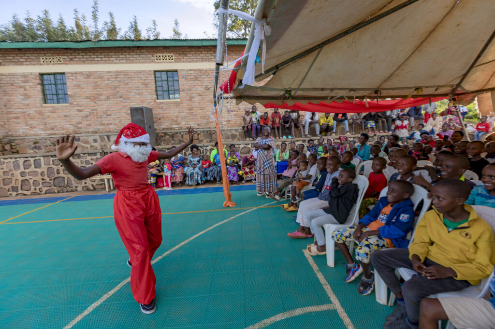
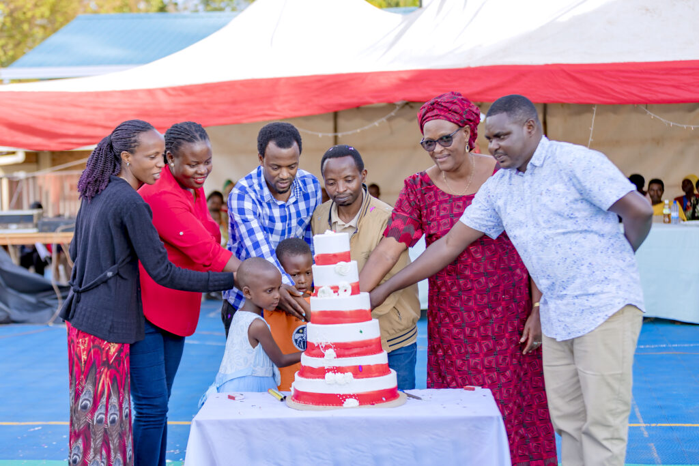

Rulindo, Rwanda – The Ineza Foundation brought the spirit of Christmas to Shyorongi Sector with a joyous celebration for local children. The event, held on Tuesday evening, brought together children, parents, and local leaders for an evening of entertainment, encouragement, and community building.

The highlight of the celebration was undoubtedly the children's performances. Youngsters showcased their talents with enthusiasm, captivating the audience with their singing, dancing, and other creative expressions. "We are so happy today! It's not every day we get to perform in front of so many people," shared Angel Umutesi, a participant in the Shyorongi community library's reading program.

12-year-old Jeanette echoed this sentiment, stating, "This event is special for us. We are showing what we can do, and it makes us feel proud."

The celebration provided a valuable opportunity for children to bond with their community and receive words of encouragement from local leaders. David Byiringiro, the Education Officer for Shyorongi Sector, expressed his gratitude for the Ineza Foundation's initiative. "This celebration is not only about enjoying Christmas, but it's also an opportunity for the children to develop their talents and build a strong connection with their community," he emphasized.

J. Bosco Ishimwe, the Coordinator of Youth Centers in Rulindo District, also addressed the children, inspiring them to strive for greatness. "The future belongs to you, and today's celebration is an important part of your growth. You have the ability to achieve great things," he declared.

Janvier, the Operations Officer for the Ineza Foundation, reminded the children of the importance of continued learning, even during the holiday season. "While we enjoy this beautiful time, I want to encourage each of you to read during the holidays," he advised. "Reading will not only improve your knowledge but also help you in your studies. And don't forget to help your parents with household chores when they need you. We all have a part to play in our homes and communities."

The event concluded with a shared meal, laughter, and stories, embodying the true spirit of Christmas: love, sharing, and unity. The Ineza Foundation's efforts were commendable in creating a space where children could celebrate the holiday while fostering a love for learning and community spirit.

 

**African Updates**
