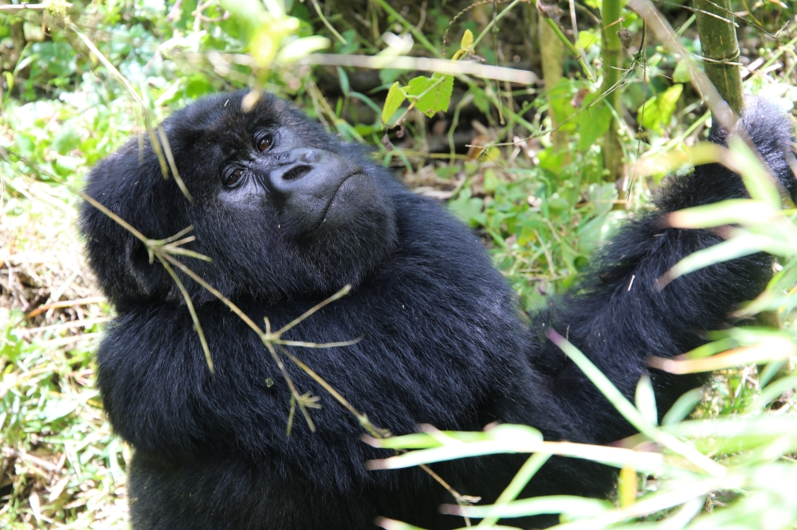
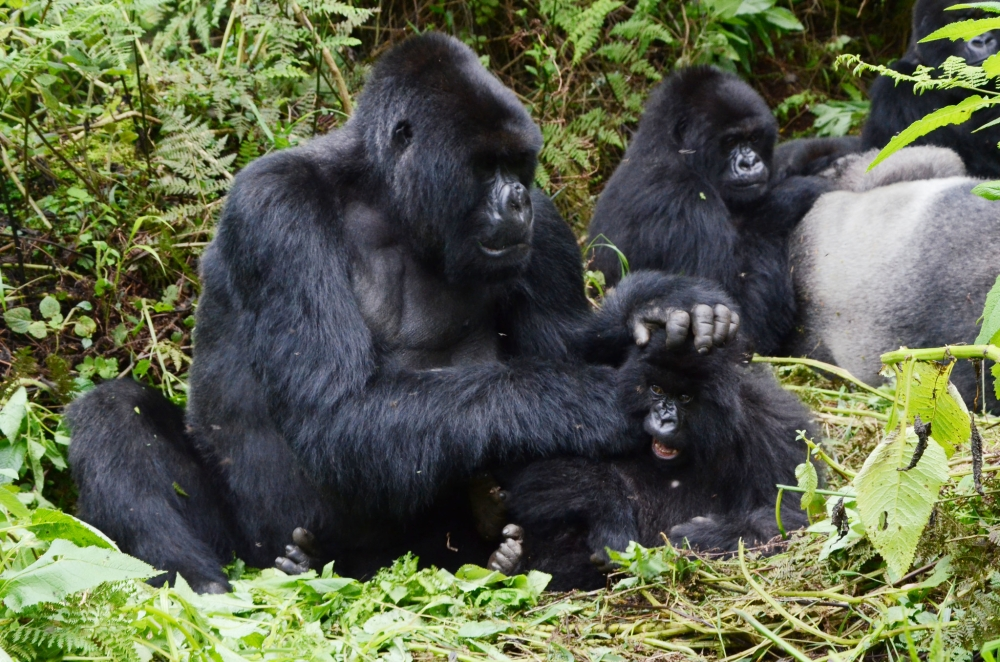

An innovative solution is being rolled out in Rwanda’s Volcanoes National Park where AI would be used to conserve mountain gorillas and at the same time empower communities around the park.

Dubbed “interspecies money,” the system allows mountain gorillas in the park to raise money for their conservation through digital wallets powered by AI-facial recognition. Last week, the initiative was named among the top ten implausible-sounding scenarios for 2025 by The Economist.

The platform has successfully been piloted on 20 mountain gorillas in the park. It is expected to enable the apes to pay for essential conservation services, such as hiring park rangers to remove snares set by poachers.

These digital wallets, similar to mobile money accounts like Momo, link the gorillas to the financial system, allowing funds to be spent on protecting their habitat and ensuring their well-being.

Created by Tehanu, an Africa-based startup, the system also offers financial incentives for local communities to participate in wildlife conservation. People in rural areas can earn money by completing tasks that support the ecosystem, such as photographing wildlife, recording animal sounds, or reporting

In an exclusive interview with _The New Times_, Jonathan Ledgard, the CEO and co-founder of Tehanu, said the project is a transformative initiative that could redefine how humans interact with the natural world.

He noted that the system creates digital identities and wallets for wildlife, recognizing the vital role gorillas play in Rwanda’s ecosystems and economy, and helps build a real-time database of biodiversity, benefiting both the environment and the local economy.

“By integrating both wildlife and humans into the financial system, the interspecies money initiative aims to create a circular economy that fosters mutual prosperity.”

 

Dubbed “interspecies money,” the innovative solution allows mountain gorillas in the park to raise money for their conservation.

Ledgard stressed that people in rural areas can earn money by completing tasks that support the ecosystem, such as photographing wildlife, recording animal sounds, or reporting sightings of specific species.

“In Kigali, you can send money to your village using Momo. Now imagine a bat, a tree, or even a gorilla being able to receive and spend money, all for services that benefit them,” Ledgard stated.

The initiative aims to recognise the often-overlooked but essential services that non-human species provide to the ecosystem, such as pollination, seed dispersal, and soil regeneration, and to integrate them into the economy.

Ledgard’s system intends to create a circular economic system that benefits both humans and wildlife by acknowledging this value and using it to support local communities.

Through the project, 20 mountain gorillas in Volcanoes National Park were given digital wallets linked to AI-powered facial recognition systems. These wallets allow the gorillas to spend funds on services that protect their habitat.

The technology goes a step further, using AI to analyse the gorillas’ behaviours and assess their needs, identifying patterns that could help predict and address threats to their welfare, he added.

“For example, AI might recognize a gorilla’s behaviour and suggest that a ranger remove a snare or that a researcher tracks its movements for conservation purposes,” Ledgard explained.

The AI could also be used to identify the preferences and needs of other species, like elephants or even trees.

“While the project is focused on mountain gorillas, the long-term goal is to extend the system to a wider variety of species, including those that provide important ecological functions, like the straw-coloured fruit bats and insects vital for pollination. Recognising their economic value could help protect these species and their contributions to the ecosystem.”

He stated that Rwanda was chosen as the ideal place to launch the initiative due to its progressive conservation efforts and technological adoption.

 

The innovative, solution dubbed “interspecies money,” allows mountain gorillas in the park to raise money for their conservation through digital wallets powered by AI-facial recognition. Sam Ngenda

Ledgard, who previously worked on pioneering projects like Zipline’s drone delivery system for medical supplies, believes that the country’s strong governance and open-minded approach to innovation make it a perfect testing ground for the interspecies money project.

“Interspecies money intends to directly benefit local communities, where people could earn money for simple actions like photographing birds, recording animal sounds, or reporting sightings of specific species,” he said.

These small tasks would provide a new source of income and contribute to a real-time database that monitors Rwanda’s biodiversity. Additionally, farmers could receive financial incentives for actions that promote species diversity in their agricultural practices.

Ledgard envisions that by 2050, Rwanda will experience improvements in soil health, forests, and wildlife.

“By introducing financial incentives to protect biodiversity, people will start to see it as a valuable asset both economically and ecologically,” he said.

The system looks forward to building emotional connections between people and wildlife, as the success of the project relies on more than just economic factors. It requires people to care about these species.

“People need to feel a sense of connection to these species for the system to work,” Ledgard said.

He said that while the project is still in its early stages, it has great potential to change how people approach conservation and value biodiversity. If successful, it could set an example worldwide, showing that recognising the economic value of animals and nature can help protect them and create benefits for both humans and the environment.

 

<iframe title="YouTube video player" src="https://www.youtube.com/embed/wR6E4y-nSqk?si=CTWVIYe1UVu-uUjw" width="560" height="315" frameborder="0" allowfullscreen="allowfullscreen" data-mce-fragment="1"></iframe>
