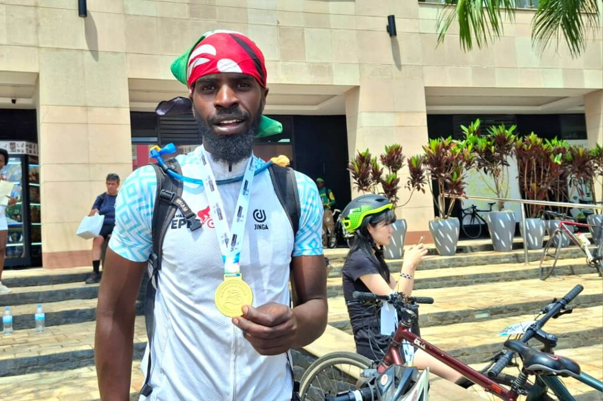
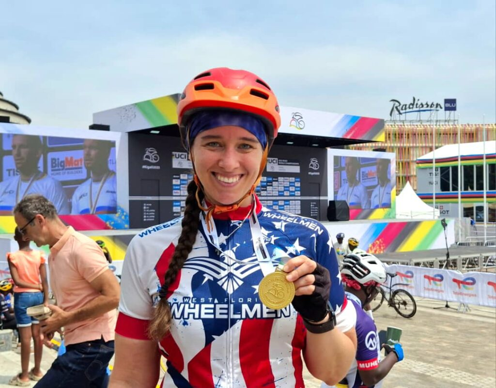
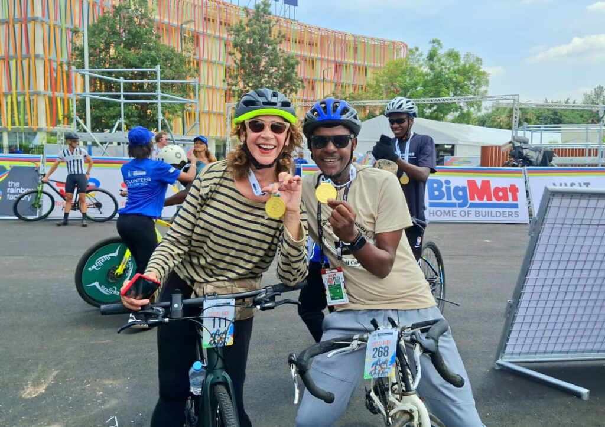
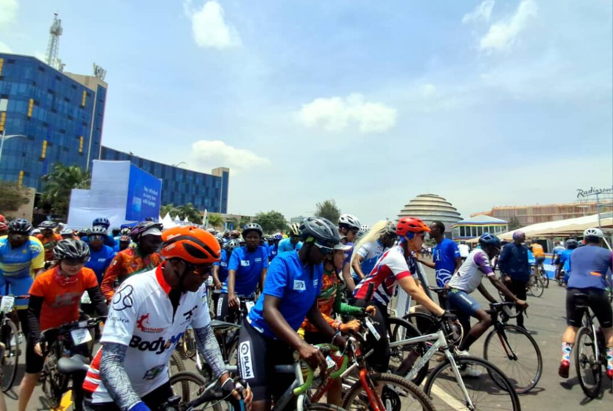
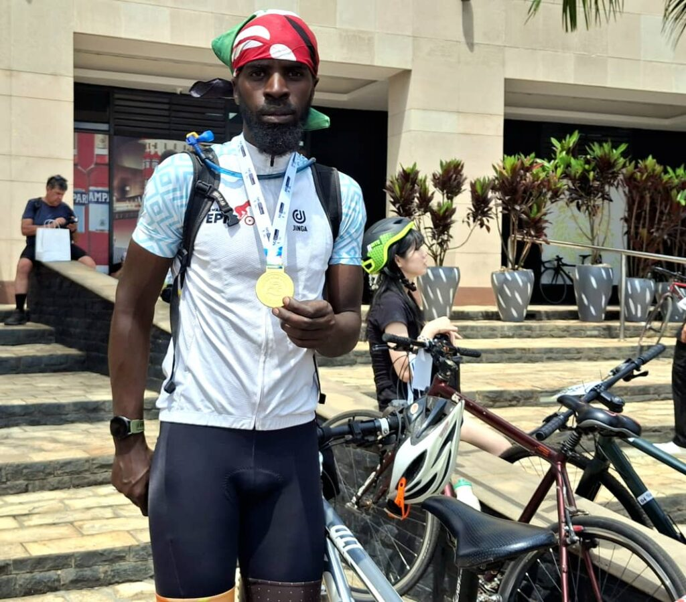
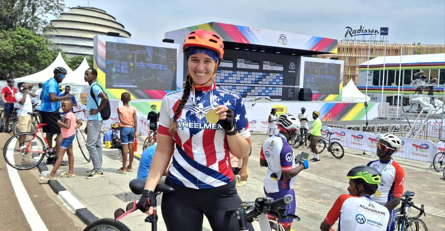
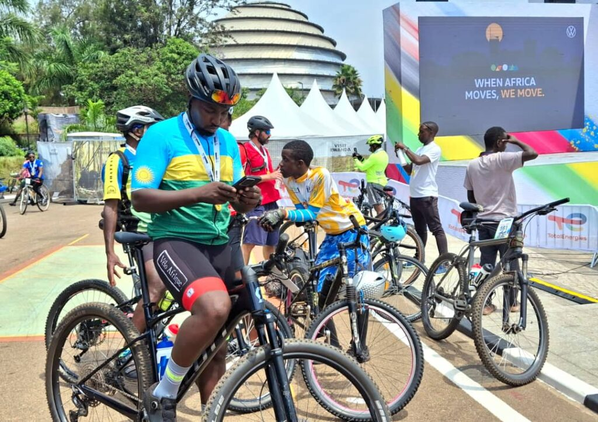
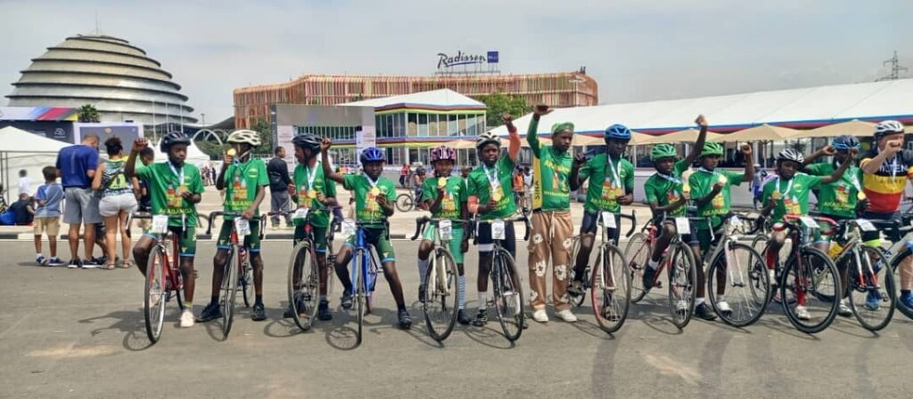
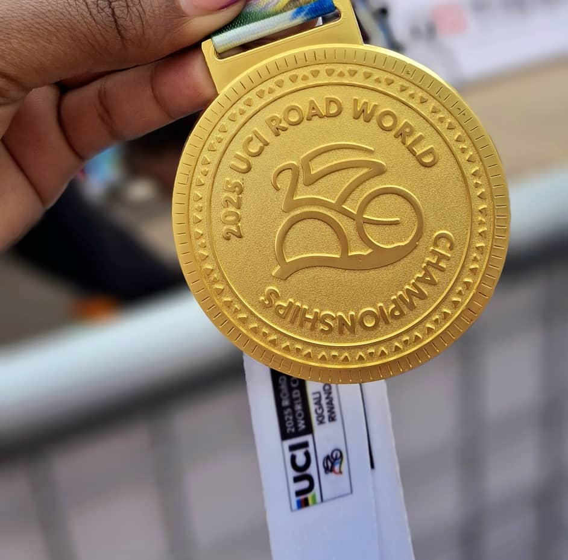

The streets of Rwanda’s capital came alive on Saturday, September 20, as hundreds of cyclists took part in a vibrant social ride ahead of the 2025 UCI Road World Championships, which officially begin today, September 21, and run until September 28 2025.

The event drew riders of all ages and backgrounds, including toddlers under three, children up to five, and professional cycling fans who rode side by side in a spirit of celebration. Each participant received a medal of participation, turning the ride into a memorable experience for families and cycling enthusiasts alike.

Among the groups that stood out was the Sina Cycling Club kids’ team, who proudly joined the ride and walked away with medals of their own.

The social ride was not only for cycling fans. It also drew key figures, including Rwanda’s Minister of Sports, Hon. Nelly Mukazayire, and the Mayor of Kigali City, Samuel Dusengiyumva. Their presence underlined the national importance of the UCI championships and the pride Rwanda takes in being the first African country to host the world event.

\[caption id="attachment\_41529" align="alignnone" width="1024"\] Rwanda’s Minister of Sports, Hon. Nelly Mukazayire, and the Mayor of Kigali City, Samuel Dusengiyumva joined the Social Ride\[/caption\]

Officials from different sectors, alongside international guests, joined local riders, creating a festive mood across Kigali’s streets.

Some participants went the extra mile literally. Polycarp Moriasi, a cyclist from Kenya, rode more than 1,200 kilometers from Nairobi to Kigali to be part of the moment. For him, the social ride was a “recovery ride” after a week-long journey across East Africa.

“This was like a recovery ride for me,” he laughed. “After the long journey, riding through Kigali with fans from all over the world felt easy and enjoyable. I’ll always cherish the medal I received it’s proof that I was here, part of this history.” he stated

\[caption id="attachment\_41531" align="alignnone" width="1024"\] Polycarp Moriasi, a cyclist from Kenya, rode more than 1,200 kilometers from Nairobi to Kigali to be part of the moment\[/caption\]

Others, like Kelly Fahnestock, an American living in Kigali, joined to enjoy the city’s famous hills and to share the joy of the cycling culture Rwanda has embraced.

she said; “It was a lot of fun to ride the hills of Rwanda with locals and people from different countries. Rwanda is known as the land of a thousand hills, and today we truly felt that. Events like this bring people together and show the power of sport to unite.”

\[caption id="attachment\_41534" align="alignnone" width="1024"\] Kelly Fahnestock, an American currently living in Kigali, described the experience as heartwarming\[/caption\]

The 2025 UCI Road World Championships are now officially underway in Kigali, with 919 riders from 110 countries competing across 13 events, from junior categories to elite men’s and women’s races. Out of the 110 nations, 38 are African, making this year’s edition historic for the continent.

The championships are expected to draw 330 million television viewers worldwide, with thousands of fans filling Kigali’s roadsides to cheer.

The elite men’s road race will stretch 267.5 kilometers, featuring a brutal 5,475 metres of climbing, while the women’s elite event will cover 164.6 kilometers with 3,350 metres of climbing. Kigali’s steep ascents, including _Mur Kigali_, are set to test the world’s top cyclists.

\[caption id="attachment\_41530" align="alignnone" width="1024"\] Each participant received a medal of participation\[/caption\]

Hosting the UCI World Championships in Rwanda carries significance beyond sport. It proves that Africa can deliver a global event of this scale, showcasing strong infrastructure, organization, and hospitality. It also inspires the next generation of African cyclists, giving them a chance to see world-class racing up close.

The inclusion of a separate Women’s Under-23 category for the first time in history highlights the growing equality in the sport, with Kigali at the center of this milestone.

For Kigali, the social ride showed how cycling is already uniting communities. From toddlers balancing on bikes to ministers and city leaders pedaling alongside ordinary citizens, the ride set the tone for a week that is more than a competition it is a celebration of resilience, unity, and African pride.

As the world’s eyes turn to Rwanda, the message is clear: Kigali is ready, and Africa’s time in world cycling has arrived.

 

\[caption id="attachment\_41538" align="alignnone" width="1024"\] Sina Cycling Club kids’ team, proudly joined the ride and walked away with medals of their own\[/caption\]

**African Updates**
