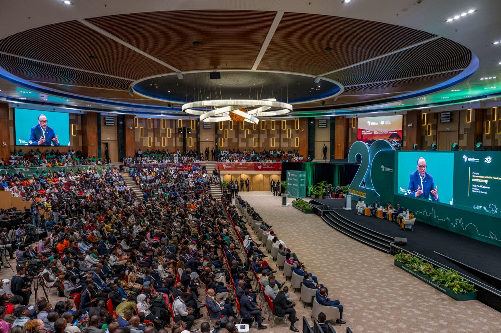
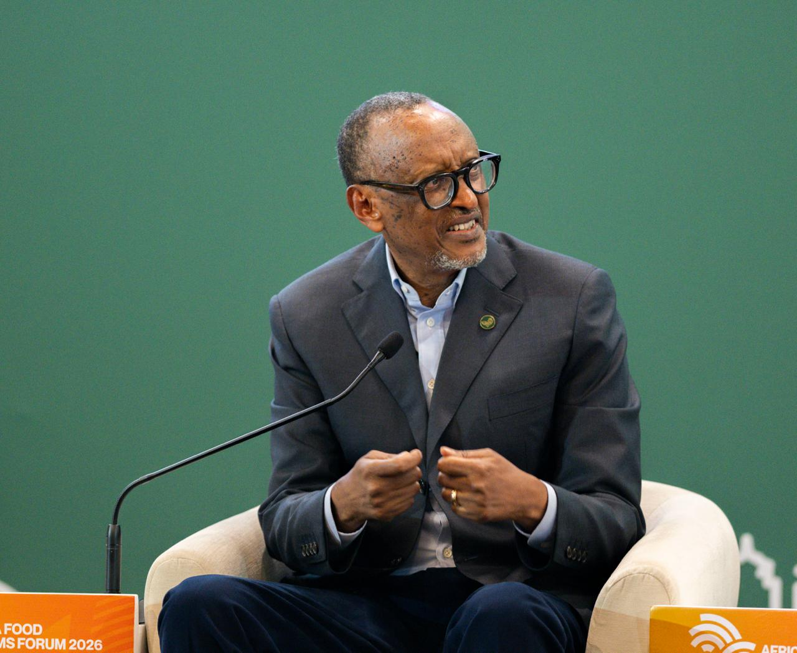
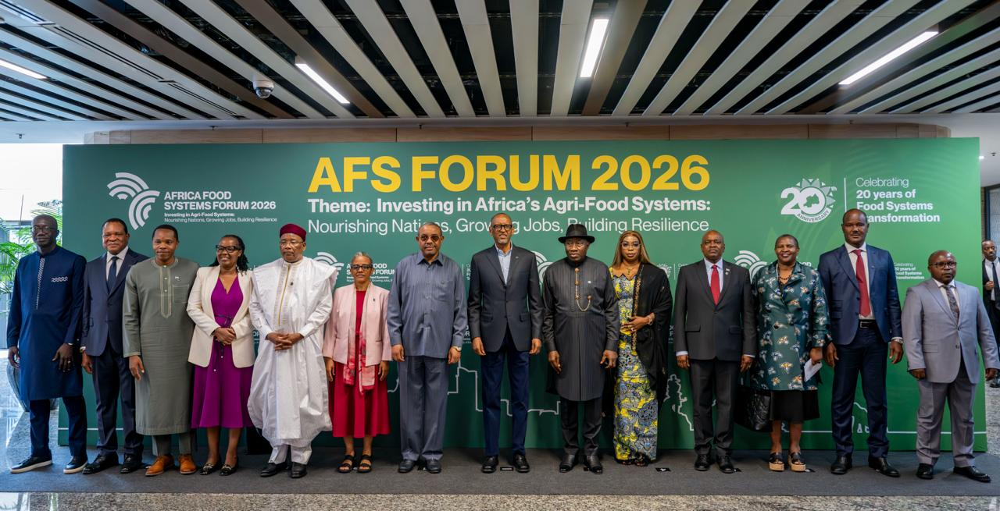

African governments should do more to reduce the risks facing financial institutions that lend to young entrepreneurs, President Paul Kagame said as he called for greater support for youth investment in agribusiness.

Speaking at the Africa Food Systems Forum 2026 in Kigali, Kagame said many young people struggle to access capital because Africa’s financial systems often favour those who already have money and collateral.

“Unfortunately, a number of parts of our financial system, on our continent, are framed in such a way that they mostly avail capital to those who have it,” Kagame said during a conversation with young people.

He said governments could help by absorbing part of the lending risk and creating financing mechanisms for entrepreneurs who have viable businesses but limited access to capital.

Kagame cited the Rwanda Development Bank (BRD) as an example of government-backed efforts to make financing available to people who may otherwise struggle to access it.

He also said governments should find ways to absorb losses from loans that cannot be recovered when the financing has helped capable young people build productive businesses.

“If the government doesn’t find ways to support people to be able to do more of what they are able to do or want to do... there is always going to be a problem,” he said.

The discussion at the Africa Food Systems Forum focused on how governments can create conditions that allow young people to invest, grow businesses and contribute to jobs and economic development across Africa.

**African Updates**
