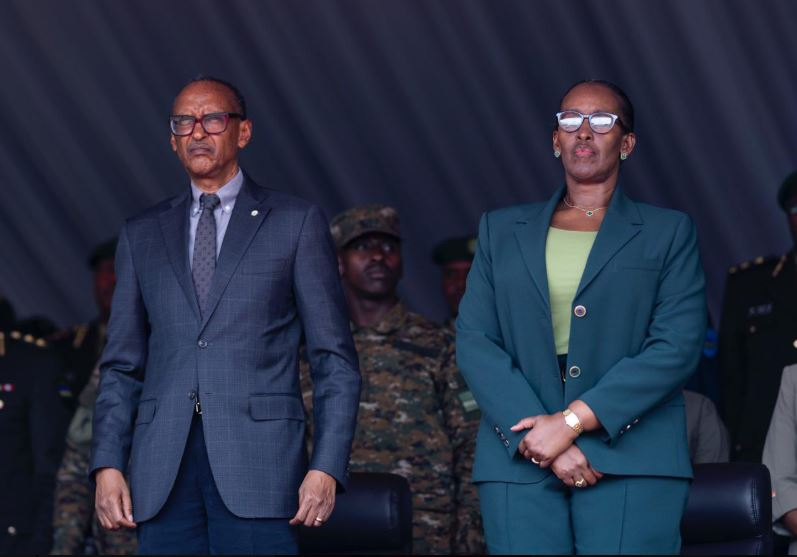

President of the Republic of Rwanda  Paul Kagame on Friday commissioned more than one thousand new officers at the Rwanda Military Academy in Gako, officially welcoming them into the Rwanda Defence Force. The graduates completed different military training programmes and were all awarded the rank of Second Lieutenant during the ceremony attended by First Lady Jeannette Kagame, military officials and families of the cadets.

In his address, President Kagame reminded the new officers that their achievement comes with responsibility. “No one should think that just because we are making progress, there is room for complacency. We are not where we want to be yet, the journey is still long. There is still a lot of work to do, and it still requires your service and resilience.” He emphasised that Rwanda expects full commitment from its young generation of officers.

The Head of State urged them to prioritise national service, saying, “You, the young people, still have so much to give as we move forward. The Rwanda Defence Force has played a role in building and developing our nation, and continues to do so to this day. By joining this profession, that is what the country expects from each and everyone of you, both now and in the future.”

He further reminded them that serving the nation also means serving their own interests. “As you take on your roles, remember that service to Rwandans is your foremost duty. When you serve Rwandans, the people you come from, your brothers and sisters, you are working for yourself. The future of our country is in your hands. We see your potential, use it to the best of your abilities. We have high expectations of you.”

The newly commissioned officers will now be deployed across various units as Rwanda continues to strengthen its defence capacity and invest in disciplined leadership. The ceremony marked another step in building a generation of officers trained not only in military skills but also in responsibility, patriotism and resilience.

Over the past years, the RDF has gained international recognition for its peacekeeping missions, rapid response operations, and discipline. Training institutions like Gako Military Academy play a key role in preparing future commanders and strategic leaders.

   

**African Updates**
