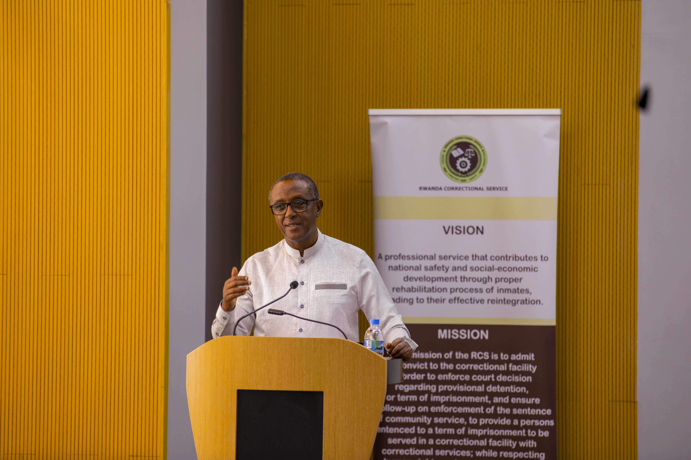
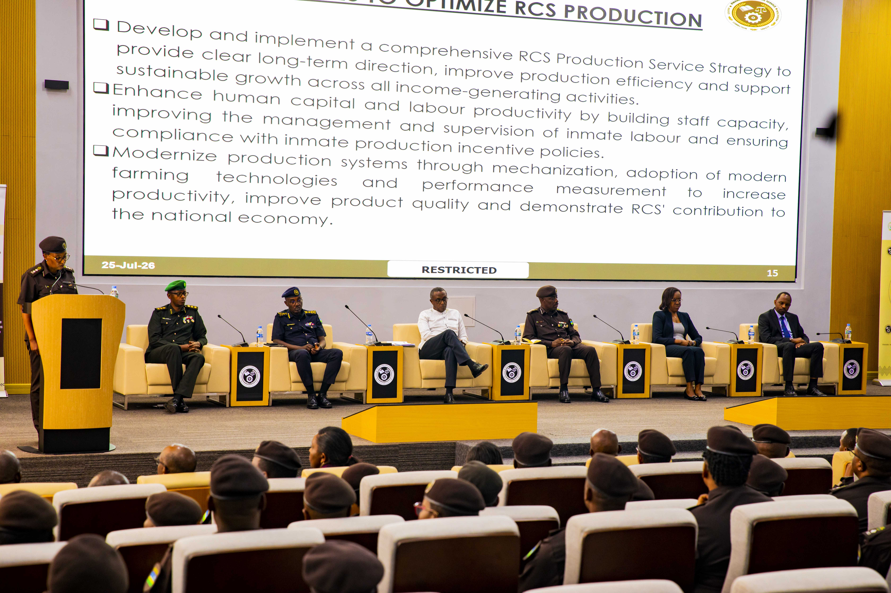

Minister of Interior in Rwanda, Dr. Vincent Biruta, has called on the Rwanda Correctional Service (RCS) to strengthen rehabilitation efforts while making better use of correctional infrastructure and land to improve the institution's productivity.

Speaking at the closing of a three day leadership retreat on Saturday, July 25, It was held under the theme: *"Enhancing RCS Strategic Development for Effective Rehabilitation and Reintegration."* Minister Biruta praised the progress made in transforming Rwanda's correctional facilities into centers focused on rehabilitation and reintegration.

He urged correctional leaders to develop practical plans for utilizing underused land owned by the Rwanda Correctional Service to generate more income and support institutional development.

"The infrastructure we have should be productive. We need concrete action plans with clear responsibilities and timelines," Minister Biruta said.

He also emphasized the importance of professionalism and accountability among correctional officers, warning that misconduct undermines public confidence in the justice system.

RCS has expanded Technical and Vocational Education and Training (TVET) programs, enabling inmates to acquire practical skills that improve their chances of finding employment or starting businesses after completing their sentences. The service has also introduced rehabilitation initiatives focusing on civic education, mental health, conflict resolution, and behavioral change.

During the retreat, senior correctional officials adopted 48 resolutions aimed at improving the management of correctional facilities, rehabilitation services, and institutional performance.

Across Africa, correctional services are increasingly shifting from punitive approaches toward rehabilitation and reintegration. According to the United Nations Office on Drugs and Crime (UNODC), education, vocational training, and rehabilitation programs play a critical role in reducing repeat offending and improving public safety, prompting many African countries to invest more in correctional reforms.

Rwanda has been among the countries advancing this approach by expanding skills development programs and strengthening inmate reintegration as part of broader justice sector reforms.

**African Updates**
