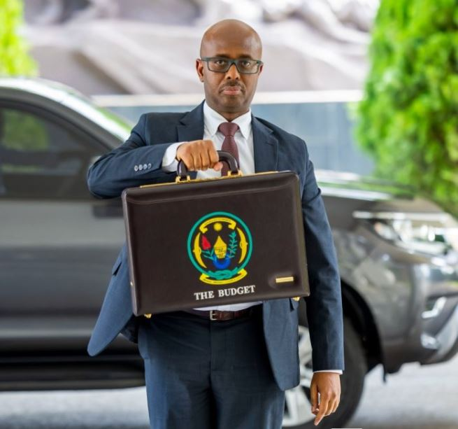

Rwanda’s revised national budget of Frw6.95 trillion for the 2025/2026 fiscal year continues to draw attention as implementation moves forward, with citizens and analysts focusing on whether increased development spending is translating into visible change on the ground.

According to the Ministry of Finance and Economic Planning, the budget was revised downward by about Frw80.4 billion**,** mainly due to adjustments in financing arrangements for major infrastructure projects. At the same time, development expenditure increased by more than Frw253 billion, reaching approximately Frw2.1 trillion.

Government budget documents also show that recurrent expenditure was reduced by about Frw198 billion, reflecting a shift toward prioritizing capital investment over administrative costs.

The revision comes as Rwanda continues to implement its long-term development strategy focused on infrastructure expansion, energy access, transport systems, and job creation.

Recent official economic data indicates that Rwanda’s economy has continued to grow strongly in recent years, supported by construction, services, and agriculture performance. However, disparities in service delivery remain a concern in some communities, particularly in areas related to infrastructure completion timelines and access to basic services.

Despite strong allocation to development projects, the key challenge highlighted by public finance observers is implementation efficiency ensuring that approved budgets translate into completed projects and improved services.

The budget documents, published by the Ministry of Finance, show that a significant share of spending is directed toward economic transformation sectors, including transport infrastructure, energy, water supply, and industrial development.

Across districts, citizens are increasingly watching whether these allocations will result in improved roads, better healthcare facilities, expanded electricity access, and more job opportunities.

In the absence of official public statements on delivery outcomes at this stage, available government budget data remains the main source of tracking progress.

As implementation continues, Rwanda’s 2025/2026 budget is increasingly being assessed not only as a financial plan, but as a test of public service delivery and development execution.

\[caption id="attachment\_44595" align="alignnone" width="655"\] Rwanda’s Finance Minister Yusuf Murangwa presenting the national budget to Parliament\[/caption\]

 

**Denyse Mbabazi Mpambara / African Updates**
