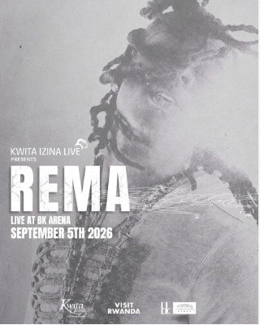

Nigerian Afrobeats star Rema is set to headline the Kwita Izina 2026 Concert at BK Arena in Kigali on Saturday, September 5, bringing one of Africa's biggest music names to Rwanda's annual gorilla conservation celebrations.

Rema, whose real name is Divine Ikubor, will perform a day after the 21st Kwita Izina gorilla naming ceremony in Kinigi, Musanze District. This year's event will be held under the theme “Conservation is Life: Sustaining the Future.”

Rwandan singer Kivumbi King is among the announced opening acts, with more performers expected to be revealed.

His connection with Rwanda is also strong. Rema was named Global African Artist of the Year and Song of the Year at the 2023 Trace Awards held in Kigali.

The concert will be the final major event in a week of Kwita Izina celebrations, which combine conservation, tourism, culture and entertainment.

Kwita Izina has become one of Rwanda's best-known conservation events, built around the annual naming of baby mountain gorillas born in Volcanoes National Park.

Rwanda is home to part of the Virunga mountain gorilla population, a critically important species that has become a major driver of conservation tourism in the country.

Rwanda Development Board Chief Tourism Officer Irène Murerwa said the event is also an opportunity to showcase Rwanda's culture, people and tourism progress.

With Rema leading the final night at BK Arena, Rwanda is once again linking its global music scene with one of its most important conservation and tourism events.

African Updates
