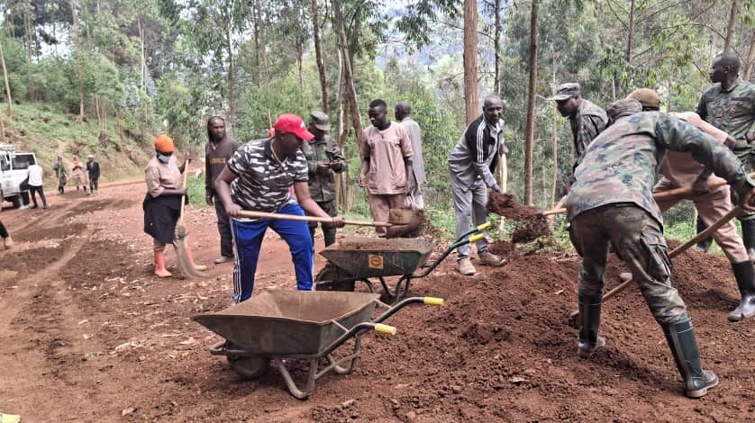
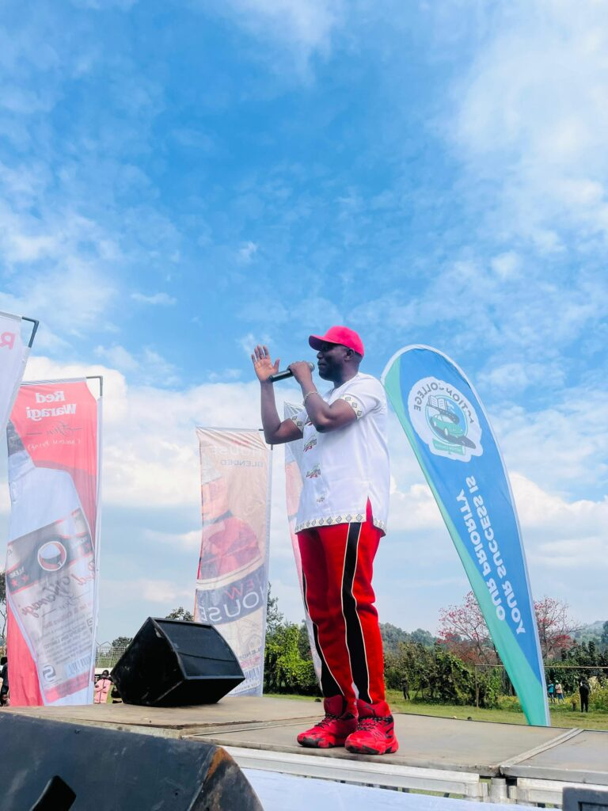
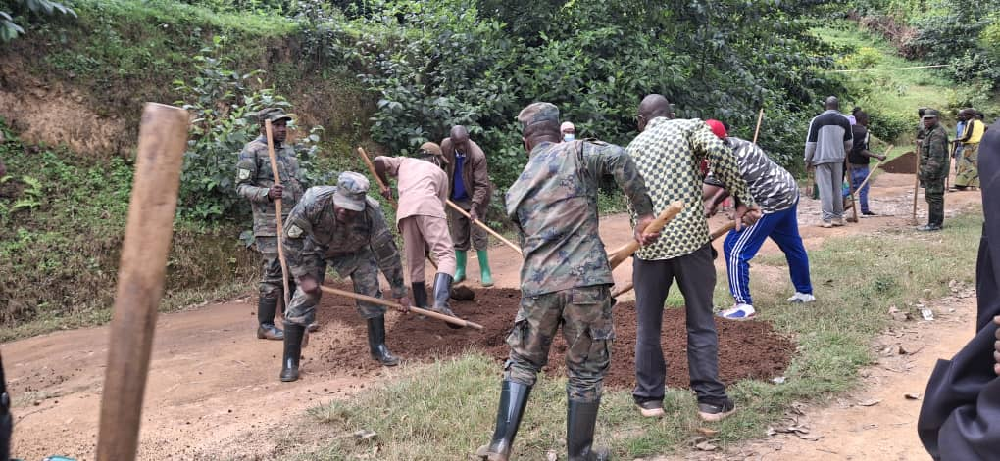
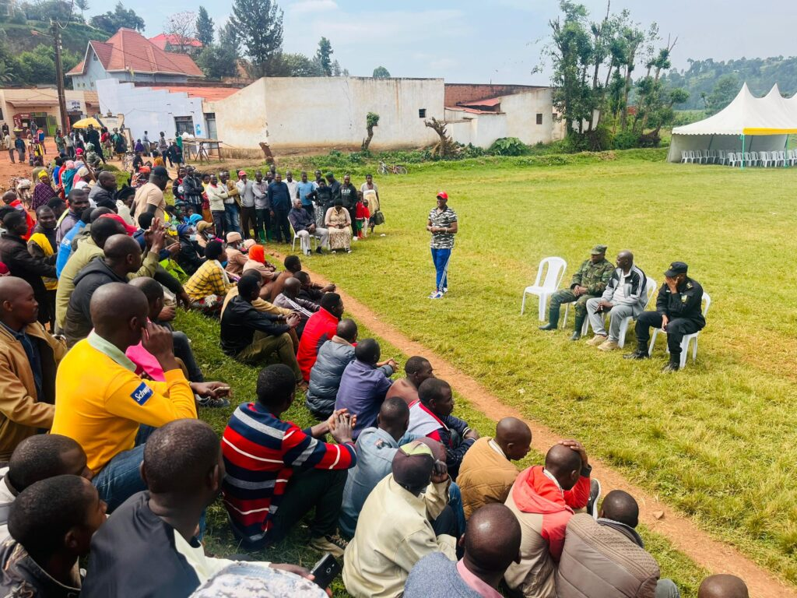
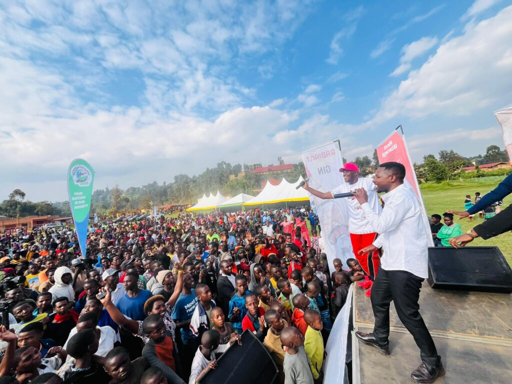
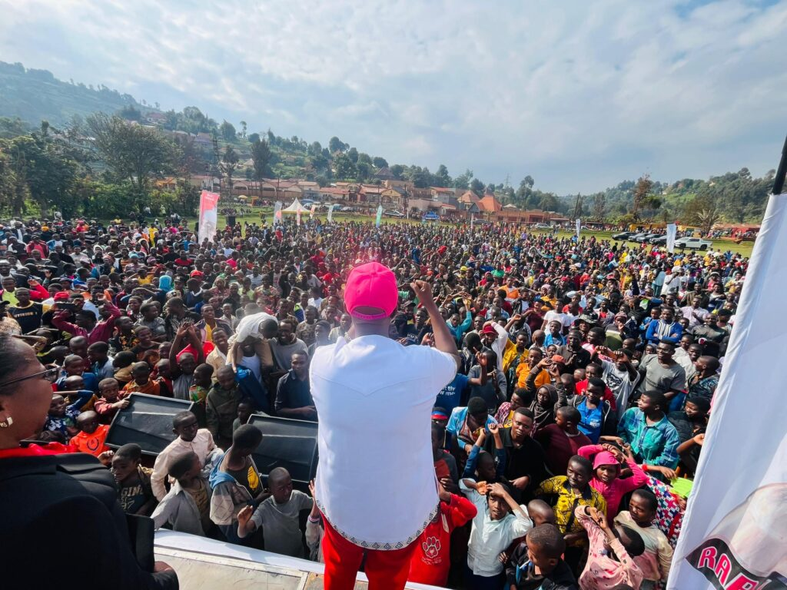
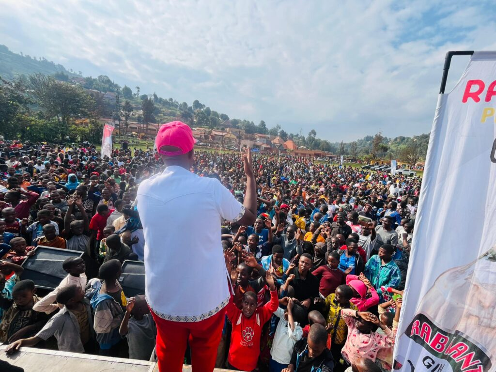
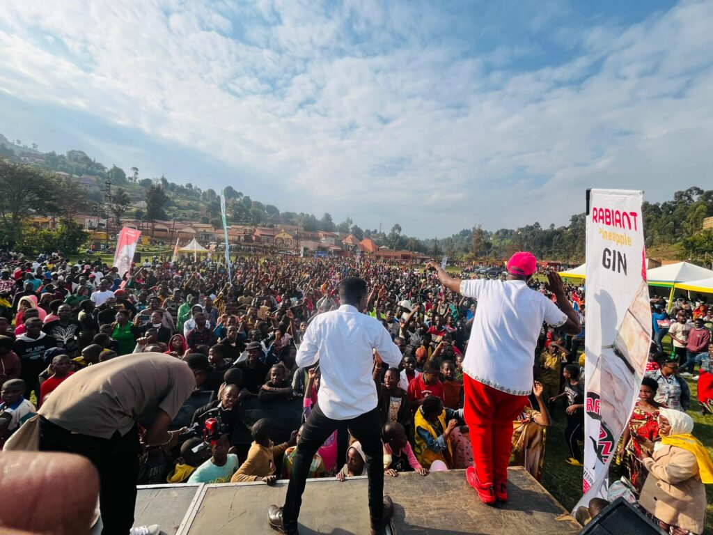
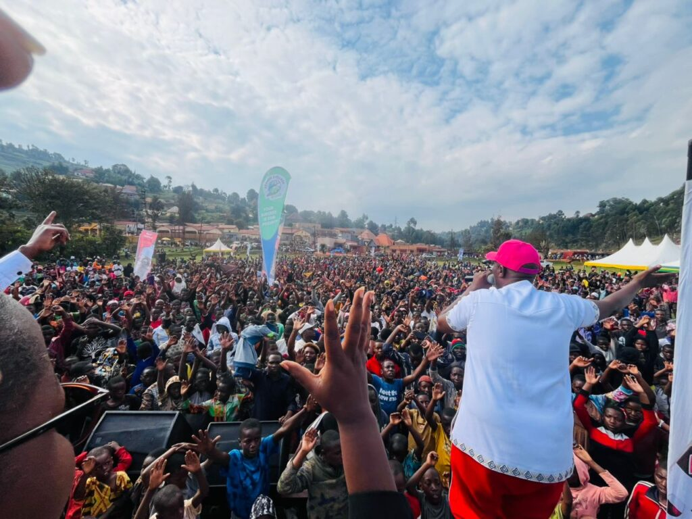

On July 11, 2025, Rwandan music icon Eric Senderi International Hit marked his 20th anniversary in the music industry with a unique celebration in Burera District. The artist joined local leaders and residents in Butaro sector in Burera District, Northern Province, for Umuganda, a monthly community work initiative, before performing a massive concert for thousands of fans.

Senderi, known for his energetic performances and diverse musical themes, began his day by participating in road reshaping efforts in Butaro Sector. He was joined by Butaro Sector Executive Secretary Kayitsinga Faustin, soldiers, Ndayisaba Fabrice (leader of the Ndayisaba Foundation), and numerous local citizens. The group worked from 8 AM to 11 AM, improving approximately three kilometers of roads.

"I am very happy with how the district mayor, soldiers, police, and Butaro Sector have all welcomed me well," Senderi stated in an interview. "I thank the high leaders of the country who give us this opportunity, and I thank the Ministry of Youth and Arts and the Ministry of Local Government that helped me organize this concert."

Following the community work, Senderi took to the stage for a highly anticipated concert. Thousands of fans from Burera, Rulindo, Gakenke, and even parts of Uganda converged to celebrate with the artist. Attendees, ranging from children to the elderly, danced enthusiastically throughout the performance.

The concert also saw the presence of prominent figures, including the Mayor of Burera District, representatives from the Rwanda National Police, the Rwanda Defence Force, and other administrative leaders. Several fellow artists joined Senderi on stage, performing duets or showing their support. The event kicked off with a talent showcase featuring local dancers, singers, and poets.

Concert goers expressed their delight at seeing Senderi perform live, with many hoping for more such events in the future.

Senderi explained his choice of Burera for this significant event: "I chose Burera because people from there love me, and I love them back. I have many fans who love me here, so I decided to come."

This concert in Burera is the second stop on Senderi's countrywide tour to commemorate his 20 years in music. He plans to perform over a dozen more concerts throughout July 2025. Through this tour, Senderi hopes to create job opportunities and reignite public interest in his extensive musical catalog.

"What I expect after these concerts I am doing all over the country is to have job opportunities, but even if I don't get music-related jobs, I believe that the citizens will have at least remembered me with my songs," he shared.

Mukamana Soline, the Mayor of Burera District, highlighted the significant developments in the area over the past two decades. She specifically mentioned the establishment of Butaro Hospital and the University of Global Health Equity within the sector, both of which have greatly improved healthcare services.

"We are very happy for Butaro Hospital that is in Burera District, and we are happy for the University of Global Health Equity because it has international and local students, and they help us in health research," Mayor Mukamana stated. She also expressed gratitude to President Paul Kagame for his role in developing the district.

Senderi International Hit, known for his songs covering themes of love, social issues, and liberation, is scheduled to perform his next concert on July 12, 2025, in Muhanga Sector, Southern Province.   

\[caption id="attachment\_35440" align="alignnone" width="1024"\] Intore Tuyisenge and Senderi International Hit singing to their Fans in Burera District, Butaro Sector.\[/caption\]

    

**African Updates**
