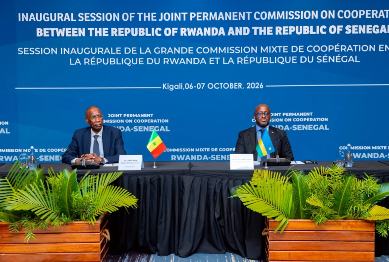

Rwanda and Senegal have signed 11 cooperation agreements as the two countries seek to strengthen ties in trade, investment, development and other areas.

The agreements were signed on Wednesday in Kigali by Rwanda's Foreign Affairs Minister Olivier Nduhungirehe and Senegal's Minister of Foreign Affairs Cheikh Niang during the first session of the Joint Permanent Commission on Cooperation.

The meeting was held alongside the Rwanda-Senegal Investment Forum, which brought together businesses and investors from both countries.

Nduhungirehe said the agreements should translate the political commitment of both governments into practical cooperation, stressing that implementation would be more important than simply signing deals.

He also said the African Continental Free Trade Area (AfCFTA) could provide opportunities to expand trade and investment between Rwanda and Senegal.

Niang said Senegalese President Bassirou Diomaye Faye's state visit to Rwanda in October 2025 had helped strengthen bilateral relations. During the visit, the two countries signed agreements covering mobility, agriculture and livestock, health, strategic programmes and correctional services.

The agreements included visa exemptions for diplomatic, service and ordinary passport holders, as well as cooperation protocols in agriculture, health and other sectors.

Niang said the focus would now be on implementing the commitments and expanding cooperation beyond government institutions to businesses, investors, universities and research centres.

The two countries plan to hold an experts' meeting next year to assess progress. The second session of the Joint Permanent Commission is expected to take place in Senegal.

**African Updates**
