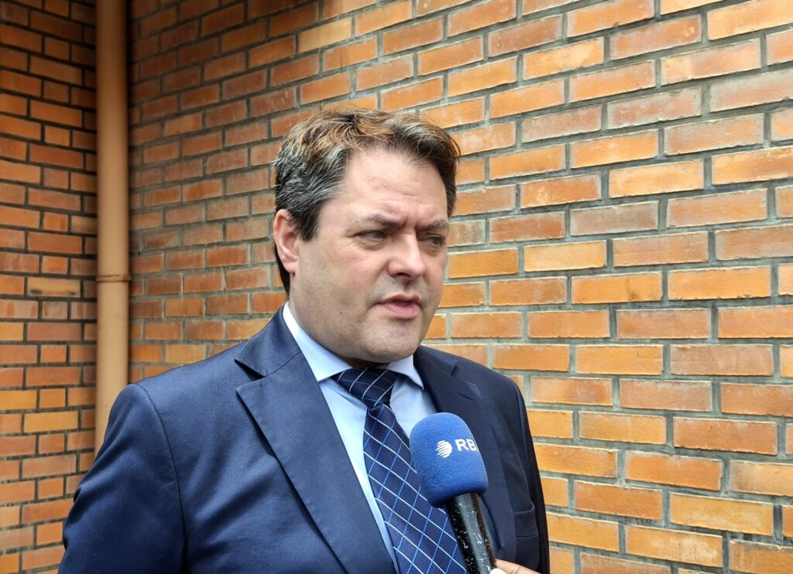
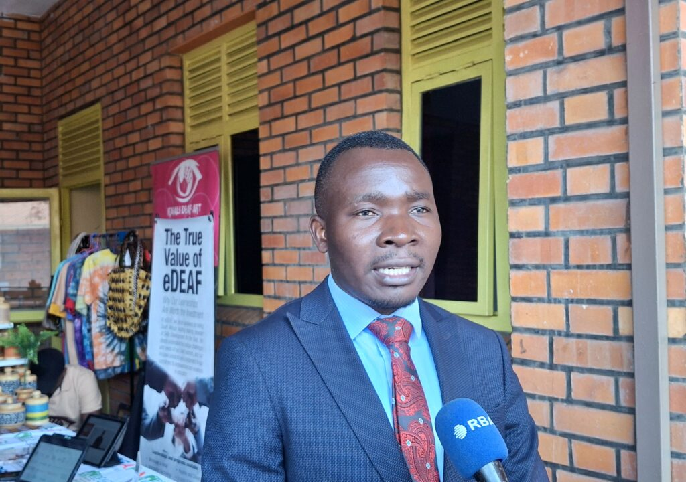

Delegates from across Africa wrapped up a major global conference here this week with fresh calls for governments to recognise sign languages and pour money into deaf communities.

Dr Christopher Stone, president of the World Association of Sign Language Interpreters, singled out Rwanda’s progress. He pointed to new university plans that could train more teachers and bring sign language onto TV news and into classrooms. “It’s about building capacity, More awareness will spark interest, and more teachers will deliver the service.” Stone said.

\[caption id="attachment\_44512" align="alignnone" width="1024"\] Dr Christopher Stone, president of the World Association of Sign Language Interpreters\[/caption\]

Joseph Musabyimana, chairperson of Rwanda’s National Sign Language Interpreters Association, spoke of the group’s short history just one or two years old and its big hopes. The association wants the government to fund interpreters in the national budget, run more training workshops and finally recognise Rwandan Sign Language as official. “We have already started talks with officials,” Musabyimana told the gathering.

He also named the everyday struggles many African interpreters face are low education levels, short training and almost no money in government budgets. Stone sent a straight message to African leaders asking them to recognise sign languages, fund deaf communities, train teachers and pay interpreters properly. “If you want deaf people to have access, interpreters need to eat and support their families,” he said.

\[caption id="attachment\_44514" align="alignnone" width="1024"\] Joseph Musabyimana, chairperson of Rwanda National Sign Language Interpreters Association (RNSLI)\[/caption\]

He added that talented young Africans could turn interpreting into a solid career, especially with paid work on television or in politics and many countries have already signed the UN convention that gives deaf people the right to their language.

Africa has about 40 million people living with hearing loss today, a figure that could hit 54 million by 2030 if nothing changes, according to the World Health Organization. Rwanda ratified the UN Convention on the Rights of Persons with Disabilities back in 2008, yet Rwandan Sign Language still waits for full official status in law or the constitution.

**African Updates**
