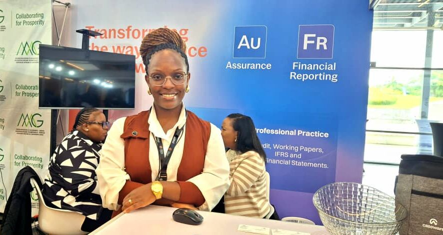
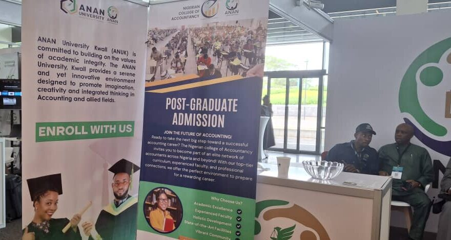
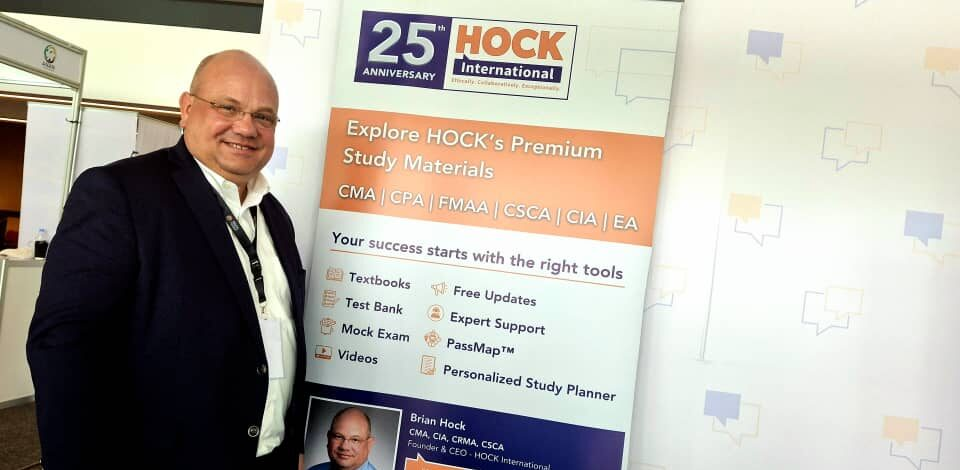
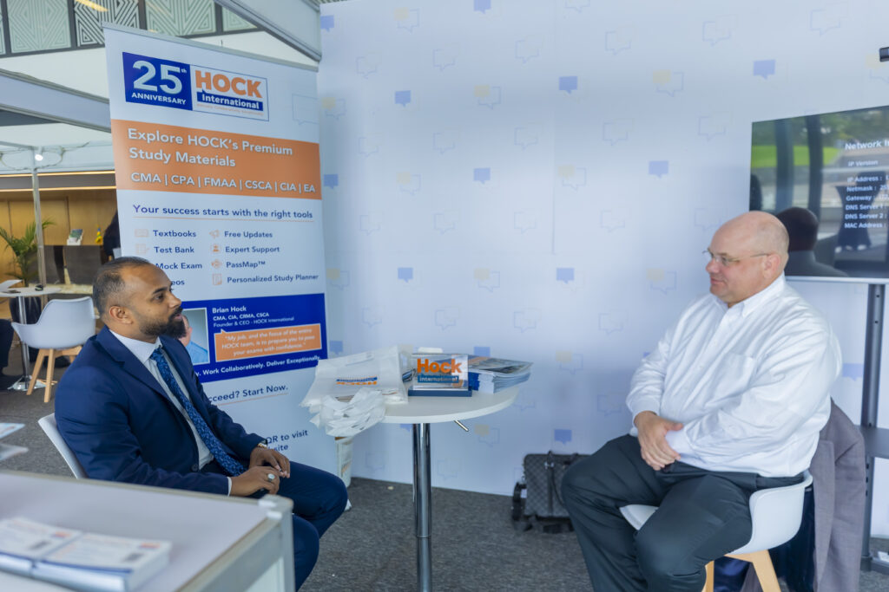
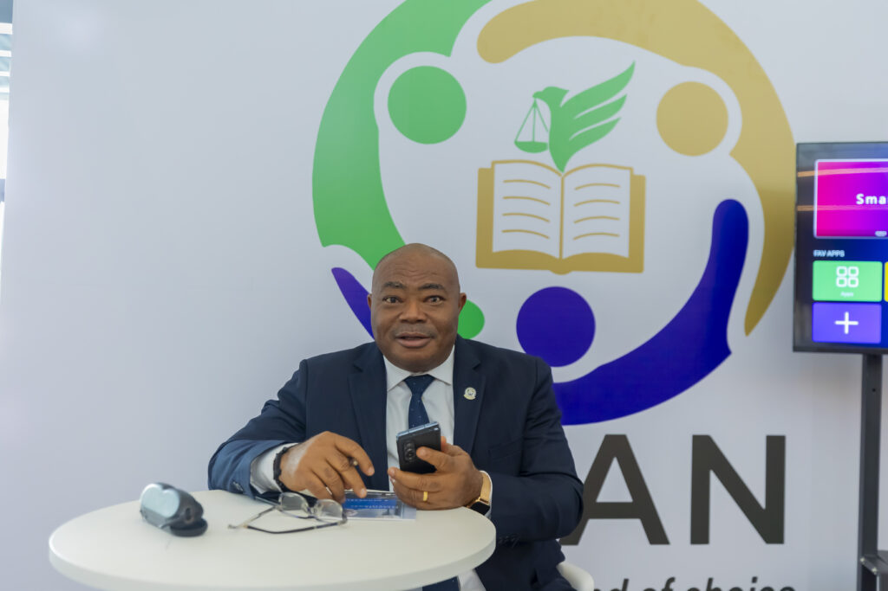

The bustling city of Kigali became a central point for the future of African finance as the 8th Africa Congress of Accountants (ACOA) unfolded. With a rising number of individuals pursuing higher education across Africa, the congress provided a vital platform for exhibitors to showcase innovations and build crucial connections within the accountancy sector. The growing demand for skilled financial professionals, driven by economic expansion and increasing regulatory complexity, was evident as companies presented their solutions and visions for the continent.

Brand visibility and direct engagement with accountants were key objectives for at ACOA 2025. "The main reason why we are here is to engage with accountants to ensure brand visibility, We want to network, get to know accountants from across the continent and see how we can work together and help them to automate their reporting process as well as their audit engagement." Said Alice Maina, Sales Consultant, Caseware Africa

A significant interest in automation by attendees was noted. "People are interested in automation. There's a lot of appetite for automating, and especially because of the increased regulations for reporting requirements," Maina observed. Caseware's software aims to ease the compliance workload for finance professionals, addressing the need for accurate and regulation compliant reports.

A challenge identified involved shifting perceptions around technology in the field. "The main challenge at the moment is just getting people to understand that IT and software is not here to replace them, it's just to enhance the quality of their work," Maina explained. She encouraged accountants to adopt these tools to remain competitive and efficient.

\[caption id="attachment\_32082" align="alignnone" width="886"\] Alice Maina, Sales Consultant, Caseware Africa\[/caption\]

ACOA 2025 offered ANAN a valuable opportunity to expand its reach and inform professionals about its offerings. "We want to engage with as much people as possible to give them information about ANAN," said Uche Arinze Representing the Association of National Accountants of Nigeria (ANAN).

She highlighted the universal nature of accounting, facilitating professional mobility and collaboration. ANAN's focus on training and retraining aims to elevate the quality of accounting professionals in Africa. "The value we want to create for Africa is to equip accountants to be better professionals, qualify them, because mediocrity is a problem in the profession."

Scholarships for international students were also promoted, demonstrating ANAN's commitment to fostering talent across the continent.

\[caption id="attachment\_32086" align="alignnone" width="880"\] Association of National Accountants of Nigeria (ANAN) was Represented in ACOA 2025 in Kigali, Rwanda\[/caption\]

Marking its first venture into the African market, HOCK International, a provider of exam preparation materials, participated in ACOA 2025. "This is our company's first exposure to Africa, And I know that we will be back. This is a large market, a growing market, a dynamic market filled with wonderful people, intelligent people." shared Brian Hock, Founder and CEO, HOCK International.

The integration of AI in the accounting field was also discussed. "It's unlikely that you will lose your job to AI, but you will lose your job to someone who knows how to use AI better than you do," Hock advised. He stressed the importance of viewing AI as a tool that requires skilled users.

Looking forward, HOCK International intends to establish partnerships with educational institutions and professional bodies in Africa. "I would expect that in the future, we will have multiple representatives of the company across Africa helping to find those relationships, make those relationships, and build those relationships," Brian concluded, signaling a long-term investment in the continent's accounting talent.

\[caption id="attachment\_32084" align="alignnone" width="960"\] Brian Hock, Founder and CEO, HOCK International\[/caption\]

The insights shared by exhibitors at ACOA 2025 shows the continent's vibrant and evolving accounting landscape, driven by innovation, collaboration, and a commitment to professional development.

  

**African Updates**
