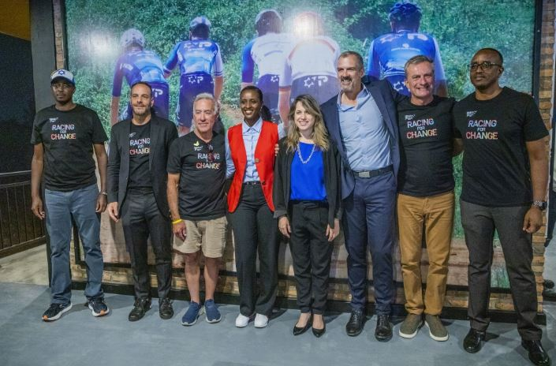
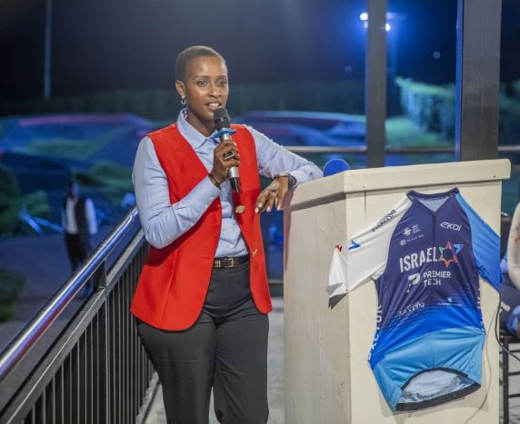
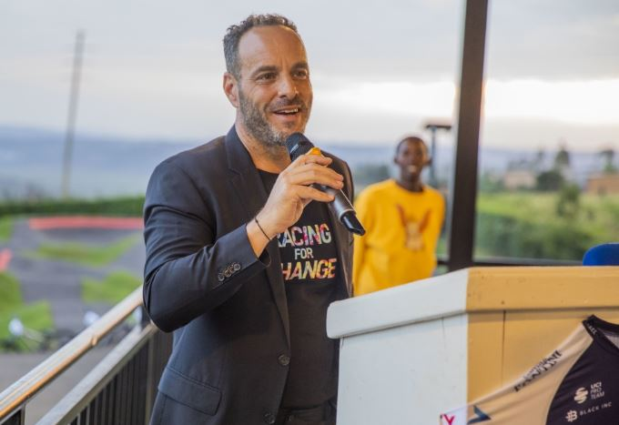
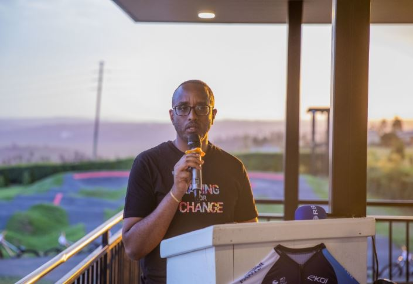
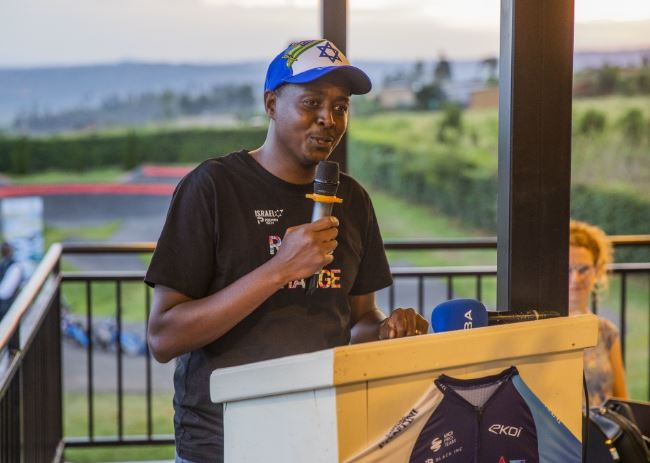
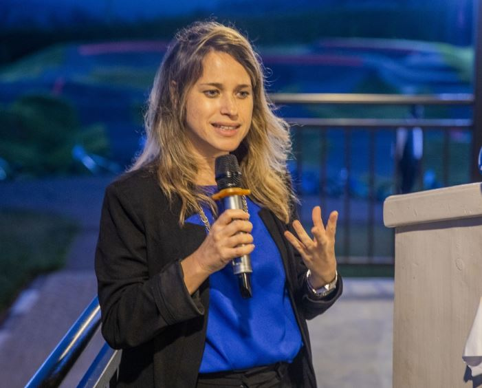
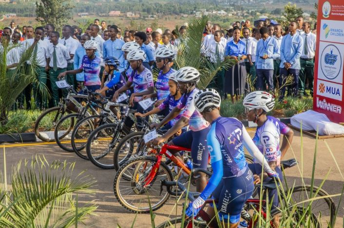
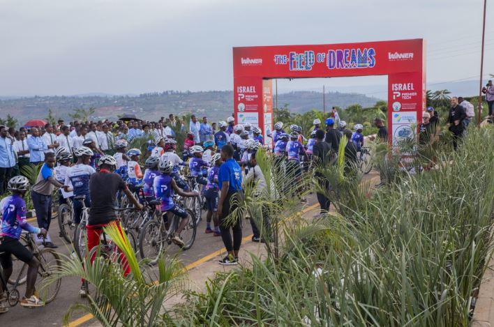

The inauguration of the Home of Dreams in Rwanda's Bugesera District marks a monumental shift for cycling across Africa, positioning the nation as a leading hub for talent development on the continent. Launched on September 24 by the Israel Premier Tech cycling team in collaboration with the Gasore Serge Foundation and Bugesera District, the multi-level youth center is a groundbreaking addition to the Field of Dreams bike facility.

Significantly, this new hub, located in Nyatarama Sector, is the first of its kind in Africa to feature both a race track and a pump track and has been officially recognized by the Union Cycliste Internationale (UCI) as a Regional Training Center. This recognition isn't merely symbolic, it places Rwanda at the heart of the UCI's strategy to expand cycling's footprint across the globe.

The event drew high-profile attendance, including Rwanda’s Minister of Sports Nelly Mukazayire, Israel Ambassador to Rwanda, Einat Weiss, World Cycling Center Director Jacques Landry, and Bugesera Mayor Richard Mutabazi. Students from the Gasore Serge Foundation showcased their skills, embodying the project's purpose.

Minister Mukazayire praised the launch of the Home of Dreams, viewing it as a crucial step that aligns perfectly with Rwanda's national goal of transforming the country into a global sporting center by investing in its future cyclists.

“Everything we’re doing here is for the next generation, they are the dream the future of today and tomorrow. By combining world-class cycling infrastructure with education and life skills at this facility, we’re building more than athletes; we’re shaping resilient, empowered citizens,” she said.

\[caption id="attachment\_41818" align="alignnone" width="572"\] Hon. Nelly Mukazayire, Minister of Sports in Rwanda\[/caption\]

This initiative arrives at a crucial moment for African cycling. According to UCI data, the number of African countries participating in UCI events has been on a steady rise, with riders from the continent securing more professional contracts in the past decade than ever before. For instance, while European countries continue to dominate, the growth rate of licensed cyclists in certain East African nations, though starting from a low base, has seen year-on-year increases of over 15% in recent years, signaling an untapped reservoir of talent.

Jacques Landry, Director of the UCI World Cycling Center, emphasized the center’s broader role.

“There’s real energy here, and this is only the beginning. At the UCI, we’re committed to developing cycling across Africa as part of our 2030 agenda. Facilities like this are essential in localizing the sport and making it accessible to young riders across the continent,” he noted.

Shaul Hatzir, the visionary leading the Home of Dreams project and the representative for Israel Premier Tech in Rwanda, shared his profound personal pride, describing the facility's opening as both a deeply emotional milestone and the successful realization of a shared dream.

“It's a very emotional moment for me to see all those kids and to think that we can change a few and give somebody a dream here. I'm really proud of this project and everybody that helped us build it,” Hatzir stated, adding a powerful articulation of the project's mission

Hatzir thanked all partners for their trust and support, including the Rwandan government, local leaders, and his own family, and emphasized that the project is not a one-time effort but the beginning of a long-term commitment to youth development in Bugesera.

\[caption id="attachment\_41819" align="alignnone" width="680"\] Shaul Hatzir, Israel Premier Tech Representative in Rwanda\[/caption\]

The Mayor of Bugesera, Richard Mutabazi, described the inauguration of the Home of Dreams as a deeply meaningful moment for the local community, highlighting the transformative power of sport in a region where over 60% of the population is under the age of 25.

“To us, the Field of Dream and Home of Dream is more than a cycling centre or infrastructure. It is a beacon of hope, ambition and excellence.” he said.

\[caption id="attachment\_41817" align="alignnone" width="705"\] Richard Mutabazi, Mayor of Bugesera district in Rwanda\[/caption\]

Gasore Serge, the Founder of the Gasore Serge Foundation, emphasized this ambitious future when speaking to African Updates, declaring a dream to see this model replicated far and wide.

“My dream is that we can have more of this around the country and all over the continent,” Serge stated, underscoring the need to scale the project's impact beyond Bugesera. He views the Rwanda center as a successful blueprint for developing youth cycling and life skills across Africa.

\[caption id="attachment\_41821" align="alignnone" width="650"\] Gasore Serge, the Founder of the Gasore Serge Foundation\[/caption\]

African Updates
