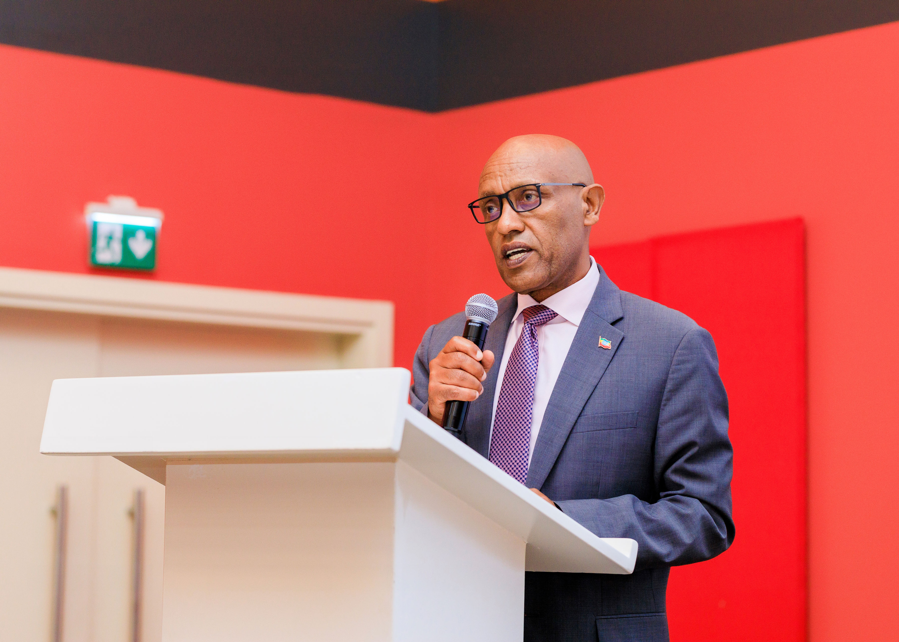
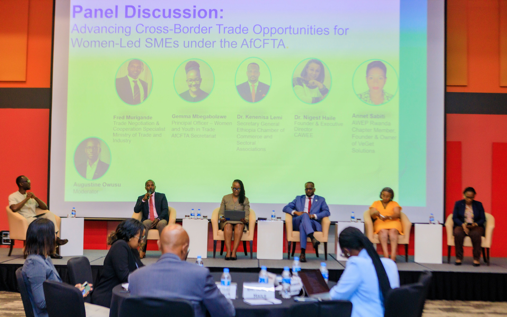
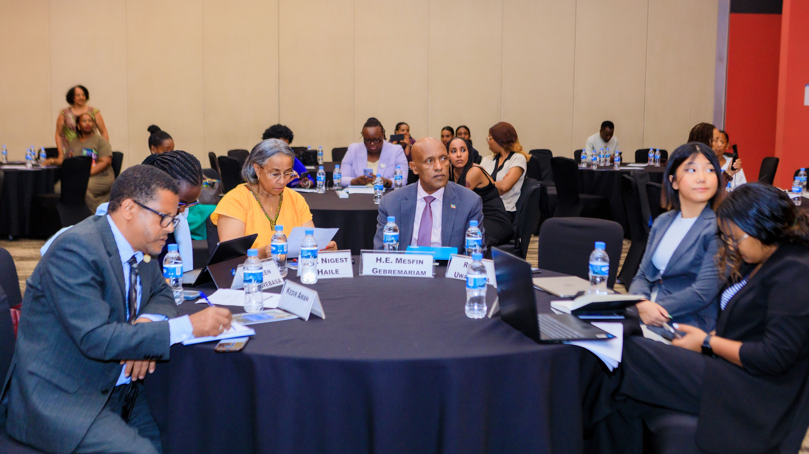
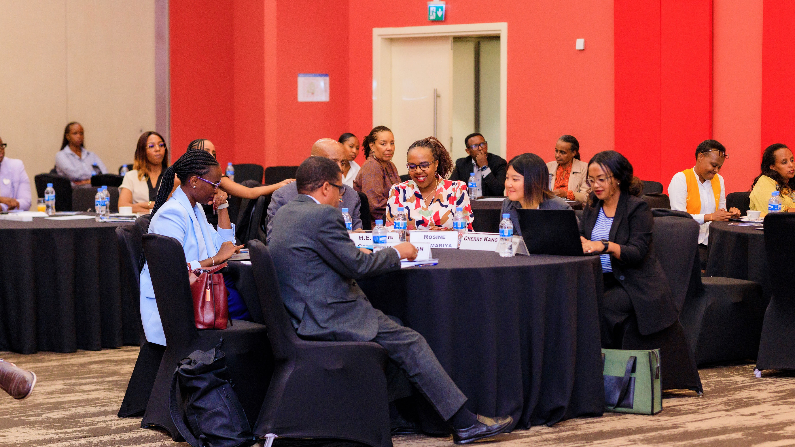
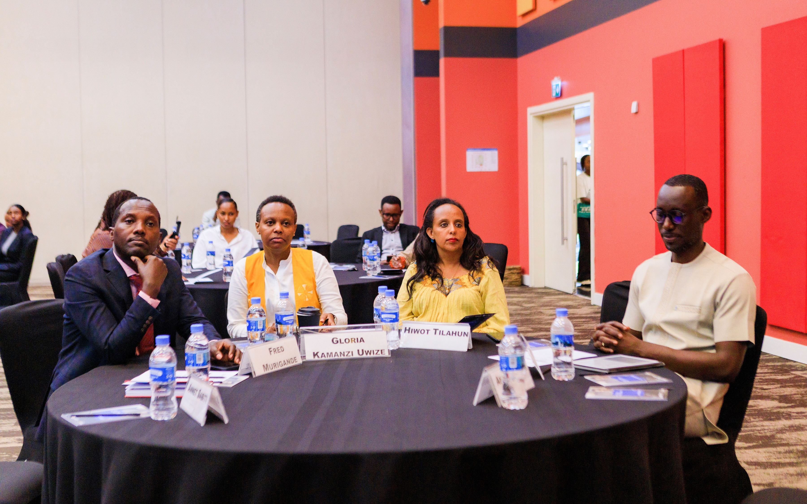

The ongoing Rwanda International Trade Fair has been described as an important platform for accelerating trade among African countries, with business leaders and trade experts urging governments and the private sector to organize more regional trade fairs to turn the African Continental Free Trade Area (AfCFTA) into real business opportunities.

The trade fair, one of the largest international exhibitions in the region, has brought together exhibitors, investors and entrepreneurs from more than 36 African countries, providing businesses with a platform to showcase products, find new markets and build partnerships across the continent.

The call was made during a high-level event organized by the Centre for Accelerated Women Economic Empowerment (CAWEE) in collaboration with the AfCFTA Secretariat, the Embassy of Ethiopia in Rwanda, and the Ethiopian Chamber of Commerce and Sectoral Associations (ECCSA). The event focused on increasing cross-border trade, particularly for women-led small and medium-sized enterprises (SMEs).

The discussions come as African countries continue implementing the AfCFTA, the world's largest free trade area by the number of participating countries. The agreement aims to create a single African market of more than 1.5 billion people with a combined gross domestic product (GDP) of about US$3.4 trillion, according to the AfCFTA Secretariat.

Despite that potential, trade among African countries remains low. According to the African Export-Import Bank (Afreximbank), intra-African trade accounts for only about 15% of Africa's total trade, compared with around 60% in Europe and about 50% in Asia. Speakers said increasing trade within Africa is critical for creating jobs, growing industries and reducing dependence on markets outside the continent.

Dr. Kananisa Lemi, Secretary General of the Ethiopian Chamber of Commerce and Sectoral Associations, said Rwanda's trade fair demonstrates how African countries can create opportunities for businesses to connect beyond their borders.

 "This is one of the biggest trade fairs in Africa, connecting businesses with businesses, governments, chambers of commerce and development partners so they can discuss how to move African business forward," Dr. Lemi said.

Dr. Lemi said more African countries should organize similar trade fairs to maintain business connections throughout the year instead of relying only on continental events.

 "The trade relationship within Africa is not good. Our intra-African trade is less than 20%, and that is why this kind of trade fair is very important. Other African countries also need to organize trade fairs that bring Africans together and strengthen Pan-African trade," he said.

The Ethiopian Chamber led a business delegation to Kigali to explore investment opportunities and strengthen commercial ties with Rwanda.

Lemi said political relations between Ethiopia and Rwanda are already strong, but trade between businesses in the two countries has not yet reached its full potential.

 "We don't have such a strong business-to-business relationship between Ethiopia and Rwanda. This trade fair creates opportunities to strengthen our business and investment relations, and AfCFTA has created a huge opportunity for us to do that," he said.

He added that Ethiopia has already started trading under the AfCFTA with countries including Kenya, Somalia and South Africa, and is looking to expand those trade links to Rwanda and other African markets. He also pointed to Ethiopian Airlines as an important tool for improving connectivity across the continent.

Officials from the AfCFTA Secretariat also stressed that national and regional trade fairs should continue alongside the continent's flagship Intra-African Trade Fair (IATF), which is held every two years.

The last edition of the IATF took place in Algiers, Algeria, while the next edition is scheduled for Lagos, Nigeria, in 2027.

Gemma Matshediso Mbegabolawe, Principal Officer for Women and Youth in Trade at the AfCFTA Secretariat, said countries should not wait for the continental event before creating opportunities for businesses.

 "We encourage countries and regions to organize their own trade fairs so entrepreneurs, women and youth do not wait for the continental one every two years. Trade must continue, networking must continue and business relationships must continue," she said.

She said such events allow entrepreneurs to share knowledge, discover new markets and create business partnerships that continue long after the exhibitions end.

Mbegabolawe also said the AfCFTA Secretariat is helping women and young entrepreneurs understand the trade agreement by working with governments to translate trade rules and other instruments into local languages.

 "Many women and young entrepreneurs operate small businesses with different education levels. Translating these instruments into local languages helps them understand the rules and trade confidently across borders," she said.

Opening the event, Ethiopia's Ambassador to Rwanda said Africa's economic transformation will depend on ensuring that women-owned businesses benefit from the AfCFTA and that member states move from discussing policies to implementing them. He said Ethiopia is carrying out reforms to improve access to finance, modernize logistics and simplify trade procedures to make regional trade more competitive.

As businesses continue networking at the Rwanda International Trade Fair, participants said the growing number of African countries represented in Kigali reflects increasing confidence in trading within the continent. They said regular regional trade fairs, together with the biennial Intra-African Trade Fair, will play a key role in helping Africa turn the AfCFTA from an agreement on paper into real business, investment and economic growth.

African Updates
