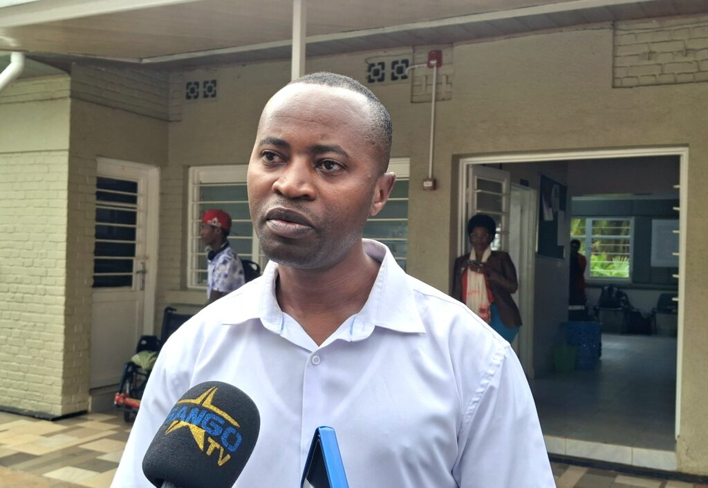
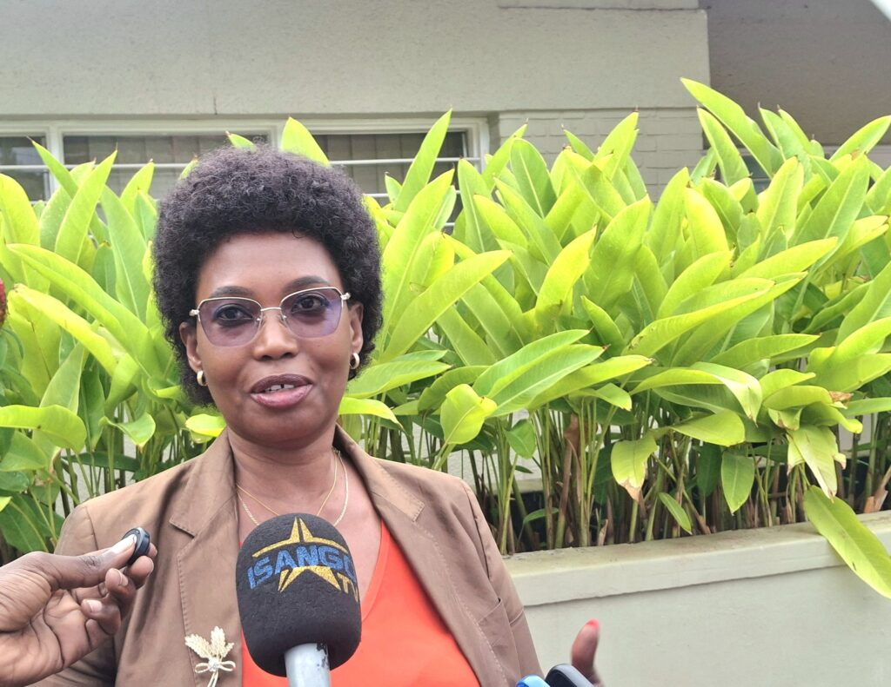
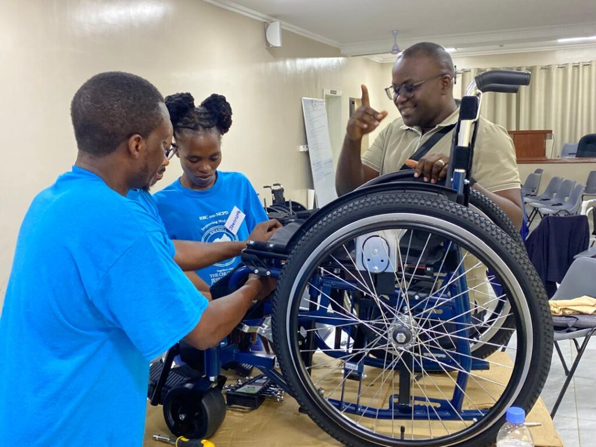
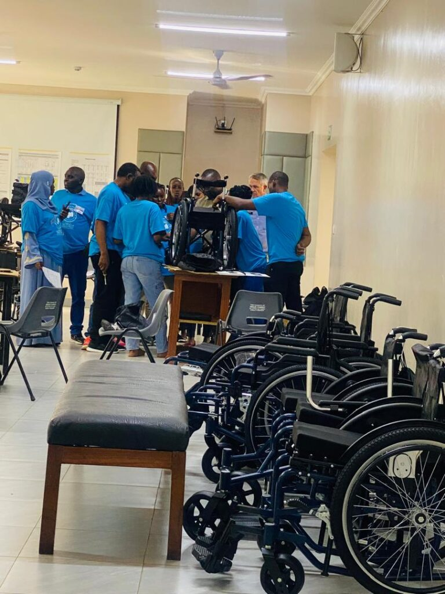
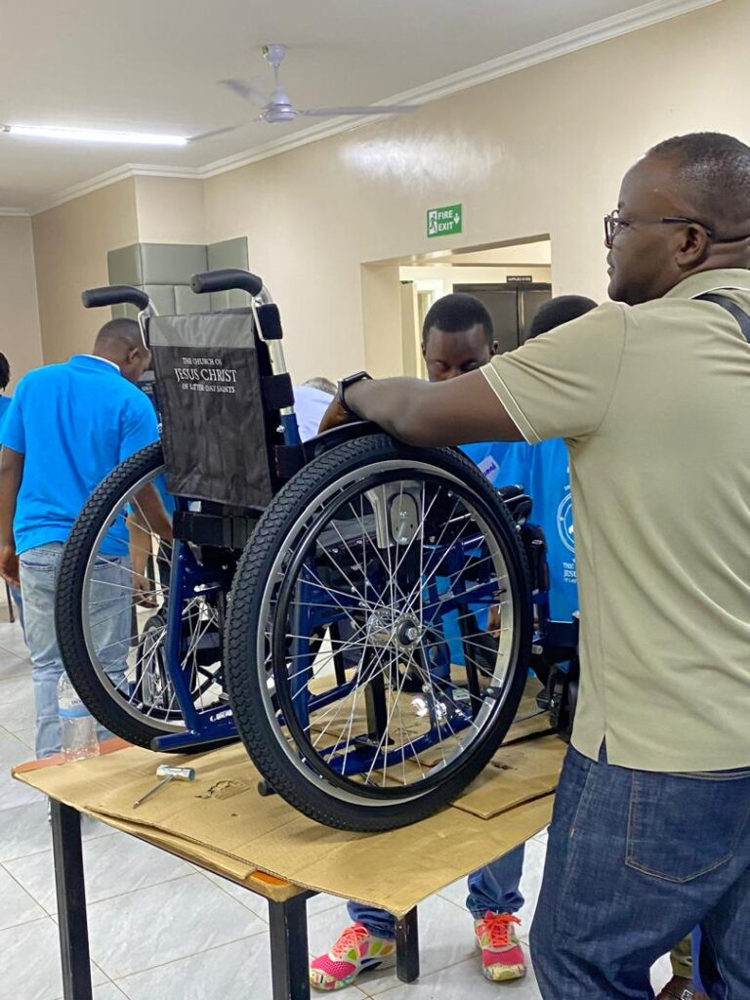
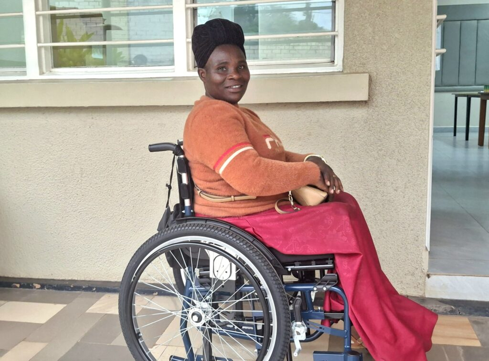
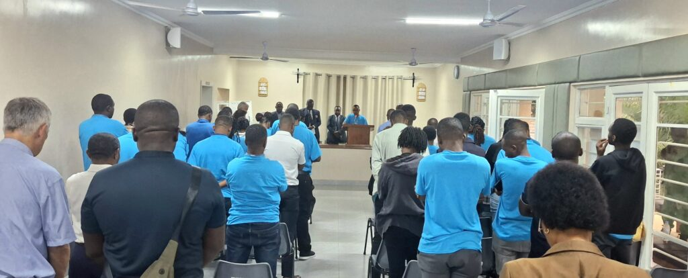

The Rwanda Biomedical Centre (RBC), in partnership with the Church of Jesus Christ of Latter-day Saints (LDS) and the National Council of Persons with Disabilities (NCPD), has launched a nationwide training program to strengthen wheelchair service delivery in Rwanda.

With financial support from UNICEF, the week-long training focused on wheelchair assessment, fitting, repair, and mobility orientation, aiming to improve the quality of life for people with disabilities. The session, held from October 27–31, brought together 39 physiotherapists, prosthetists, orthotists, and biomedical equipment technicians from district, provincial, and referral hospitals.

Speaking during the training, Jean Pierre Ndikumana, Country Representative of the Church of Jesus Christ of Latter-day Saints Wheelchair Project, said the initiative aims to build technical capacity and ensure that every person receives a wheelchair that truly fits their needs.

“We are training physiotherapists and hospital biomedical staff on how to assess, fit, and repair wheelchairs. A wheelchair must match the user’s type of disability an ill-fitting one can cause more harm than help,” said Ndikumana.

He added that Rwanda currently has about 900 wheelchairs and other assistive devices, including walking canes and crutches, available through the Ministry of Health for distribution across districts.

\[caption id="attachment\_42658" align="alignnone" width="1024"\] Jean Pierre Ndikumana, Country Representative of the Church of Jesus Christ of Latter-day Saints Wheelchair Project\[/caption\]

The training combined theory and practice. Participants worked directly with around 40 people with disabilities, who attended the sessions for real-time assessments and fittings.

By including users in the process, health professionals gained practical skills in mobility device assembly, adaptation, and repair. The final day focused on an Intensive Repair Workshop, where prosthetics and biomedical experts learned how to fix damaged wheelchairs brought in by users.

Among the innovations introduced was the Cross Terrain wheelchair a foldable model designed for rough terrain, offering more comfort and durability for rural users. The training also introduced basic wheelchairs for children with mild balance challenges.

Participants received instruction on mobility orientation, covering the proper use of walking aids like crutches, frames, and white canes.

RBC and partners emphasized that this training is part of a broader plan to make wheelchair and mobility services sustainable within Rwanda’s health system.

“We are also working with local rehabilitation centers such as Gahini and Gatagara to build local fabrication capacity, In the future, we hope to produce and repair some wheelchair parts locally instead of depending entirely on imports.” Ndikumana explained.

Irene Bagahirwa, Director of the Injuries and Disabilities Unit at the RBC’s Non-Communicable Diseases (NCDs) Division, highlighted that this year’s participants include focal persons who have not previously attended the annual training program. The aim is to expand expertise to new districts and ensure consistent quality of wheelchair prescriptions across the country.

Bagahirwa explained that the number of people categorized as having disabilities and in need of assistive devices has nearly doubled from 17,000 in 2015 to more than 32,000 today.

“Proper assessment and fitting are crucial to preventing complications and ensuring that users can live more independent, mobile lives, This requires consistent training and skills updates to ensure proper healthcare.” Bagahirwa said.

\[caption id="attachment\_42656" align="alignnone" width="1024"\] Irene Bagahirwa, Director of the Injuries and Disabilities Unit at the RBC’s Non-Communicable Diseases (NCDs) Division\[/caption\]

Currently, most of the wheelchairs used in Rwanda are imported, often requiring advanced technical knowledge for assembly and maintenance. Training local professionals is seen as a long-term solution to bridge this expertise gap.

Across Africa, the World Health Organization (WHO) estimates that only 5–15% of people who need wheelchairs have access to one. Many who receive them face challenges with poor fitting or lack of maintenance services issues Rwanda’s program aims to solve.

By improving assessment and repair skills, Rwanda is aligning with global efforts to ensure inclusive and appropriate mobility aids, reducing the risk of secondary complications, such as posture problems or pressure sores.

The collaboration between RBC, NCPD, LDS, and the Rwanda Union of the Blind marks a significant step toward inclusive healthcare and independence for persons with disabilities.

\[caption id="attachment\_42652" align="alignnone" width="1024"\] Trained health workers put their new wheelchair service skills into action.\[/caption\]

\[caption id="attachment\_42654" align="alignnone" width="768"\] Trained health workers put their new wheelchair service skills into action.\[/caption\]

\[caption id="attachment\_42655" align="alignnone" width="1024"\] Mukeshimana Jeanine beams with joy after receiving a new wheelchair\[/caption\]

\[caption id="attachment\_42657" align="alignnone" width="1024"\] A full house of health professionals during the wheelchair training session held in Kigali on 30th October 2025\[/caption\]

 

**African Updates**
