On Friday, May 2, 2025, President of The Republic of Rwanda Paul Kagame and First Lady Jeannette Kagame welcomed Guinean President Mamadi Doumbouya and First Lady Lauriane Doumbouya to their farm in Kibugabuga, Bugesera District. This visit underscores the growing friendship and cooperation between Rwanda and Guinea.

President Doumbouya arrived in Kigali on Thursday and engaged with members of the Guinean community in Rwanda on Friday morning. His visit is scheduled to conclude on Saturday.

The relationship between Rwanda and Guinea has strengthened over recent years. In April 2023, President Kagame visited Conakry, leading to the establishment of a Joint Cooperation Commission covering sectors such as agriculture, ICT, education, mining, and security . In October 2024, both countries signed 12 agreements to enhance collaboration in areas including public administration, export promotion, tourism, and special economic zones .

As Rwanda and Guinea continue to build on their partnership, their collaboration serves as a model of African solidarity and shared progress.

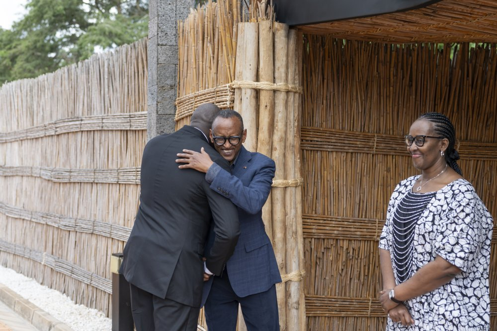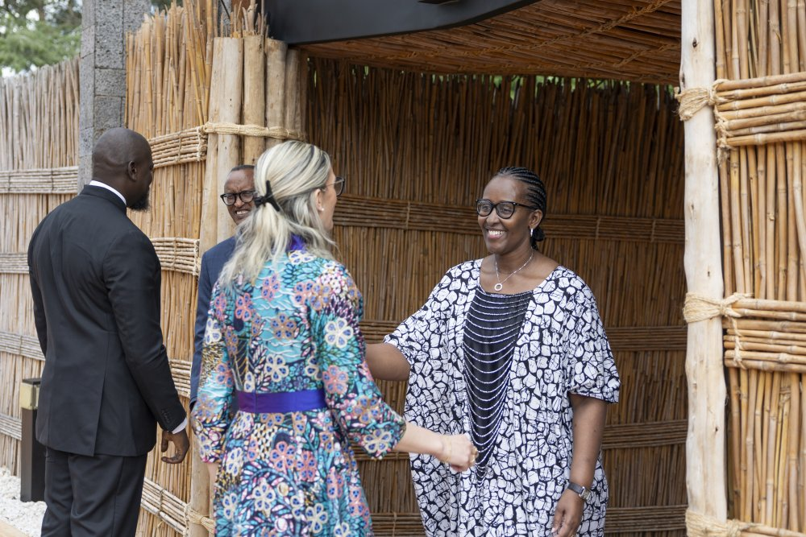

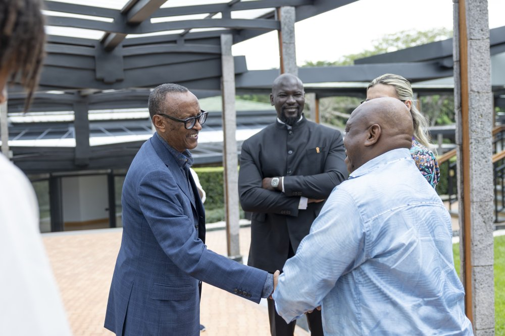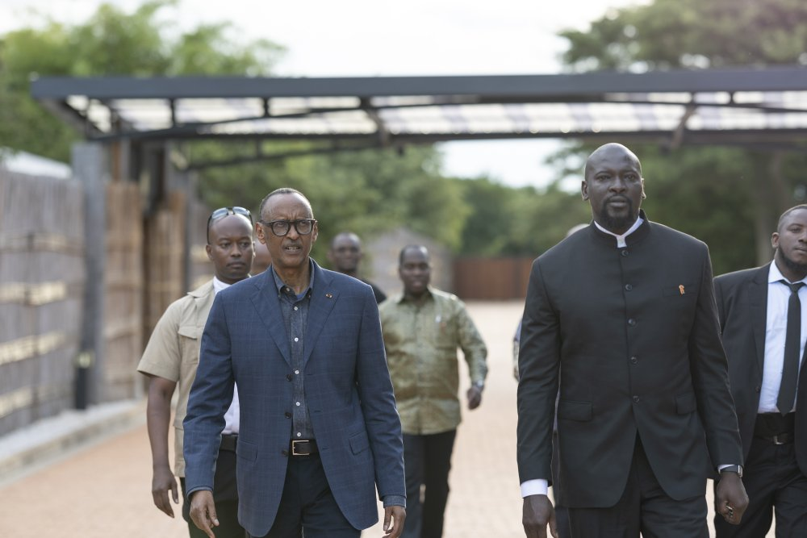

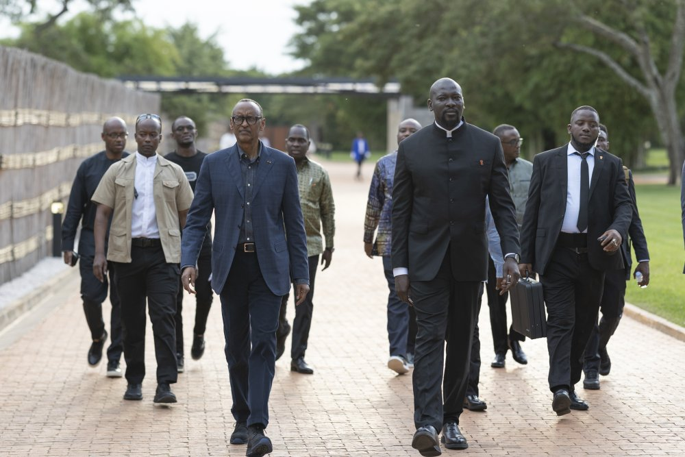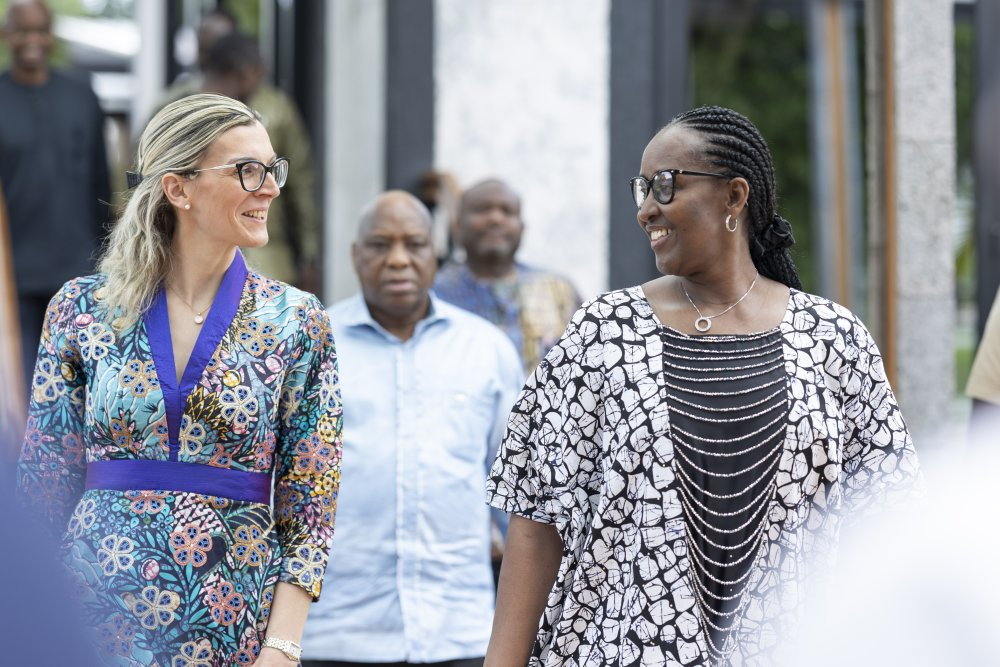

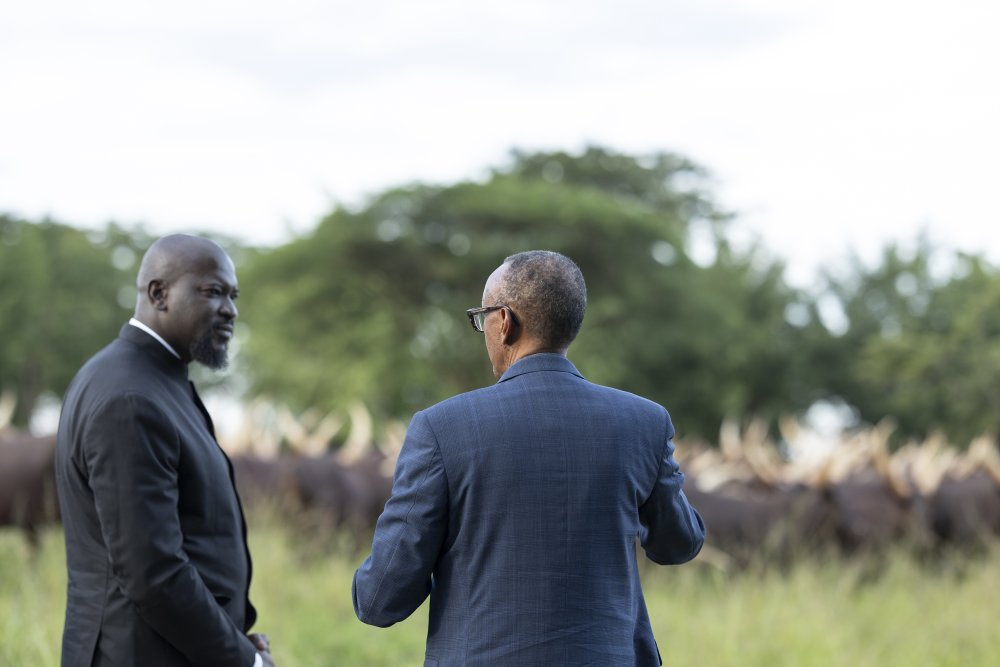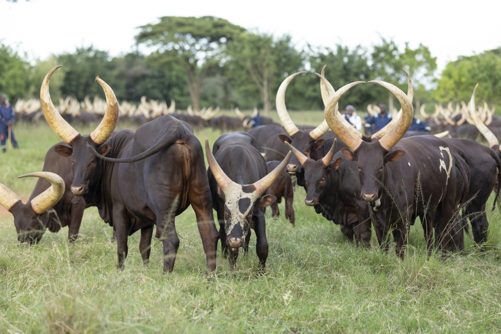 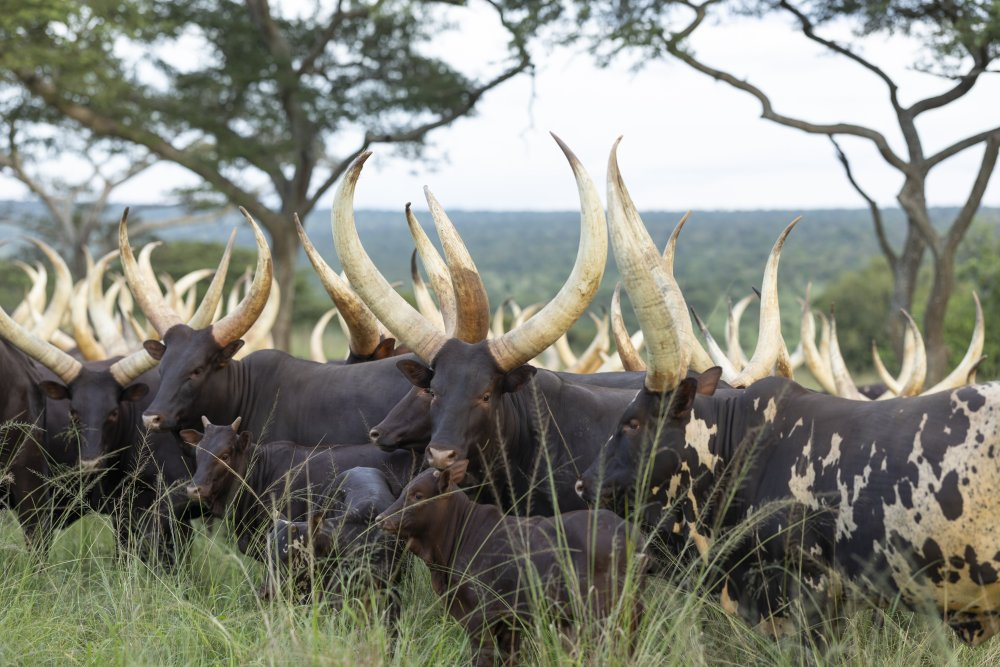

\[caption id="attachment\_32045" align="alignnone" width="1000"\]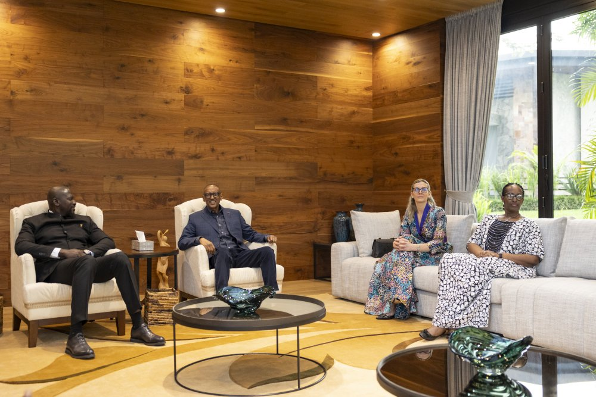 President Paul Kagame and First Lady Jeannette Kagame welcomed Guinean President Mamadi Doumbouya and First Lady Lauriane Doumbouya to their farm in Kibugabuga, Bugesera\[/caption\]

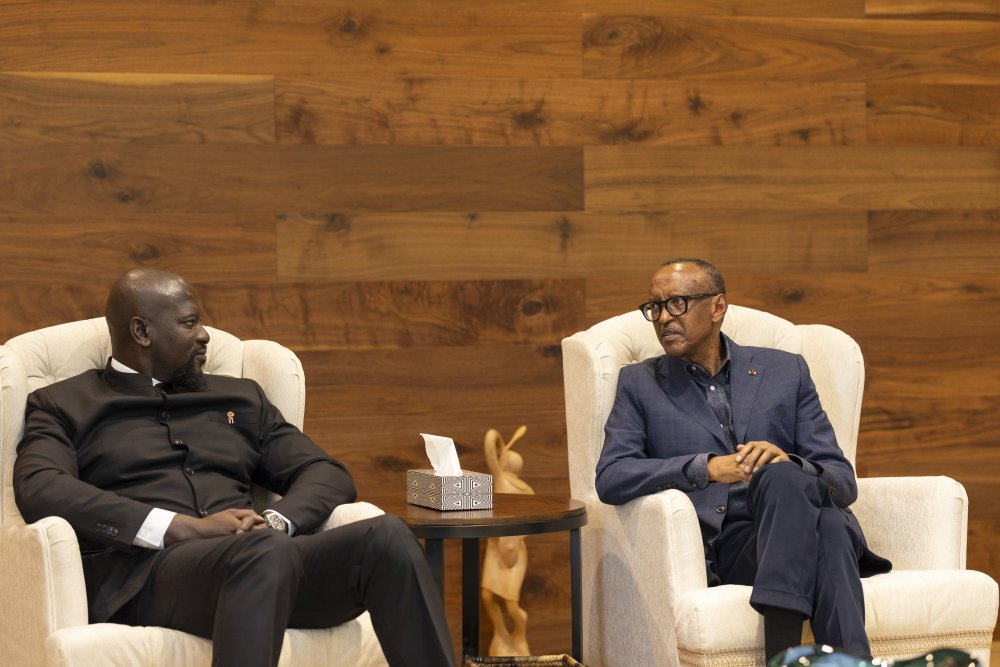

\[caption id="attachment\_32043" align="alignnone" width="1000"\]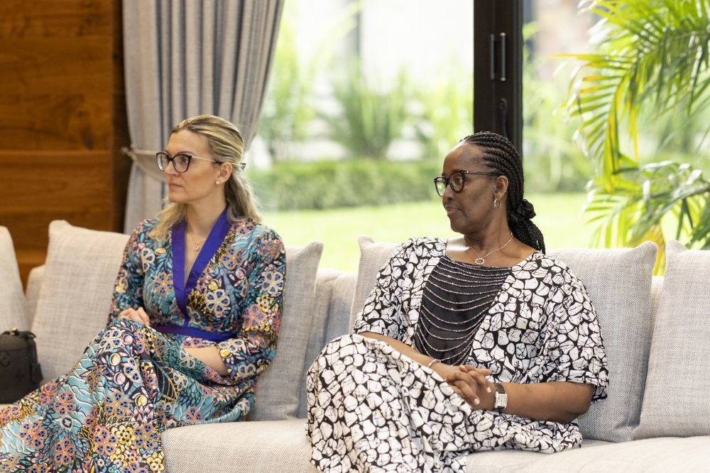 First Lady of Rwanda Jeannette Kagame and Guinea's First Lady Lauriane Doumbouya\[/caption\]

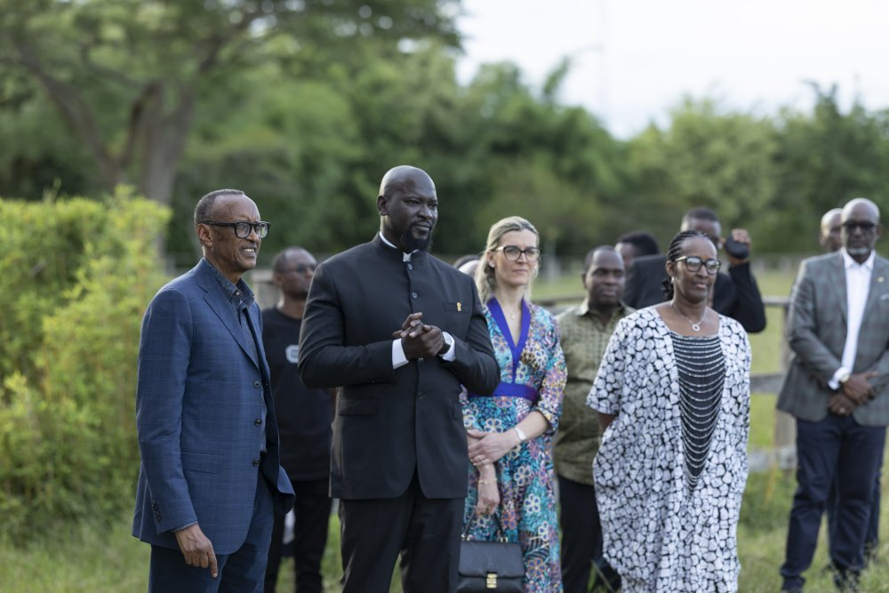

**African Updates**
