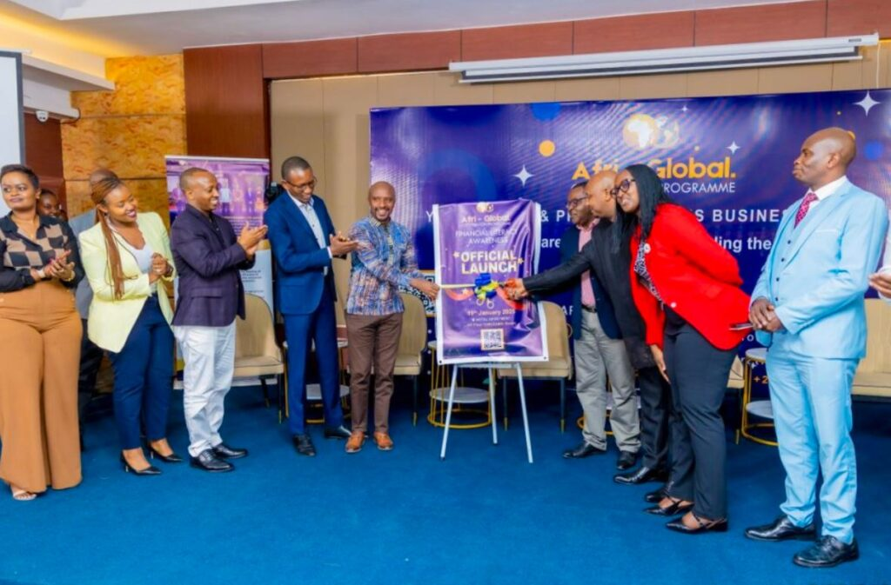
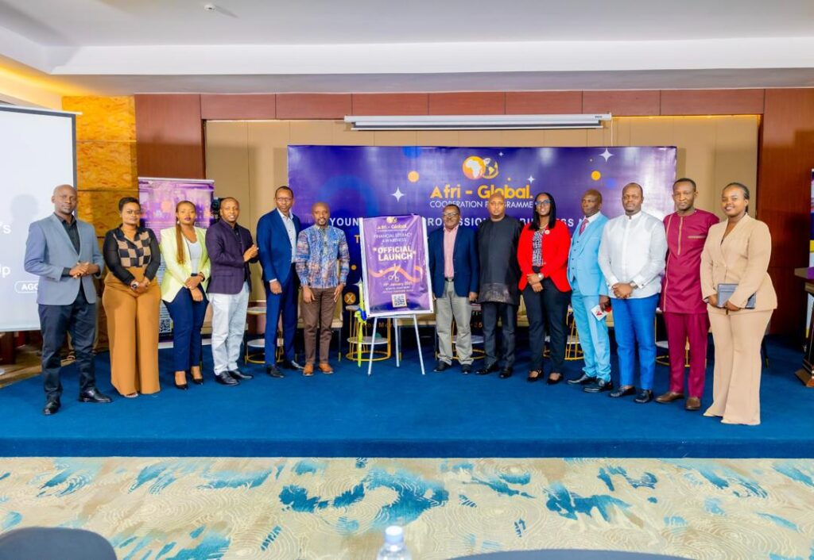
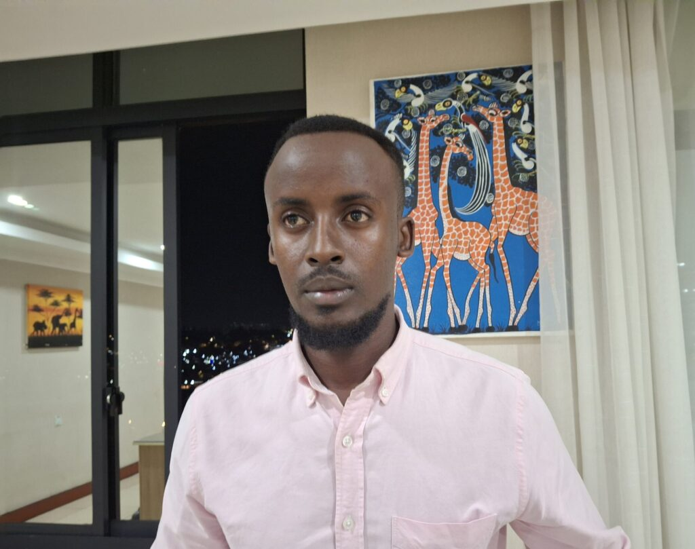
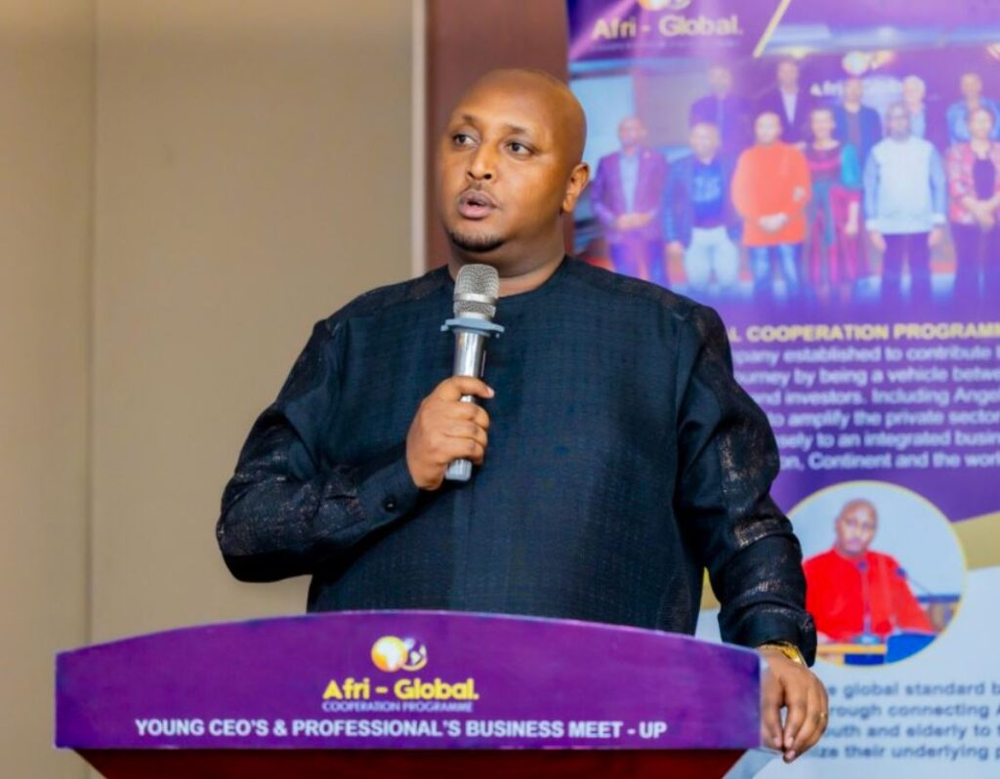
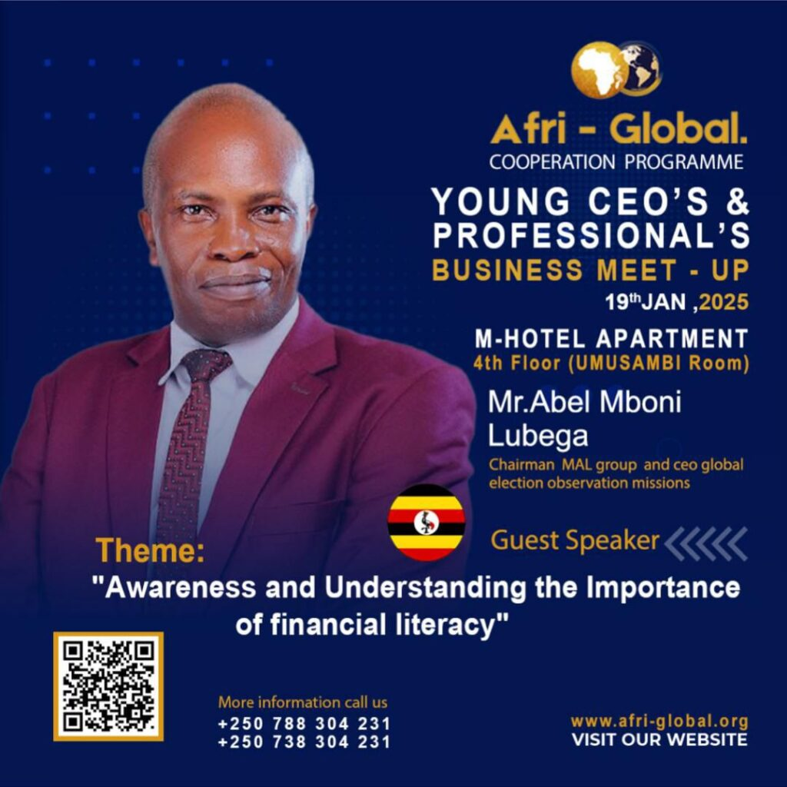
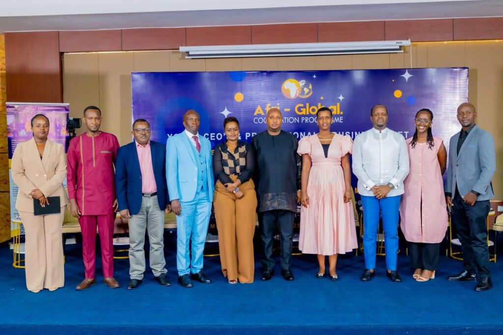
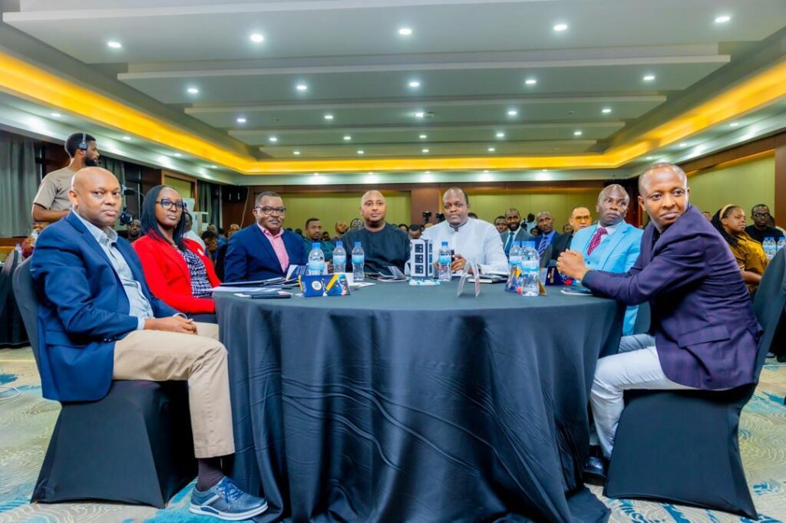
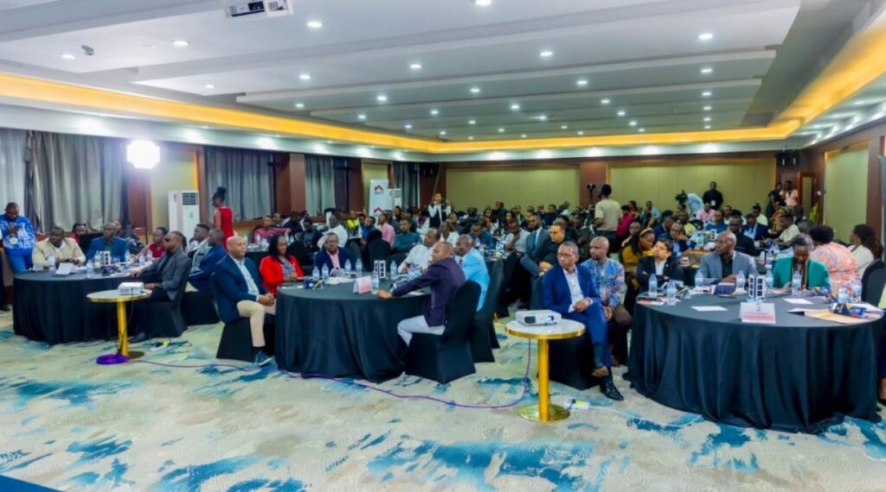

On Sunday, January 19, 2025, Kigali, Rwanda played host to a dynamic gathering of young CEOs and business professionals at a significant event aimed at discussing and promoting the importance of financial literacy. The event,  brought together industry leaders, entrepreneurs, and thought leaders to tackle pressing challenges and opportunities in the business world around the theme _"Awareness & Understanding the Importance of Financial Literacy,"_ The day was marked by the official launch of a nationwide financial literacy program, a significant step towards empowering the next generation of entrepreneurs.

The newly launched program aims to equip participants with the tools and knowledge necessary for making sound financial decisions and building sustainable businesses.

In an exclusive interview with _African Updates_, Ronald Kabera, CEO of ARO Group Ltd, a company specializing in manufacturing and interior design, shared his perspective on the challenges facing young entrepreneurs in Rwanda.

He emphasized that capital remains one of the biggest obstacles for most businesses, particularly startups. “The main challenge we face is finding capital,” Kabera said. “But I believe in pushing ourselves and starting from scratch, just as I did. With determination and financial knowledge, we can overcome this challenge and build our businesses from the ground up.”

\[caption id="attachment\_31742" align="alignnone" width="1024"\] Ronald Kabera, CEO of ARO Group Ltd, a company specializing in manufacturing and interior design\[/caption\]

Shyaka Nyarwaya Michael, Chairman of Afri-Global Cooperation Programme Ltd, highlighted the long-term vision for Rwanda’s business ecosystem, emphasizing the importance of preparing today’s entrepreneurs for the challenges of tomorrow. “There are people who can buy shares in the company. That can help these young CEOs so that in 2050, they will be pioneers, even billionaires, but we must start preparing them today,” said Shyaka. He also highlighted the ambitious goals of the National Strategy for Transformation (NST2), which aims to create 250,000 youth jobs annually.

Shyaka believes that by working together with young CEOs, the government, and private sector partners, Rwanda can create even more opportunities. “If we collaborate, we can aim to create 500,000 jobs, reducing unemployment and driving economic growth,” he added. This collaboration is essential for achieving broader national objectives, such as ensuring every citizen earns at least $4,000 per year by 2035.

\[caption id="attachment\_31743" align="alignnone" width="1024"\] Shyaka Nyarwaya Michael, Chairman of Afri-Global Cooperation Programme Ltd\[/caption\]

One of the most impactful moments of the event came during a panel session with Dr. Mboni Abel, CEO of GEOM and Chairman of Mal Group. Dr. Mboni offered valuable advice to young entrepreneurs, stressing the importance of financial literacy in shaping Africa’s future. “Let us join hands and be partners to ensure that financial literacy reaches everyone—not only in Rwanda but across Africa. We have all the resources, we have everything we need,” he said.

He urged young CEOs to seek guidance as they navigate the challenges of entrepreneurship, recognizing that no one can succeed alone. “If the youth are lifted, the problem of Africa is solved,” he emphasized.

Dr. Mboni’s words resonated deeply with the audience, highlighting the importance of saving, reinvesting, and expanding businesses in order to achieve long-term growth.

\[caption id="attachment\_31748" align="alignnone" width="1024"\] Dr. Mboni Abel, CEO of GEOM and Chairman of Mal Group\[/caption\]

The Young CEOs & Professionals Business Meet-Up was not just an event, but a starting point for a new era of financial awareness and empowerment. With the launch of the financial literacy program, young entrepreneurs in Rwanda now have access to essential resources that will enable them to make smarter financial decisions and build thriving businesses.

As Rwanda continues its journey toward economic growth and prosperity, events like these play a pivotal role in shaping the future of the country's business landscape.

**African Updates**
