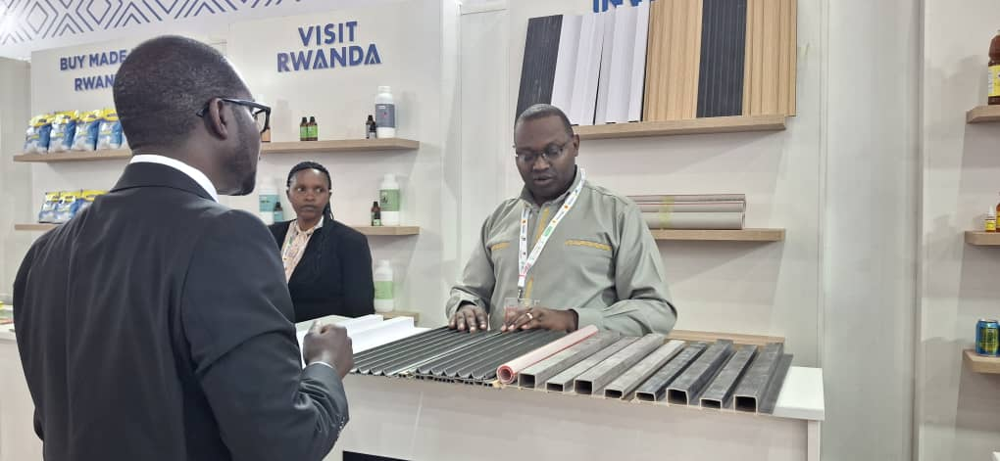
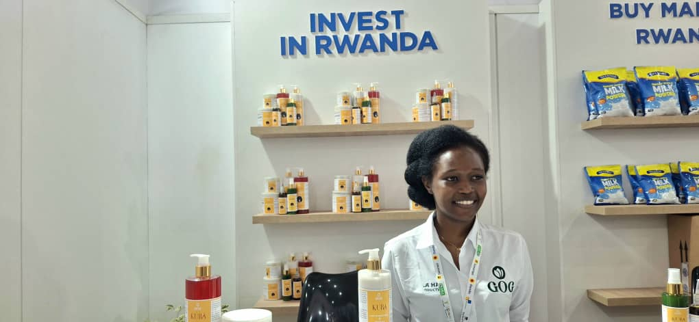
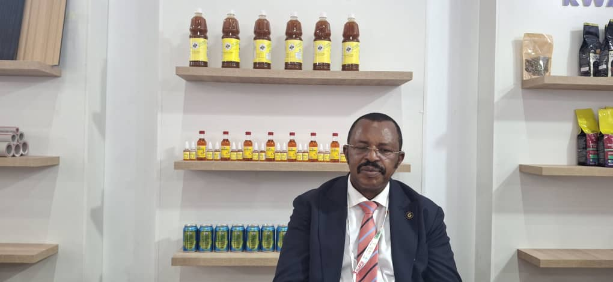
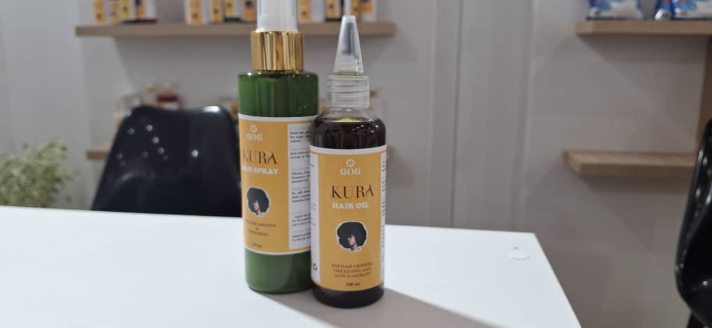
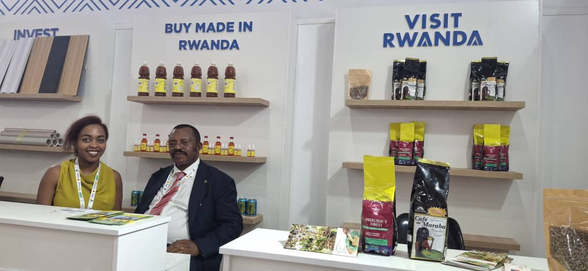

The Intra-African Trade Fair (IATF 2025) is underway in Algiers, Algeria. The fair started on 4 September and will end on 10 September 2025. It is the 4th edition, bringing together all African countries in one place.

At the previous IATF 2023 held in Cairo, Rwanda faced challenges with packaging. Their products were often more expensive compared to others. This was due to Rwanda’s ban on single-use plastics, which made packaging harder to find.

Rwanda’s Minister of Trade, Prudence Sebahizi, told _African Updates_ that the issue is now being solved. “We now have industries producing boxes and paper bags. It was a hard journey but today Rwanda can manufacture packaging materials.”

****Exhibitors at the Algiers fair confirm this progress. Goodluck Mutoni, producer of _Kura Oil_, said packaging is no longer a barrier. “Before, it was very hard. Importing took time. Now, thanks to Rwanda Rema, we even get accreditation quickly, even on weekends. Competing is no longer difficult.”

Mutoni added that the challenge today is building trust inside Rwanda. “Some people still believe imported products are better. But we know this mindset will change.”

\[caption id="attachment\_41029" align="alignnone" width="1020"\] Goodluck Mutoni, producer of Kura Oil\[/caption\]

Another Rwandan exhibitor is Dr. Sina Gerard, CEO of _Entreprise Urwibutso_, famous for _Akabanga_ chili oil. His company is among the biggest in Rwanda. He said the fair is a chance to advertise across Africa. “It is a way of increasing our market outside Rwanda and supporting the country’s economic growth.”

On packaging, Dr. Gerard advised fellow producers to focus on quality. “People should buy because of the quality, not only because of packaging or price.”

\[caption id="attachment\_41032" align="alignnone" width="1020"\] Dr. Sina Gerard, CEO of Entreprise Urwibutso\[/caption\]

With Africa importing over $40 billion of food annually despite vast resources, events like IATF underline the urgency of strengthening local industries, improving value addition, and creating regional supply chains.

As the fair continues until 10 September 2025, it is clear that African businesses are not only showcasing their products they are shaping the continent’s future in trade and industrializ****

\[caption id="attachment\_41031" align="alignnone" width="1020"\] Dr. Sina Gerard, CEO of Entreprise Urwibutso, one of Rwanda’s largest companies and producer of the internationally known Akabanga chili oil\[/caption\]

**African Updates**
