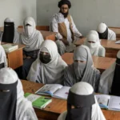

**Rebero, Rwanda** – As the National Commemoration Week concluded at the Rebero Genocide Memorial, Rwanda paid tribute to politicians who bravely opposed the 1994 Genocide against the Tutsi. Prime Minister Dr. Ngirente joined Senate President François Xavier Kalinda and other senior officials in honoring these individuals, whose courage and sacrifice continue to resonate in Rwanda's journey towards healing and unity.

Senate President François Xavier Kalinda emphasized the significance of the annual commemoration held every April 13th. "It is essential that we remember these politicians who were killed because they stood against the genocide," Kalinda stated. "Their dedication to fighting the genocide against the Tutsi serves as a powerful lesson for the future of our country."

In his address, Kalinda underscored the nature of the genocide. He further highlighted the detrimental influence of Belgium's colonial legacy, noting, "Belgium played a crucial role in dividing Rwandans by creating political parties based on ethnic divisions."

The commemoration at Rebero serves as a poignant reminder of the individuals who risked and lost their lives in the fight against hatred and division. Their memory reinforces Rwanda's commitment to "Never Again," and to fostering a society built on unity and reconciliation.

This has not only honored the past but also served as a call to action for future generations to uphold the values of justice and peace. By remembering the past, Rwanda aims to safeguard its future.

   

**African Updates**
