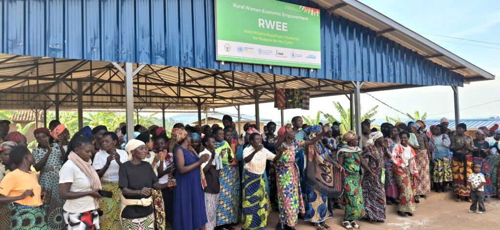
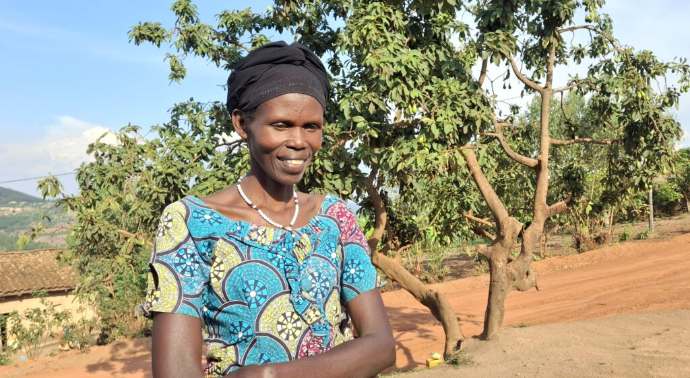
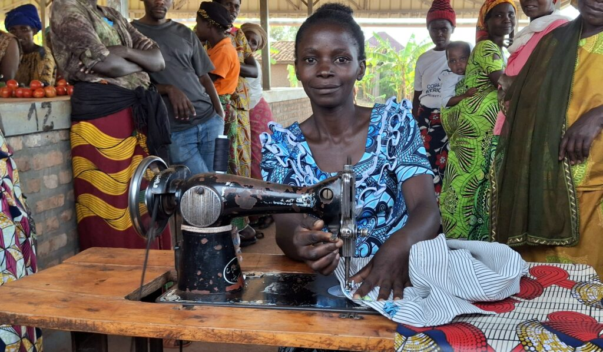
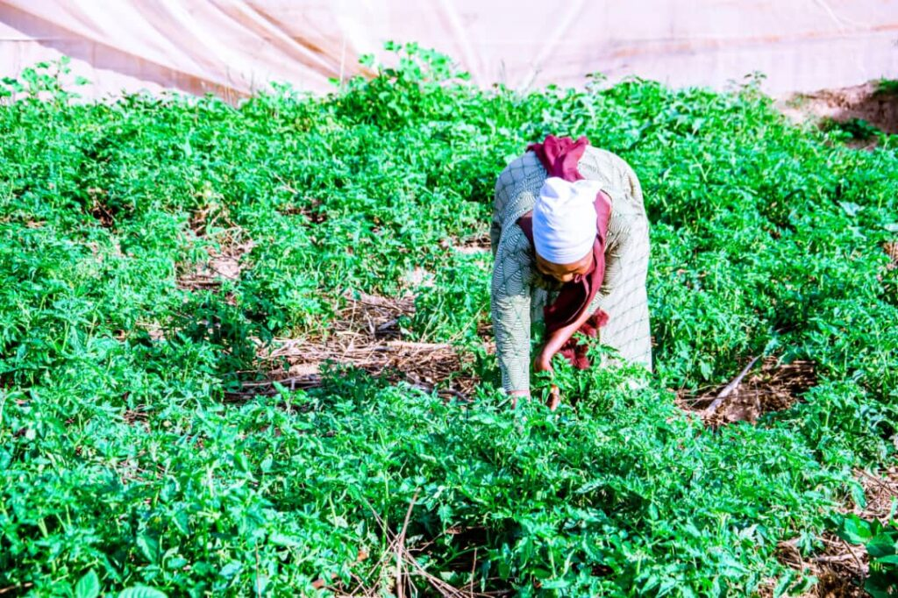
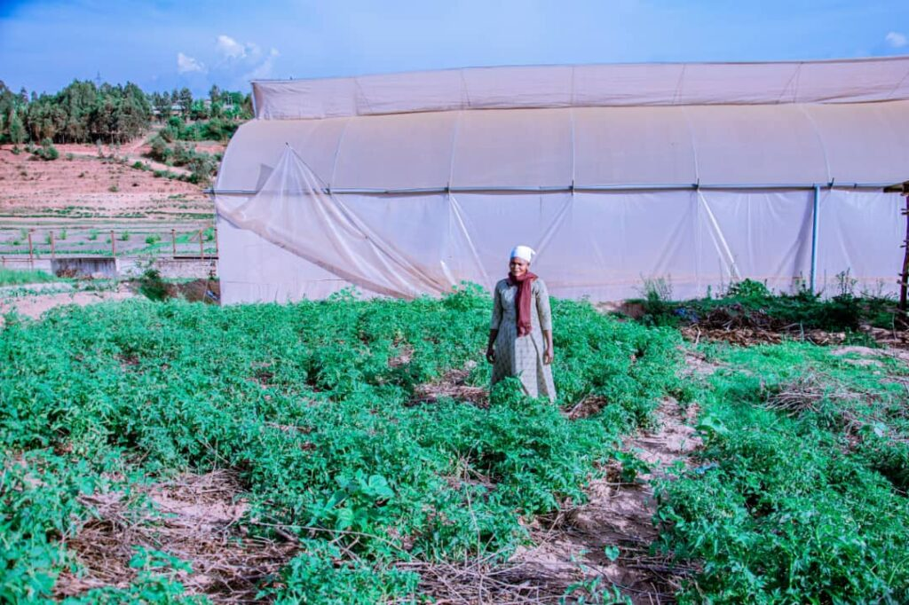
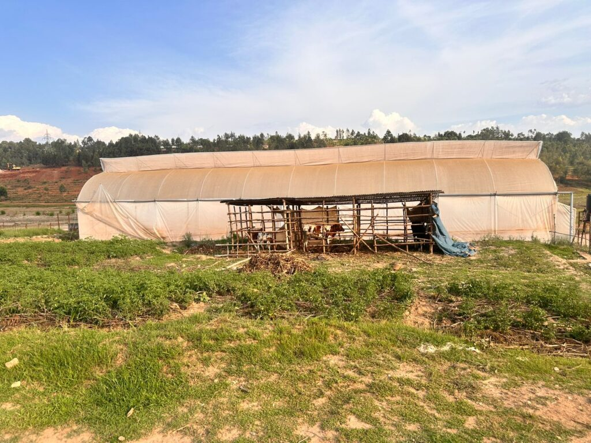
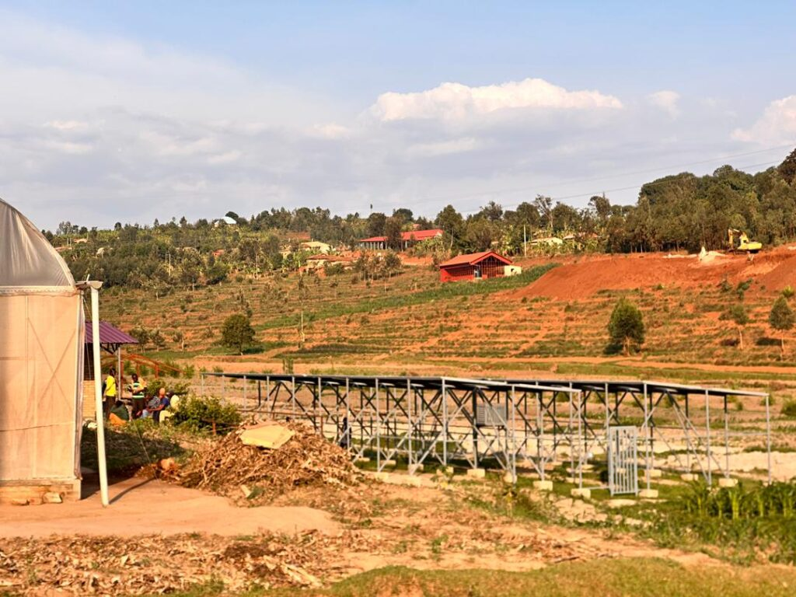
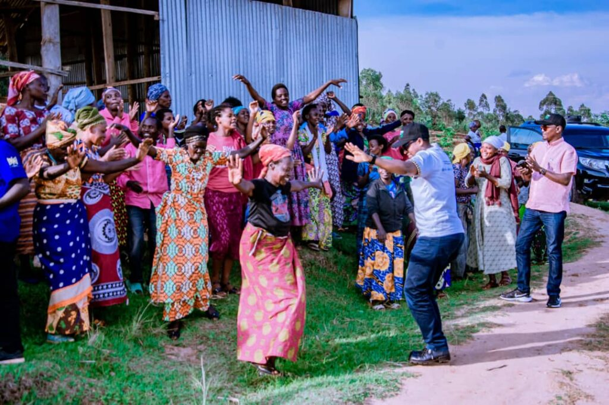

A quiet revolution is transforming the lives of rural women across five districts in Rwanda, turning smallholder farmers into confident entrepreneurs and community leaders. Through the Joint Programme on Accelerating Progress towards Rural Women’s Economic Empowerment (JP RWEE), a global initiative bringing together key UN agencies and the Government of Rwanda to strengthen women’s livelihoods and resilience in agriculture.

The program's impact is vividly clear in Gisagara District, Southern Province, where women are moving beyond traditional subsistence farming to embrace modern, climate-resilient agricultural practices and market access.

For Clementine Mushimiyimana, a mother of seven from Rwamutabazi village, Shyanda Cell, the JP RWEE program was a turning point. Before joining, the elder woman felt a lack of confidence and respect at home.

“Development activities had not reached me before. I worried if I could even earn enough to buy a piece of new fabric for myself,” she shared.

After receiving training in trade and entrepreneurship through the program, Clementine took a small loan of 40,000 Rwandan Francs (RWF) to start a small business selling local snacks.

"That small venture made me a respected woman at home. We no longer had to struggle to buy small household essentials," she said.

The program’s holistic approach goes beyond simple cash transfers. Clementine was equipped with essential knowledge and tools, which include Enabling her to manage loans and savings. Receiving a water tank for rainwater, help her to maintain a family vegetable garden of crops like eggplant and green pepper during dry spells and She was able to purchase a cow and consistently pay for the family's health insurance, ensuring her children now have school uniforms.

Looking ahead, Clementine's ambition is set on securing a dairy cow to provide milk for her small children and grandchildren a testament to her newfound economic autonomy.

\[caption id="attachment\_42584" align="alignnone" width="1024"\] Clementine Mushimiyimana, a mother of seven from Rwamutabazi village, Shyanda Cell, Save Sector in Gisagara Sector\[/caption\]

In the same area, Leontine Uwitonze, a single mother and talented tailor, celebrates the transformation of her work environment.

"Before we got the market facility, I used to do tailoring at the front doors of other people’s houses. It was difficult; clients often couldn’t find me, and I had to pay to work there," Leontine recounted.

The JP RWEE supported the creation of a dedicated market space, a central hub for the women's cooperatives. "Now, I can come anytime, clients find me easily, and I am thankful," she exclaimed.

Leontine is part of a Village Savings and Loan Association group, where members save a small, manageable amount just 250 RWF per week. This collective saving mechanism, a core component of the program's focus on financial inclusion, provides the capital needed for their cooperatives to thrive. Her future plan is to purchase an additional sewing machine and start teaching tailoring skills to others.

\[caption id="attachment\_42585" align="alignnone" width="1024"\] Leontine Uwitonze, a talented tailor, celebrates the transformation of her work environment\[/caption\]

The commitment to collective growth is evident in local cooperatives. Mukagatsimbanyi Claudine, President of the Twitezimere Cooperative, explained that while membership fluctuated as some members left when they realized they would not receive free money but training and skills, the core group is dedicated to sustained progress.

Similarly, the Inkingi z’Iterambere Cooperative in Shyanda cell is embracing modern agriculture. They manage a valuable greenhouse structure and have moved past old farming methods.

Rukundo Jean Claude, the Vice President, noted, "We used to use poor-quality seeds. Now, we work with the Rwanda Agriculture and Animal Resources Development Board (RAB) to source certified, high-yielding seeds."

Another cooperative member, Vestine Nyirahabimana, highlighted the vital post-harvest training. "We now harvest maize and keep it in a proper warehouse, allowing us to sell it at a better market price. Before, we lost a lot of money because our stored produce would get contaminated due to poor drying techniques," she explained, thanking the JP RWEE for the knowledge on post-handling equipment and quality preservation.

The cooperative's ability to now cultivate diverse and high-value crops like eggplant and tomatoes year-round is further secured by the program's provision of irrigation machinery and water tanks essential tools for climate-smart agriculture in a nation heavily reliant on rainfall.

 Implemented by UN agencies FAO, IFAD, UN Women, and WFP in partnership with the Government of Rwanda, the JP RWEE Phase II (2023-2027) aims to reach 9,000 smallholder farmers, 80% of whom are women.

The program's success in Gisagara and other districts Kirehe, Ngoma, Nyamasheke, and Nyaruguru demonstrates the power of empowering rural women not just as beneficiaries, but as active agents of change. By aligning with national strategies like the National Strategy for Transformation (NST2), the JP RWEE ensures that the voices and realities of women like Clementine and Leontine directly inform and shape Rwanda’s development agenda, creating a blueprint for gender equality and sustainable growth across the African continent.

  

**African Updates**
