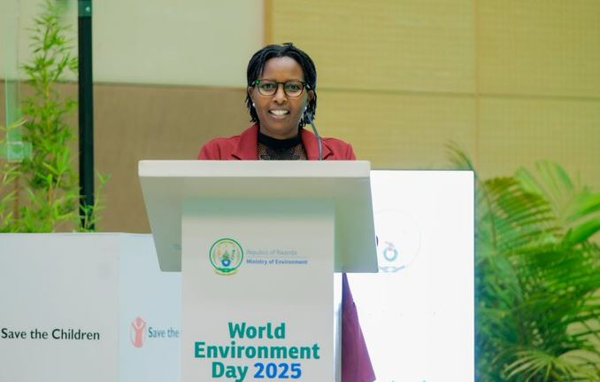
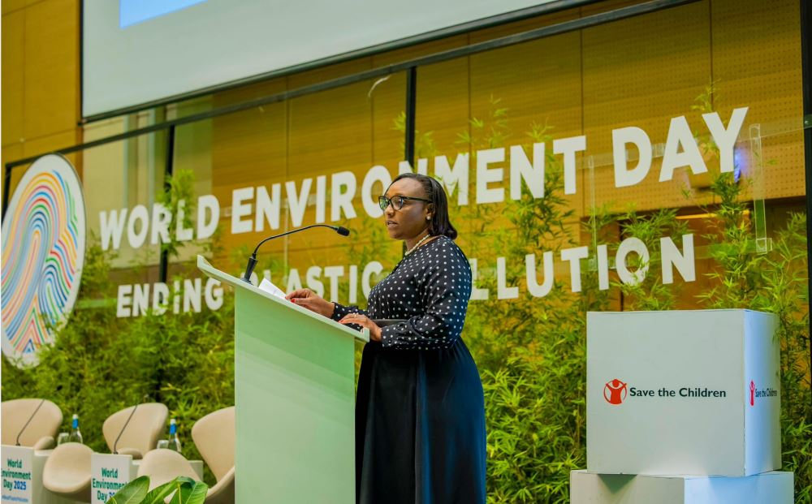
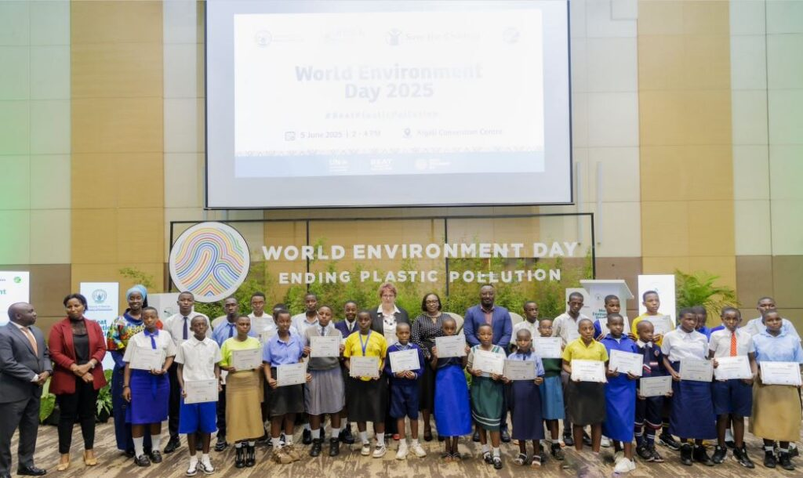
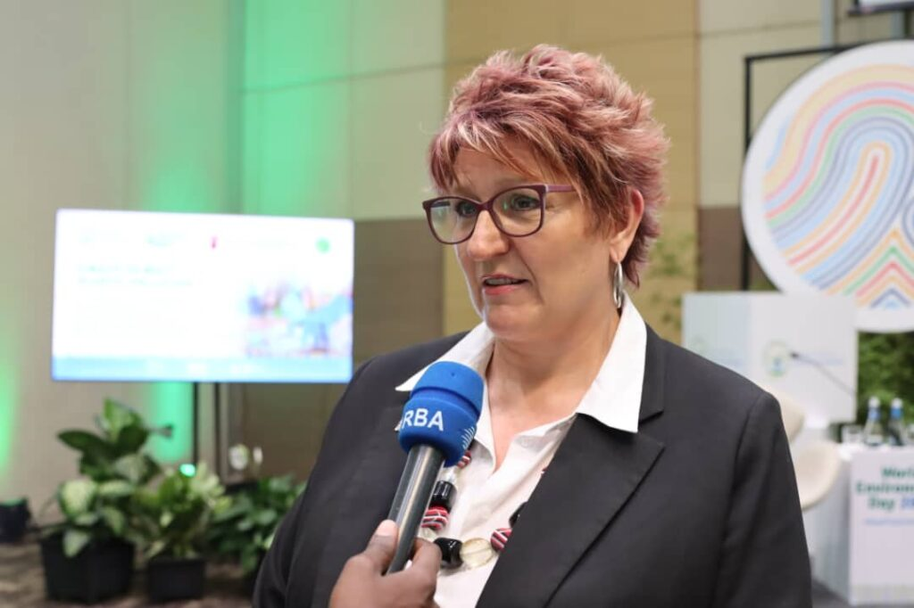
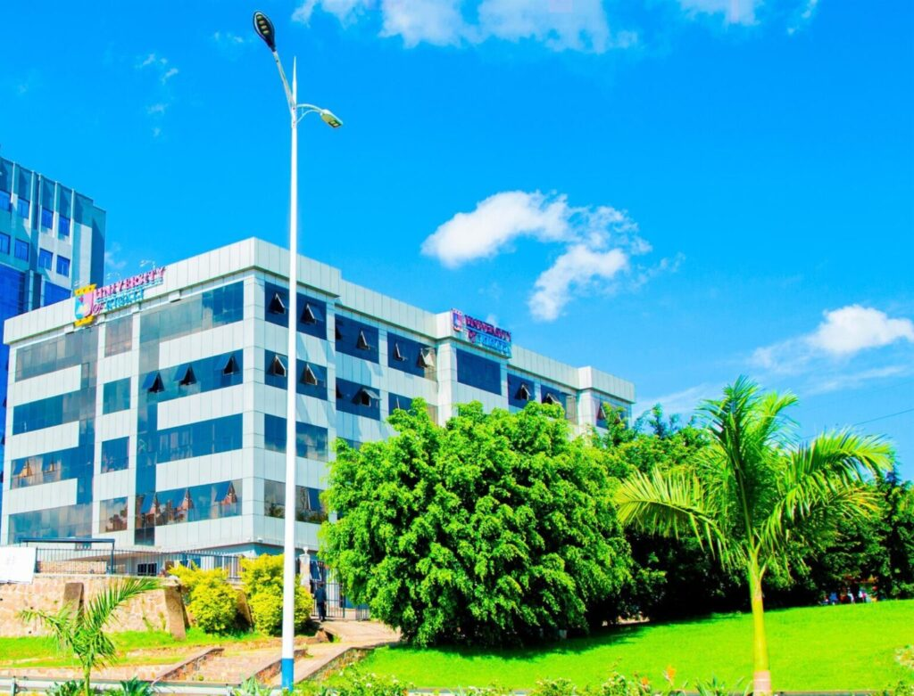
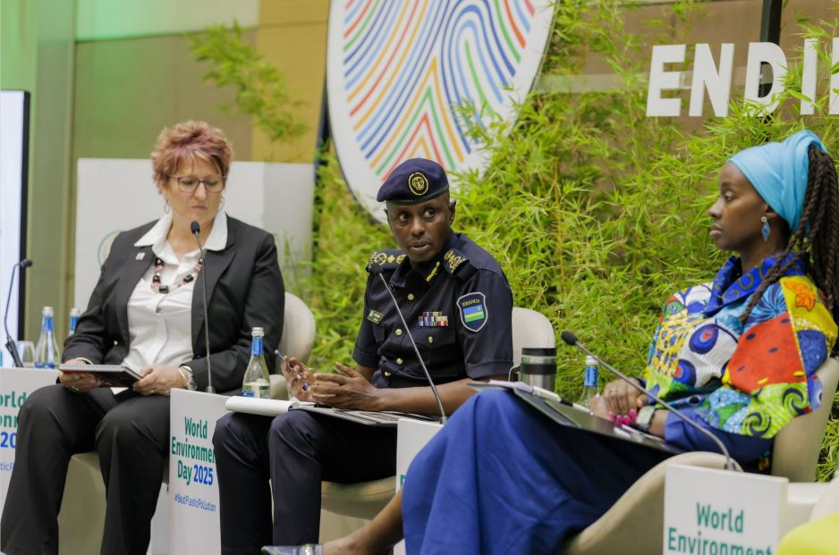

KIGALI, Rwanda: As the world recently marked World Environment Day, Rwanda stood out as a testament to what focused environmental policies and strong national commitment can achieve. With a proactive stance against plastic pollution and a growing focus on sustainable development, the East African nation offers valuable lessons for the continent and beyond.

During recent World Environment Day celebrations, Rwanda's leaders shared their amazing journey. Juliet Kabera, Director General of the Rwanda Environment Management Authority (REMA), explained how serious plastic pollution is. "Plastic pollution threatens our ecosystems, our health, our climate and so much more across the world, Without action, studies have projected and show that plastic pollution will triple by the year 2040, but Rwanda chose a different path early, early enough, and with determination." she said.

Rwanda's fight against plastic started small in 2004, targeting thin plastic bags. Then, in 2008, they made a big move: they completely banned plastic bags, becoming one of the first countries in the world to do so. By 2019, they went even further, banning almost all single-use plastics the kind you use once and throw away, like plastic bottles and straws.

"These policies, one were not important. They are inspired by the realities we faced here at home," Kabera explained. Because of these strong actions, Rwanda's capital, Kigali, is famous for being one of Africa's cleanest cities. You won't see plastic bags clogging drains or littering hillsides anymore.

Banning plastics didn't just make things cleaner; it also created new businesses and jobs. REMA and a group of private businesses teamed up. They put a small fee on companies that make plastics, and that money helps collect and recycle old plastic.

"Because of this initiative, thanks to the PSF, 24 plastic collection points have been put in place Countrywide, And they have recovered over 1500 tons of single use plastics, and more than 1200 jobs in waste collection and management have been created." Kabera proudly announced.  Rwanda even added a tiny fee (0.2%) on goods imported in plastic packaging to further fund these cleanup efforts.

\[caption id="attachment\_32157" align="alignnone" width="678"\] Juliet Kabera, Director General of the Rwanda Environment Management Authority (REMA)\[/caption\]

Dr. Valentine Uwamariya, Rwanda's Minister of Environment, said the plastic ban "not only improved clean waste, but also opened the doors for investment and job creation." She pointed out that there are now "14 industries now active in plastic recycling and the production of alternative packaging made from cloth, banana leaves and apparents."

\[caption id="attachment\_32154" align="alignnone" width="1000"\] Dr. Valentine Uwamariya, Minister of Environment in Rwanda\[/caption\]

Henriette Uwera Nshimiyimana Marketing Officer at Earth Biobag Ltd a company that makes special bags from cornstarch and cassava that break down into natural materials in about 180 days. "Most of the people don't know about us," she mentioned. She also hopes they can start making their raw materials right here in Rwanda instead of importing them from Europe, which would make their products even cheaper.

### Protecting Our Planet, A Big Global Goal

World Environment Day this year also celebrated biodiversity the variety of life on Earth. Minister Uwamariya stressed that fighting plastic pollution and protecting nature are deeply linked to solving the world's "triple planetary crisis. These are pollution, biodiversity loss and climate change."

These goals align with important global targets, like using resources wisely (SDG 12), taking action on climate (SDG 13), protecting oceans (SDG 14), and caring for land (SDG 15). Even with all the efforts, plastic pollution is still a huge worldwide issue. The United Nations has focused on it three times in just seven years, which shows how serious it is. "If current trends continue, plastic waste food outweigh fish in our oceans by 2050!" she warned.

### 

Children are also playing a big role in this green movement. Jo Musonda, Country Director for Save the Children in Rwanda and Burundi, noticed that kids everywhere are worried about climate change. "Children can see there's more droughts, there's more floods, there's more effect on the climate," she observed.

Musonda praised Rwanda's kids for growing up in a clean environment. "I think children in Rwanda have grown up in this environment of picking up rubbish, of not, you know, using like plastics anyhow," she said. "And I think the way that you grow up influences what you do as an adult. So I think in Rwanda, children ahead of the game here." She believes teaching more about the environment in schools and creating "green jobs" (jobs that help the environment) are key for all of Africa. She also sees Rwanda as a shining example for other African countries, proving that "you can't do it. You've proven you can do it."

\[caption id="attachment\_32153" align="alignnone" width="1024"\] Jo Musonda, Country Director for Save the Children in Rwanda and Burundi\[/caption\]

Even universities are getting involved. Dr. Ronald Kwena from the University of Kigali said his university is building a "green campus" and creating new study programs about sustainable development and fighting climate change. "We are actually working on a circular economy research project where we are trying to identify waste collection at the household level and coming up with solutions to try and solve this problem of of waste," he explained, noting their focus on converting waste into useful things like farm fertilizer.

\[caption id="attachment\_32159" align="alignnone" width="1024"\] The University of Kigali is actively promoting eco-friendly practices and fighting environmental pollution.\[/caption\]

While Rwanda has done a lot, challenges remain, including "limited alternatives, there are financing gaps, cross border, plastic flows and market pressures." But the call to action is clear.

"I therefore call on all Rwandans to play their part, starting with their everyday actions that make a real difference," Minister Uwamariya urged. Her message was clear: "Say no to unnecessary packaging and break reusable bags while shopping, say no to single use plastics such as bottles, cups and straws, and instead use reusable bottles and cups. Clean up our environment and invest in reuse and plastic recycling."

Rwanda's long-term goal is to be a prosperous nation that is clean and resilient to climate change by 2050. The country's strong environmental laws, new ideas, business involvement, public awareness, and strict enforcement make it a shining example for all of Africa. As Juliet Kabera proudly stated, "These everyday actions multiplied across the country, and the reason Rwanda has become a global example in the fight against plastic pollution."

**African Updates**
