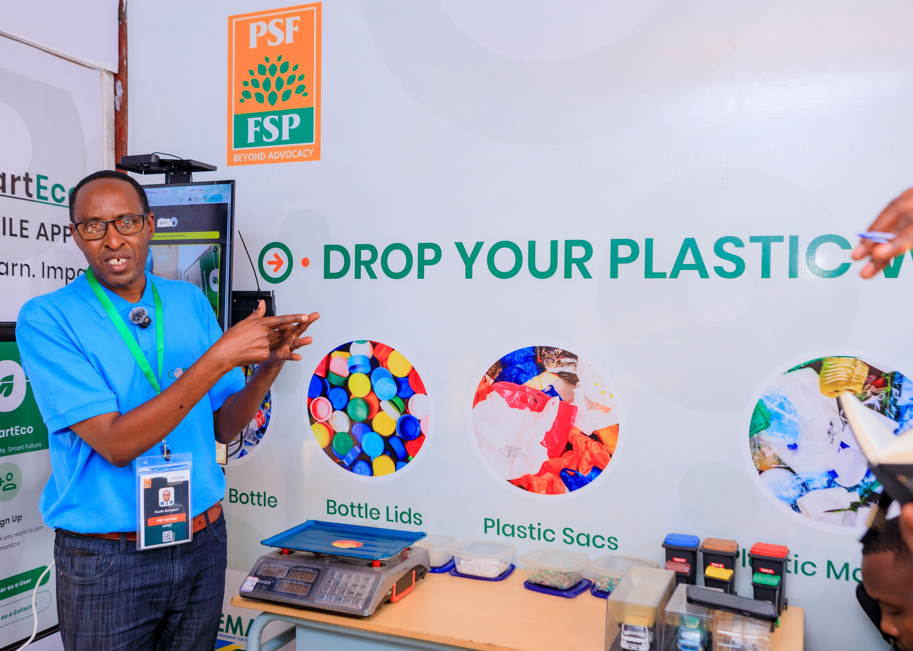
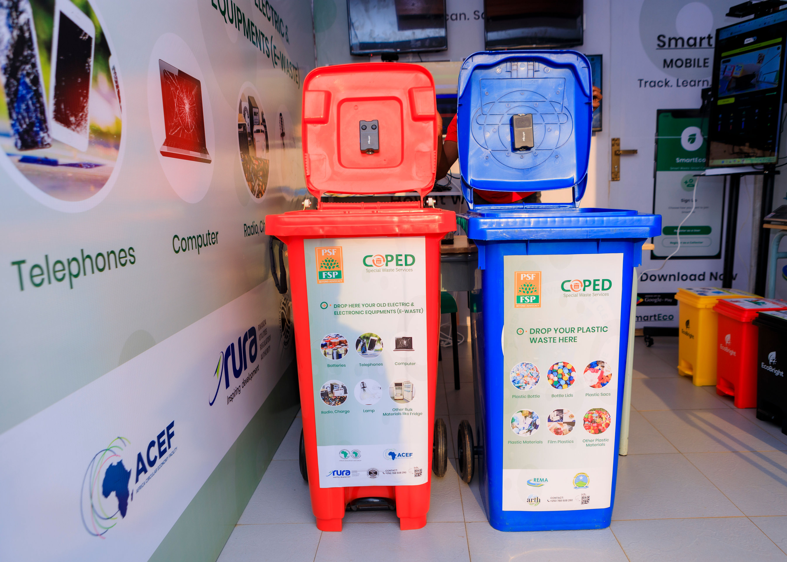
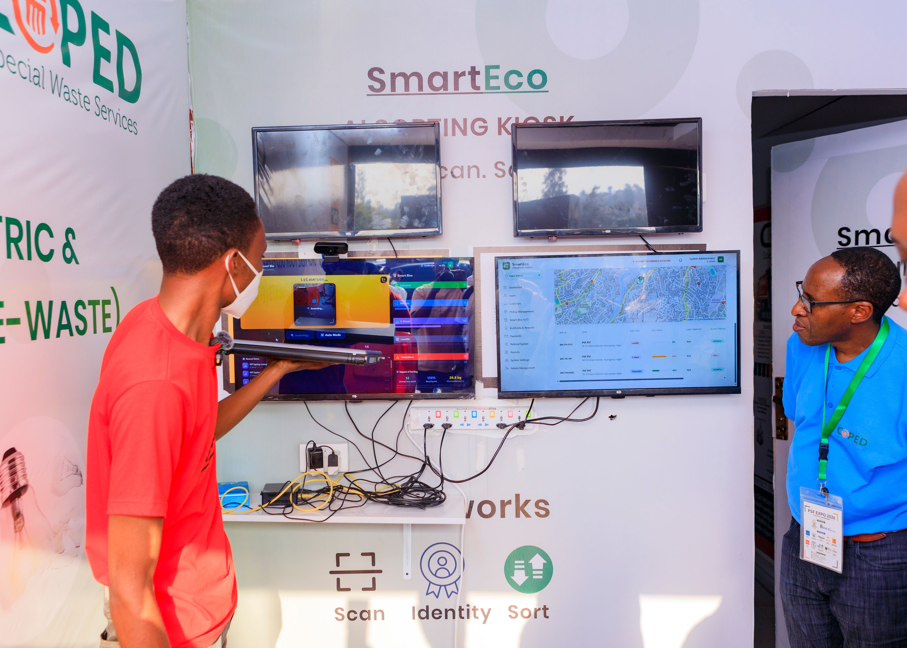
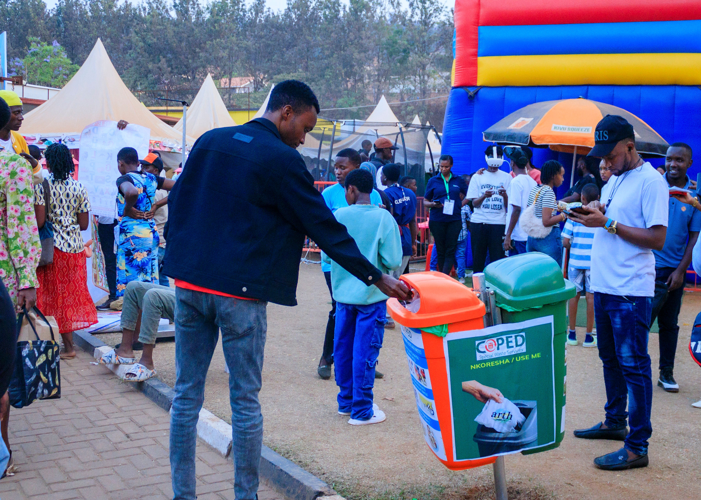
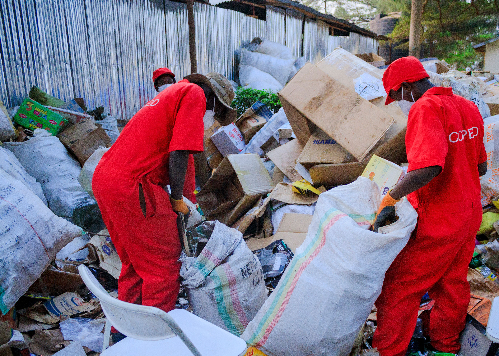
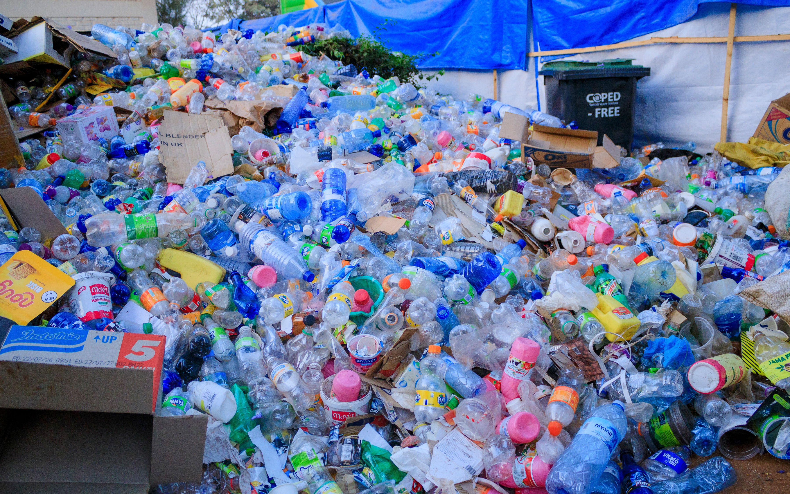

Rwanda’s 29th International Trade Fair ended Monday,18th August 2026 with more than business deals and exhibitions on display. Behind the scenes, organisers and waste-management companies were testing a new way of dealing with what major events leave behind.

At the centre of the effort was COPED, a Rwandan environmental and waste-management company working with the Private Sector Federation (PSF) under a three-year Green Expo project.

The project seeks to ensure that waste produced at exhibitions is properly collected, separated and measured, with recyclable materials sent to industries instead of ending up in landfills.

“We start at the waste-generator level, where waste is produced. We support our clients to properly sort their waste, educate them and train them,” Paulin Buregeya, CEO of COPED, told African Updates during the final day of the expo 2026.

COPED separated waste at the expo into four categories of general, recyclable, hazardous and electronic waste. The company also established a collection point for e-waste and plans to continue collecting electronic equipment and plastics beyond the exhibition.

COPED pays people for materials brought for collection, including Rwf100 to Rwf200 per kilogramme for e-waste, depending on the material, and up to Rwf100 per kilogramme for plastics. The collected materials are then sold to specialised recycling companies.

The Green Expo initiative is also testing a Smart Eco-Platform developed by US-based CT Consult Tech. The platform combines a mobile application, smart bins, an administrative portal and an AI-powered sorting system. It can allow users to request and track waste collection, while sensors monitor bin levels and temperature. 

For Abdoul Razak Hamissou, the developer of the platform, the idea began with a simple question: how could Kigali move beyond being known as a clean city?

“I thought about, okay, what can I create? So that's how the Smart Eco Platform came about,” Hamissou said. He said the goal was to help Rwanda move from being clean to becoming “not just clean but green.”

The system is intended to help businesses and households understand how much waste they produce, how much can be recycled and what environmental impact can be avoided through better waste management.

Buregeya believes the approach could have value beyond Rwanda.

“What is interesting for other countries is that component whereby we can have a decentralised collection system built on a system,” he said, pointing to the use of data to track waste collected from different sites.

That could be significant for Africa, where growing cities are producing increasing amounts of waste while recycling systems remain limited.

The Global E-waste Monitor has found that less than 1% of Africa's e-waste is formally documented as collected and recycled, highlighting the scale of the challenge.

The expo may now be over, but COPED's work is not. Its collection of e-waste and plastics is expected to continue, while PSF plans to expand collection points and public awareness.

With COPED's collection and recycling work, PSF's Green Expo programme and technology designed to improve sorting and tracking, Rwanda is testing whether waste from major events can instead become a source of materials, income and environmental value.

