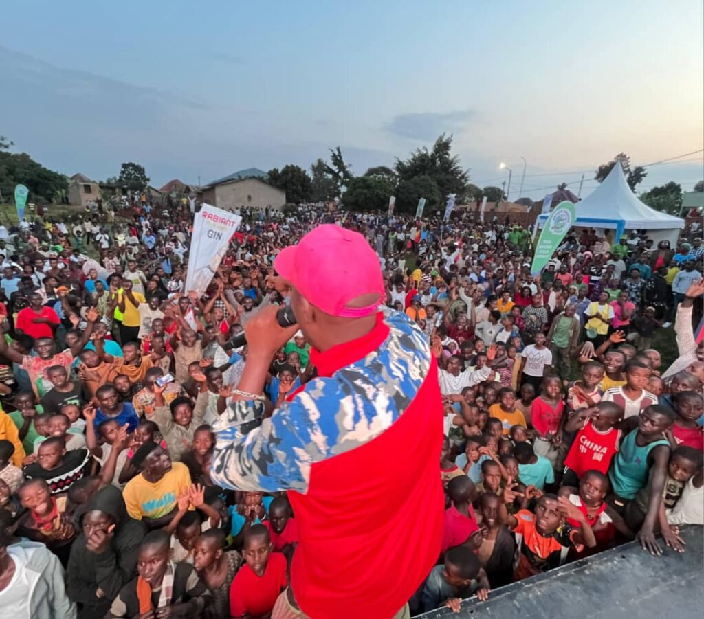
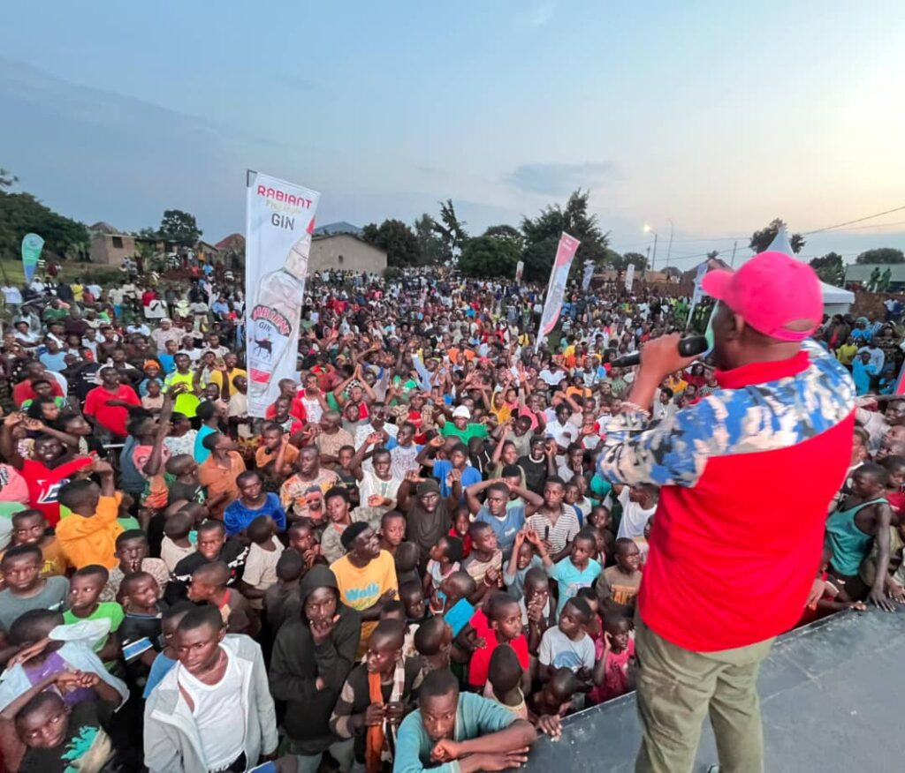
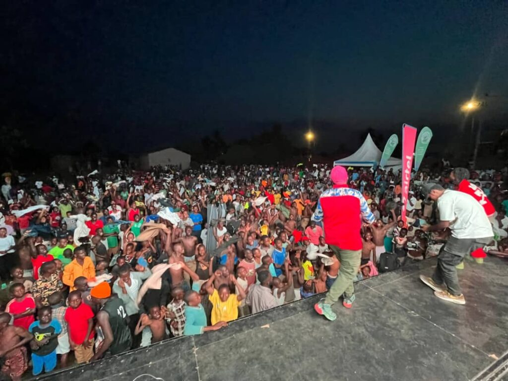
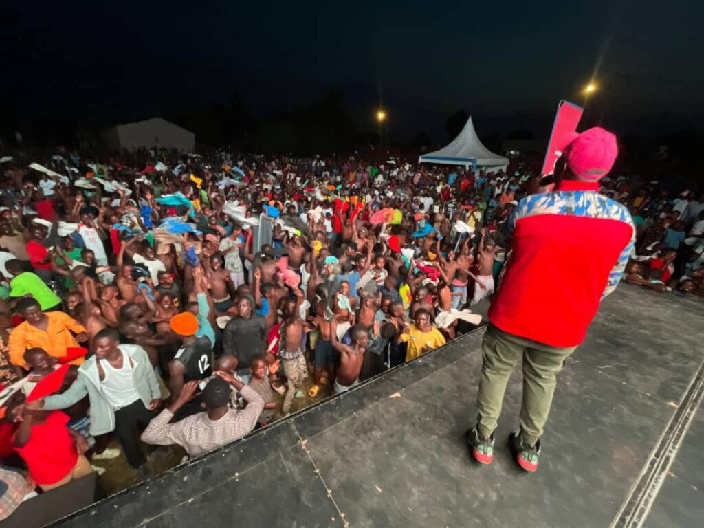
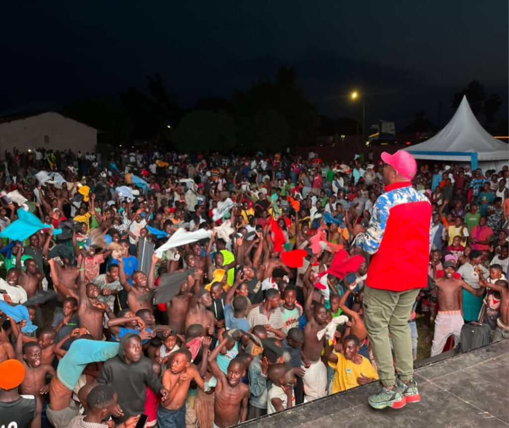
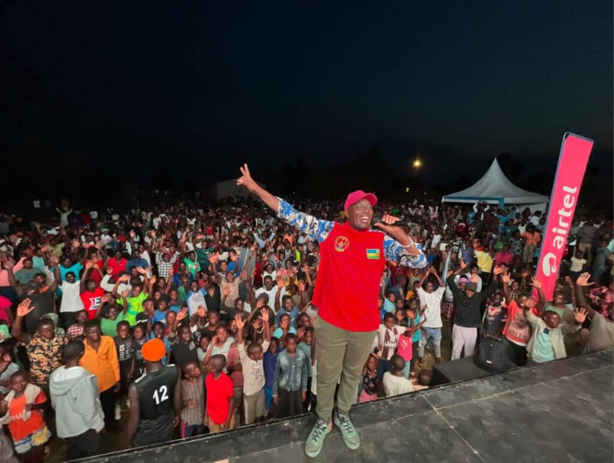

Kayonza, Rwanda; July 23, 2025 Rwandan music legend Eric Senderi International Hit continued his national tour in celebration of 20 years in the music industry with an electrifying concert in Mukarange Sector, Kayonza District, that drew thousands of devoted fans.

The event was a vibrant display of unity, music, and celebration, as fans from across the Eastern Province gathered to honor the man known for his powerful songs about patriotism, social life, and love for Rwanda. The night was unforgettable, with Senderi performing all his greatest hits including fan-favorite collaborations on a stage bursting with energy and emotion.

As the sun set, the concert grounds transformed into a sea of movement. Men danced until they removed their shirts in exhilaration, women shook their hips to the rhythms, and children joined in with unmatched joy. The crowd danced non-stop, sweat dripping, smiles shining a true reflection of the connection between Senderi and his fans.

“I’ve been listening to Senderi since I was a teenager,” said Jean Claude, a local fan. “Seeing him live, right here in Kayonza, is a dream come true. We hope he comes more often!”

The concert was not just about entertainment it was also a moment of community engagement and health awareness. HDI Rwanda, one of the event’s key partners, distributed 15,000 condoms and provided free HIV/AIDS testing and counseling services. Additionally, two young people were awarded scholarships to study at Action College, thanks to the event’s sponsorship.

The concert was graced by several local leaders, including Mr. Ntambara John, Executive Secretary of Mukarange Sector, the Vice Mayor of Kayonza District, and a Youth Representative, all showing their support for the veteran artist.

“This concert is not only a celebration of music, but also a celebration of Rwandan culture, values, and unity,” said Ntambara John.

Corporate sponsors Airtel Rwanda and Ingufu Gin Ltd added vibrance to the event by showcasing their services and products, engaging directly with the community throughout the concert.

Senderi expressed deep gratitude to his fans, saying, “I thank you for 20 years of love and support. You are the reason I sing, and I promise to keep delivering music that speaks to your hearts and lives.”

This stop in Kayonza marked one of the major highlights of Senderi’s ongoing 20-year anniversary countrywide tour, which began earlier this month.

The tour continues with: Ngoma District (Eastern Province) July 25, 2025, Musanze District (Northern Province) July 26, 2025, Rubavu District (Western Province) July 27, 2025.

More concert are expected as Senderi brings his message of love, unity, and resilience to every corner of Rwanda.

As one fan said: “This wasn’t just a concert. It was history. It was love. It was Rwanda.”

    

**African Updates**
