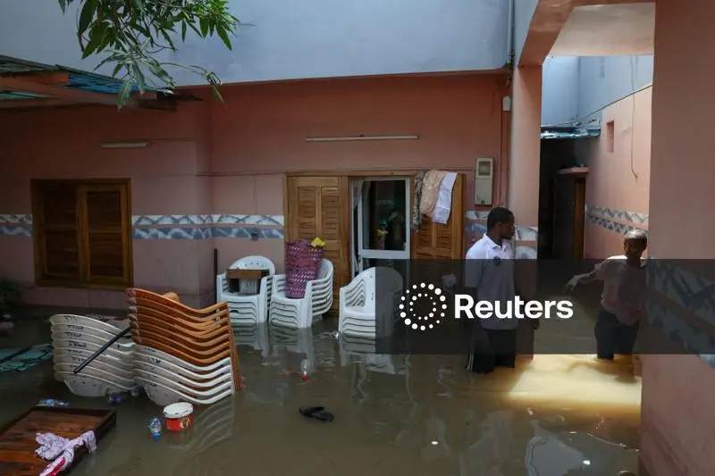

Heavy rains have caused flooding across parts of Senegal, killing several people, damaging buildings and disrupting transport, according to the government.

Floodwaters hit Dakar and other parts of the country over the weekend, just weeks before the capital is due to host the 2026 Summer Youth Olympics.

Local media reported that a mother and her child died after their home was flooded in Dakar's Parcelles Assainies area. Senegal's Interior Ministry also reported deaths and injuries in Dakar and the northeastern Matam region, while a building collapsed in the southern town of Kaolack.

Prime Minister Ahmadou Al Aminou Lo warned that more rain could fall on Monday, Tuesday and Wednesday. He said the start of the school year could also be delayed if floodwaters do not recede.

Senegal's meteorological agency, ANACIM, recorded 142 millimetres of rain within 24 hours in Rufisque, near Dakar, and Ranerou in the Matam region. Dakar's Yoff district received 138 millimetres.

The flooding has raised concerns over the country's ability to manage heavy rainfall, particularly as Senegal prepares to welcome thousands of visitors for the Youth Olympics beginning on October 31.

**African Updates**
