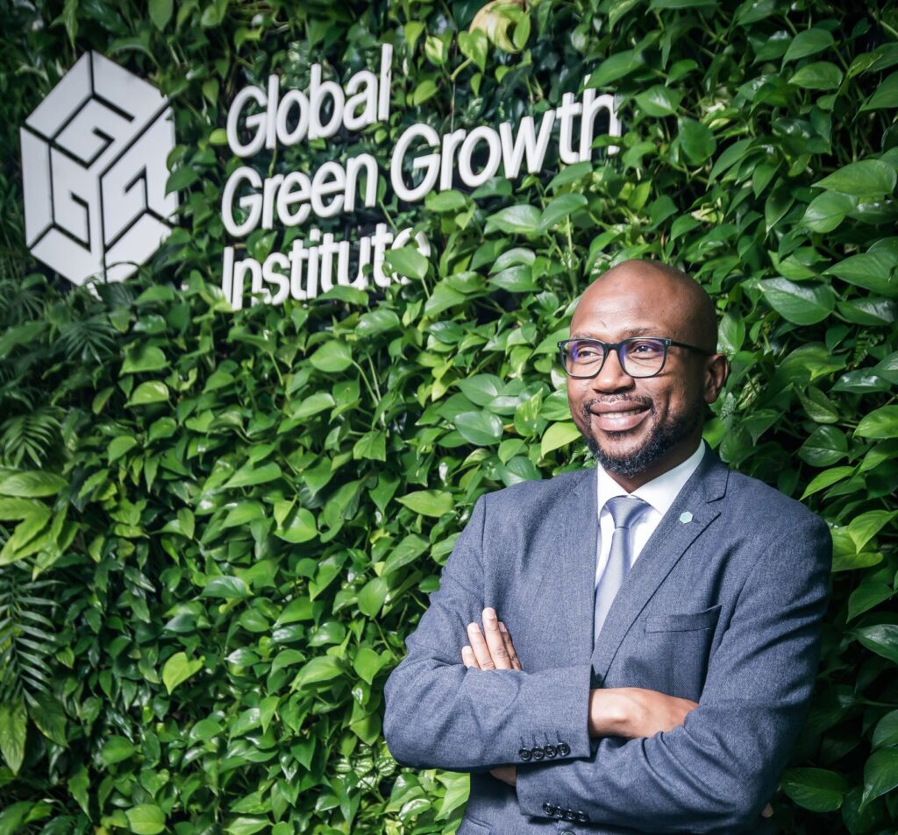

The Global Green Growth Institute (GGGI) has appointed Senegalese expert Dr. Malle Fofana as its new Deputy Executive Director and Head of Green Growth Implementation, marking a major milestone for African leadership in global climate action.

Dr. Fofana becomes the first African to join the GGGI Executive Team, a move seen as a strong step toward giving developing countries a bigger voice in global climate and green growth decisions.

Based in Seoul, Republic of Korea, the appointment follows an international selection process. Dr. Fofana hails from Senegal and brings more than 20 years of experience in climate policy, sustainable development and international cooperation.

Since joining GGGI in 2018, he has served in senior roles including Regional Director for Africa and Asia, where he helped expand the organization’s climate and green growth projects across several countries.

In his new role, Dr. Fofana will oversee nearly 300 green growth projects in more than 50 countries, supporting governments to access climate finance, improve policies and invest in sustainable development.

GGGI says Africa is now a key focus region, with more than 15 African countries working with the organization on climate and green economy programs. In 2025 alone, GGGI helped mobilize over USD 140 million in green investments in Africa and supported dozens of climate and development projects.

GGGI Executive Director Sang-Hyup Kim said Dr. Fofana’s appointment reflects Africa’s growing role in global climate solutions and the organization’s commitment to inclusive leadership.

Dr. Fofana said his appointment shows that Africa is becoming a stronger voice in shaping global green growth policies.

“This reflects Africa’s growing leadership in the global green growth agenda,” he said.

The appointment is seen as a key moment for African representation in international climate leadership and sustainable development decision-making.

\[caption id="attachment\_44605" align="alignnone" width="1024"\] Dr. Malle Fofana - Deputy Executive Director - Global Green Growth Institute\[/caption\]

**Denyse Mbabazi Mpambara / African Updates**
