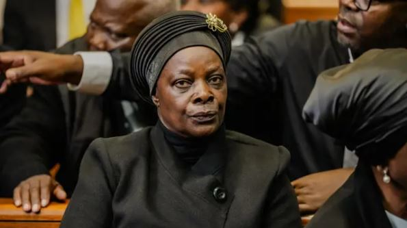

The High Court in Pretoria has dismissed an appeal from the family of late Zambian president Edgar Lungu, who wanted him to be buried in South Africa. The court ruled that Lungu should be laid to rest in his home country.

Lungu, who led Zambia from 2015 to 2021, died in June at the age of 68 while receiving medical treatment in South Africa. Since then, his remains have been kept in a South African morgue as his family fought legal battles over where he should be buried.

The family insisted that the burial take place in South Africa, arguing that they did not want Zambia’s current president, Hakainde Hichilema, to use the funeral for political purposes. Lungu and Hichilema were fierce rivals during Zambia’s heated elections.

However, the Pretoria court reaffirmed that the Zambian government holds the right to organize and conduct the burial of a former head of state. The ruling clears the way for Lungu’s remains to be flown back to Zambia in the coming days.

In Zambia, the burial of a former president is more than a private family matter it is a national event. Funerals of past leaders often bring together political figures, citizens, and foreign dignitaries. Such moments are not only about mourning but also about national unity and history.

The debate around Lungu’s burial reflects deeper tensions in Zambia’s politics, where transitions of power have sometimes been marked by rivalry and mistrust. Yet Zambia remains one of Africa’s stronger democracies, known for peaceful transfers of power compared to some of its neighbors.

Across Africa, the passing of former presidents often sparks debate about legacy, leadership, and respect for national institutions. In countries like Ghana, Kenya, and Tanzania, state funerals have been seen as moments to reflect on democratic progress and challenges.

As Zambia prepares to lay Lungu to rest, the spotlight is on how the nation balances respect for the family’s wishes with the state’s duty to honor its leaders.

**African Updates**
