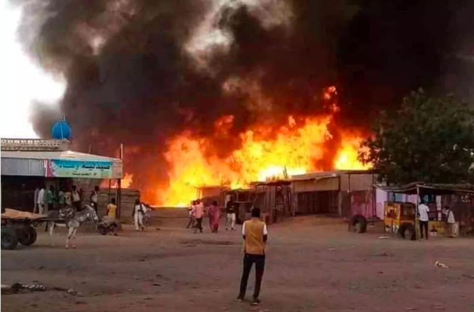
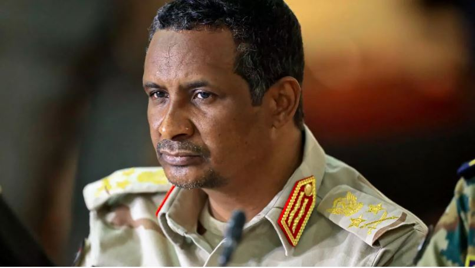

_KHARTOUM, Sudan – April 15, 2025,_ As Sudan’s brutal civil war enters its third year, the country’s paramilitary Rapid Support Forces (RSF) announced the formation of a rival government, escalating fears of a formal split in Africa’s third-largest country.

The declaration came Tuesday, coinciding with the second anniversary of the conflict’s outbreak on April 15, 2023 a war the United Nations has labeled **t**he world’s worst humanitarian crisis, with over 13 million people displaced, including more than 3.5 million who fled across borders.

RSF leader Mohamed Hamdan Daglo, formerly deputy to Sudanese army chief Abdel Fattah al-Burhan, announced the creation of a new administration in territories under RSF control.

"On this anniversary, we proudly declare the establishment of the Government of Peace and Unity, a broad coalition that reflects the true face of Sudan," Daglo said in a statement shared on Telegram.

The move formalizes a charter signed in Kenya in February, where the RSF and allied civilian groups introduced a “transitional constitution”. The document outlines a 15-member presidential council, representing what Daglo described as a “roadmap for a new Sudan.”

### Fears of a National Split Intensify

Analysts warn that this step marks a dangerous turning point in the conflict, potentially leading to a de facto partition of Sudan.

“With the RSF entrenched in Darfur, the territorial division that's occurring could mean a de facto separation,” said Sharath Srinivasan, a Sudan expert at the University of Cambridge.

The Sudanese army responded to the announcement with renewed airstrikes on RSF targets near El-Fasher, the last remaining major city in Darfur outside RSF control.

### Darfur Under Siege

The humanitarian toll continues to mount. In El-Fasher, over 400 people have been killed in recent days, according to the United Nations. The RSF claims to have seized the Zamzam displacement camp, once home to nearly one million internally displaced people.

As the RSF advanced, an estimated 400,000 civilians fled the area, reports the International Organization for Migration. Aid agencies now warn of an escalating famine crisis, with Zamzam being the first location in Sudan officially declared famine-stricken.

Nearby camps are reportedly following suit, with El-Fasher itself projected to fall into famine by next month.

### Civilians Bear the Brunt

Inside Sudan, millions remain caught between frontlines and hunger.

“In these two years, the lives of millions have been shattered. Families have been torn apart. Livelihoods have been lost. And for many, the future remains uncertain,” said Clementine Nkweta-Salami, the UN’s humanitarian coordinator in Sudan.

In Khartoum, where the army has regained control in recent weeks, returning civilians find only ruins.

“I’ve lost half my bodyweight,” said Abdel Rafi Hussein, 52, who lived under RSF control in the capital. “We’re safe now, but we suffer from a lack of water, electricity, and most hospitals aren’t working.”

Zainab Abdel Rahim, 38, returned with her six children to Khartoum North, only to find her home looted. “We’re trying to pull together the essentials, but there’s no water, no electricity, no medicine,” she said.

The UN now estimates that 2.1 million people are expected to return to Khartoum in the coming six months. In central Sudan, nearly 400,000 have already returned, though many have nothing left.

### Global Condemnation

At an international conference in London, world leaders condemned the escalation.

The United States accused the RSF of “deliberately targeting civilians and humanitarian actors” in Zamzam and Abu Shouk camps.

“The escalation of attacks in Darfur is deeply alarming,” said State Department spokeswoman Tammy Bruce.

The conference concluded with a joint demand for an immediate and permanent ceasefire, and over €800 million ($900 million) in new humanitarian aid was pledged. The African Union and European nations also warned against the partition of Sudan, stressing the need to maintain national unity.

Meanwhile, the Group of Seven (G7) foreign ministers, meeting in Canada, urged both factions to “engage meaningfully in serious, constructive negotiations.”

While official death tolls remain elusive, former U.S. envoy Tom Perriello estimated in 2024 that up to 150,000 people may have died since the war began.

Two years into the conflict, Sudan teeters between fragmentation and collapse. With a rival government now declared, and famine spreading across Darfur, the stakes for millions have never been higher.

\[caption id="attachment\_31898" align="alignnone" width="806"\] Sudanese RSF commander, Mohamed Hamdan Dagalo\[/caption\]

**African Updates**
