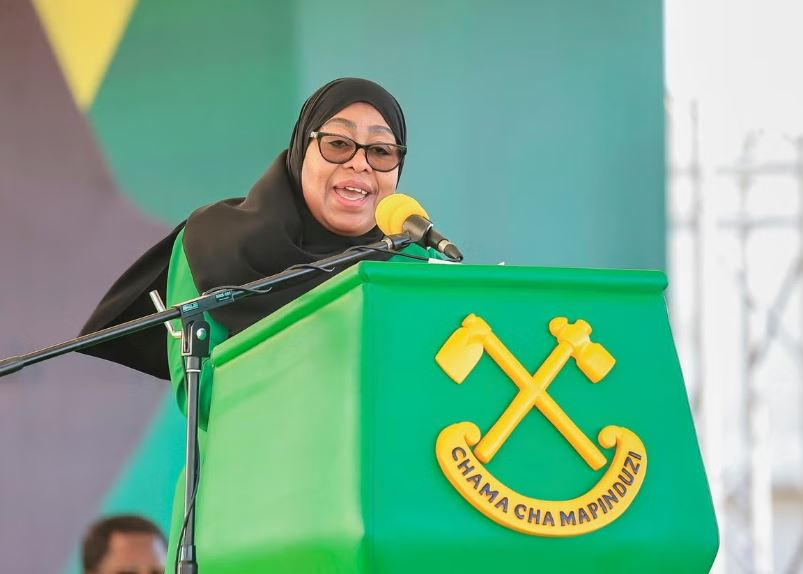

President Samia Suluhu Hassan has been re-elected with 97.6% of the vote, the Tanzanian Electoral Commission announced on Saturday. The landslide victory follows a tense election marked by the exclusion of major opposition figures, low voter turnout, and violent protests.

The final results, released three days after polls closed, confirmed what many observers had already expected. Most of Hassan’s main challengers were barred from running or detained months before the vote, leaving her with minimal competition.

This victory gives President Hassan her first full elected term since taking office in 2021, following the death of her predecessor, John Pombe Magufuli. Her re-election consolidates her leadership in a nation that had initially welcomed her as a symbol of political openness and reform.

Reports from both local and international observers described a very low voter turnout, with many polling stations nearly empty. Videos shared online showed ballot boxes being taken or damaged by demonstrators protesting what they called an unfair election.

The two largest opposition parties in Tanzania boycotted the election after their leaders were disqualified, raising further doubts about the legitimacy of the vote.

The days surrounding the election saw violent clashes between security forces and protesters in several cities. By the time results were announced, Dar es Salaam remained calm but tense after three consecutive days of unrest.

Foreign missions in Tanzania have urged caution, with several embassies advising staff to avoid non-essential travel due to security concerns.

While President Samia Suluhu’s victory secures her position as Tanzania’s first elected female head of state, analysts say the controversial process and public unrest could challenge her goal of presenting Tanzania as a stable and democratic nation.

**African Updates**
