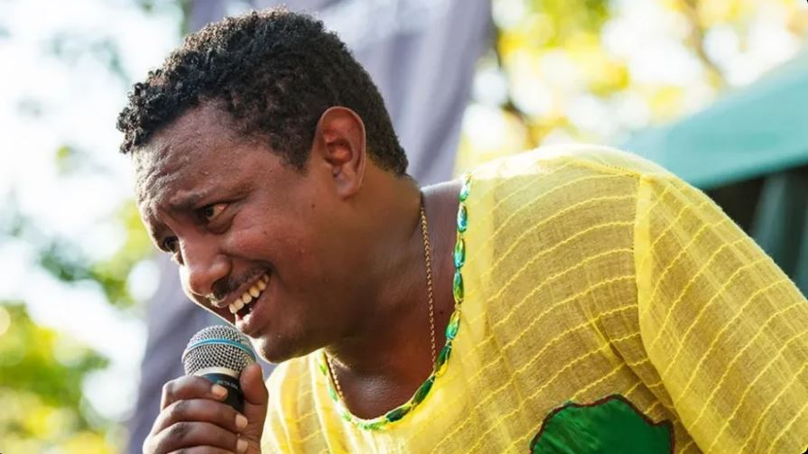

A newly released song by one of Ethiopia’s most prominent artists is generating widespread discussion, as its message appears to question the country’s current direction and leadership.

Teddy Afro, whose birth name is Tewodros Kassahun, has unveiled a track titled “Das Tal,” meaning “pitch the tent.” Within days of its release, the song attracted millions of views online, reflecting both his enduring popularity and the public’s curiosity about its themes.

Drawing on the symbolism of a traditional mourning tent, the song carries a somber tone. Through its lyrics, the singer reflects on a deep sense of national loss, expressing feelings of displacement and sorrow. He paints a picture of someone who feels estranged from their own homeland, unsure where to turn to grieve.

The lead-up to the release was not without intrigue. A scheduled media preview event in Addis Ababa was abruptly called off, with no official explanation, adding to speculation surrounding the project.

Known for weaving social commentary into his music, Teddy Afro has long had a complicated relationship with authorities. In the mid-2000s, he served a prison sentence following a hit-and-run case, which he has consistently argued was influenced by politics.

His 2017 album, “Ethiopia,” became a major success, resonating strongly with listeners and even topping international charts. The record promoted national unity and revisited historical narratives, though it encountered obstacles at home when officials blocked its formal release.

That period coincided with significant unrest, including mass demonstrations led largely by members of the Oromo community protesting political exclusion. The protests ultimately contributed to a shift in leadership.

When Abiy Ahmed assumed office as prime minister, his calls for reconciliation and unity were initially welcomed by many, including the artist. Over time, however, ongoing violence and conflict particularly the prolonged war in the country’s northern region have led to growing frustration among observers.

Teddy Afro has continued to address these challenges through his music. A previous release in 2022 highlighted concerns about rising ethnic divisions, and his latest work builds further on those ideas.

Although the government maintains that unity remains central to its vision for the nation’s future, the strong response to this new song suggests that its message is striking a chord with a wide audience.

**African Updates**
