Friday, on 9th of May 2025, in Kigali, Rwanda, the Institute of Certified Public Accountants of Rwanda (ICPAR) celebrated the launch of its new building, an event that drew attendees from across the continent who were also present for the Africa Congress of Accountants (ACOA) 2025. Against the backdrop of this milestone, a crucial question took center stage: the pivotal role of accountants in achieving Africa's aspiration of ‘creating value for Africa,’ and the ways in which ICPAR is championing technology to realize this vision.

The discourse resonated with the overarching theme of ACOA 2025, emphasizing sustainable growth and the empowerment of professionals within the accounting sector. Speakers underscored the evolving responsibilities of accountants, positioning them not just as number crunchers but as strategic thinkers and catalysts for impactful change across the African landscape.

Ms. Keto N. Kayemba, the Outgoing President of the Pan-African Federation of Accountants (PAFA), set the tone by stating, "Our objective, our goal, in PAFA, is sustainable value creation for the benefit of the citizens of Africa." She highlighted PAFA's focus during the ACOA conference on "driving sustainability," a matter of increasing global significance.

\[caption id="attachment\_32109" align="alignnone" width="1024"\]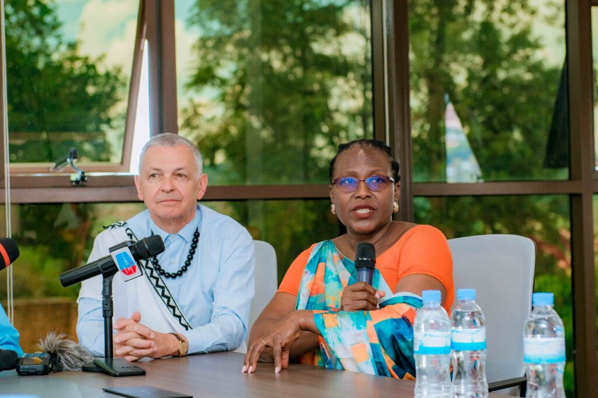 Ms. Keto N. Kayemba, the Outgoing President of the Pan-African Federation of Accountants (PAFA)\[/caption\]

According to Ms. Kayemba, by bringing sustainability to the forefront of the African accounting fraternity, companies will be better equipped to report on their sustainability efforts. "When you do this, your companies will be able to report on sustainability, and therefore your country will be more aware of what's happening. It can relate with all the world leaders. It can relate in terms of the financials that come out of your country. Accountants be prepared, be the strategic thinkers around sustainability. Breathe that driving force around sustainability."

Mr. Jean Bouquot, President of the International Federation of Accountants (IFAC), stated the sentiment on sustainability, stressing its global imperative He emphasized the unified approach of organizations like IFAC in ensuring the profession is integral to addressing this critical issue for the planet and its people. "So what we aim at as organizations which convene the whole profession, which try to have the same approach, or understandable approach from each and every one is to make sure that we are part of this very important item topic for the future of the earth, for the future of the society and for the future of the citizens." Mr. Bouquot pointed out the growing trend of corporations integrating sustainability information with financial data, indicating a fundamental shift in how the economy is being organized and how citizens expect it to operate.

\[caption id="attachment\_32108" align="alignnone" width="1024"\]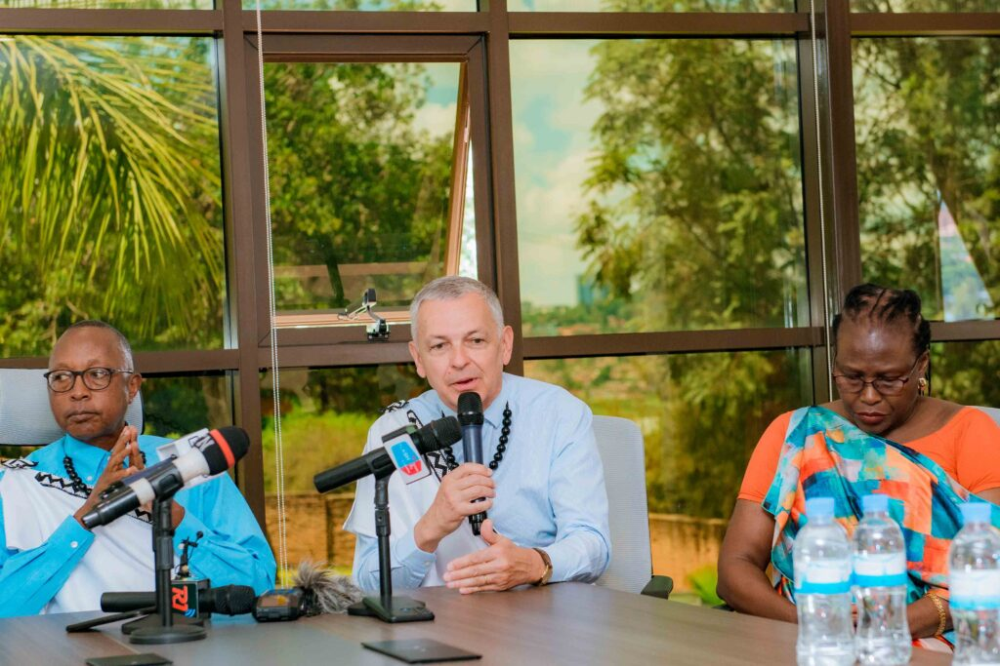 Mr. Jean Bouquot, President of the International Federation of Accountants (IFAC)\[/caption\]

Mr. Obadiah R. Biraro, President of ICPAR, shifted the focus to the fundamental role of accountants as communicators of financial information. "You coordinators of information around your subject matter, ought to know that accounting, contrary to what was believed in those years, that accounting remains somewhere by the back room, no accounting is a vehicle that facilitates dissemination or financial information." He stressed the necessity of effective communication. Mr. Biraro also highlighted missed opportunities where the expertise of accountants could have been invaluable, particularly in areas like arbitrations and contributing to national development.

\[caption id="attachment\_32106" align="alignnone" width="1024"\]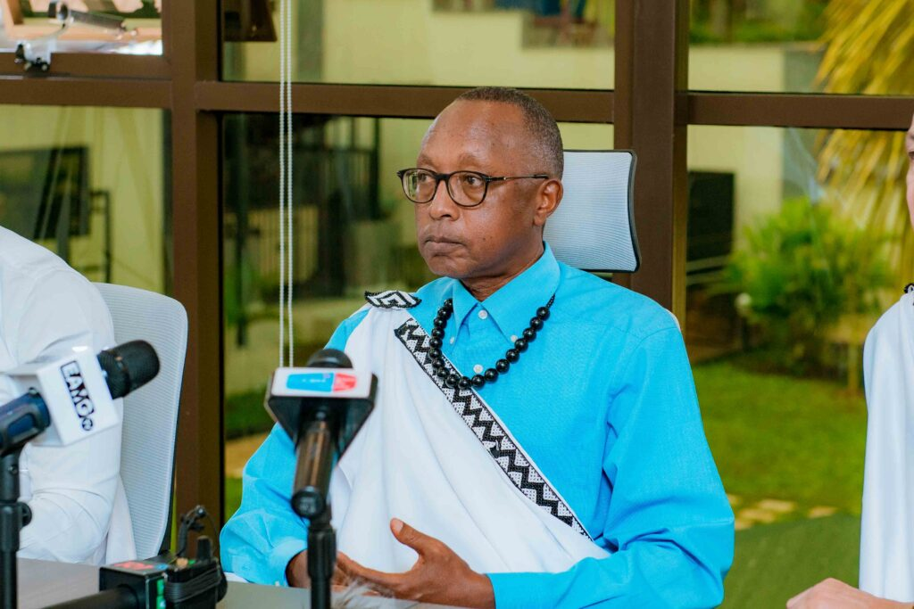 Mr. Obadiah R. Biraro, President of ICPAR\[/caption\]

Turning to the technological advancements championed by ICPAR, Mr. Bugunya, Vice President of ICPAR, elaborated on the institute's strategic embrace of automation. "I'll talk about automation and what we are trying to do around automation, but I think automation, if you look at the 17 UN SDGs, talks about innovation and also the last bit of the 17th pillar talks about partnerships." He emphasized that ICPAR's strategy places automation as a central pillar, recognizing its potential to revolutionize the accounting profession and contribute to Africa's growth.

\[caption id="attachment\_32107" align="alignnone" width="1024"\]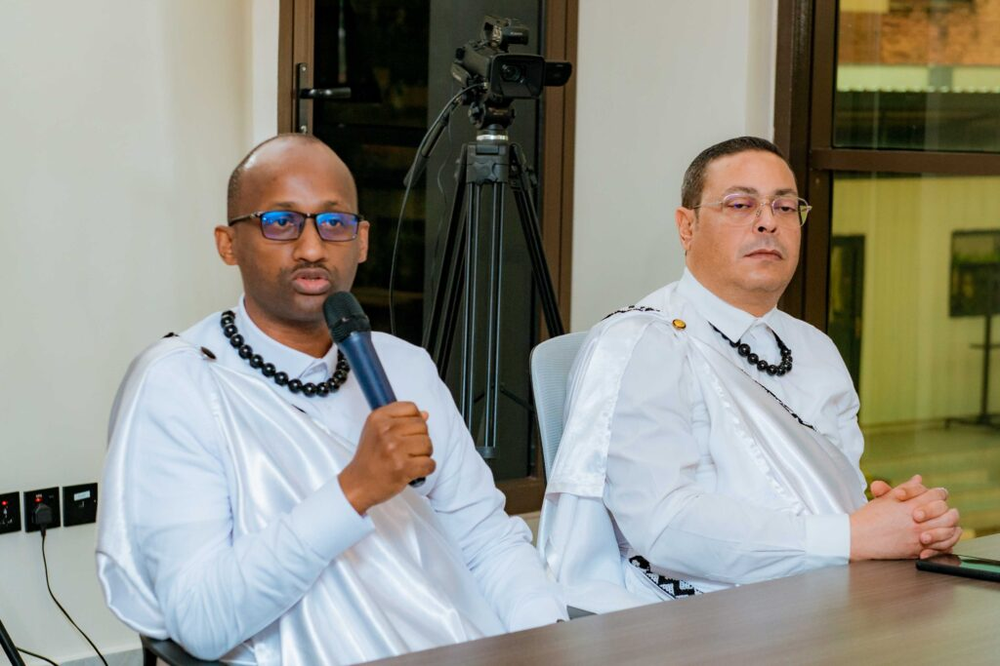 John Bugunya, Vice President of ICPAR\[/caption\]

The discussions at ICPAR's building launch, following the ACOA 2025 conference, painted a clear picture of an evolving accounting profession in Africa. Accountants are being positioned as key enablers of value creation, driving sustainability initiatives, fostering inclusivity, and leveraging technological advancements.

ICPAR's proactive approach to integrating technology into its training and development programs signals a strong commitment to equipping its members with the skills needed to navigate the future and contribute meaningfully to Africa's progress. The emphasis on ethical conduct and the profession's role in building trust remains paramount as Africa charts its course towards sustainable and inclusive growth.

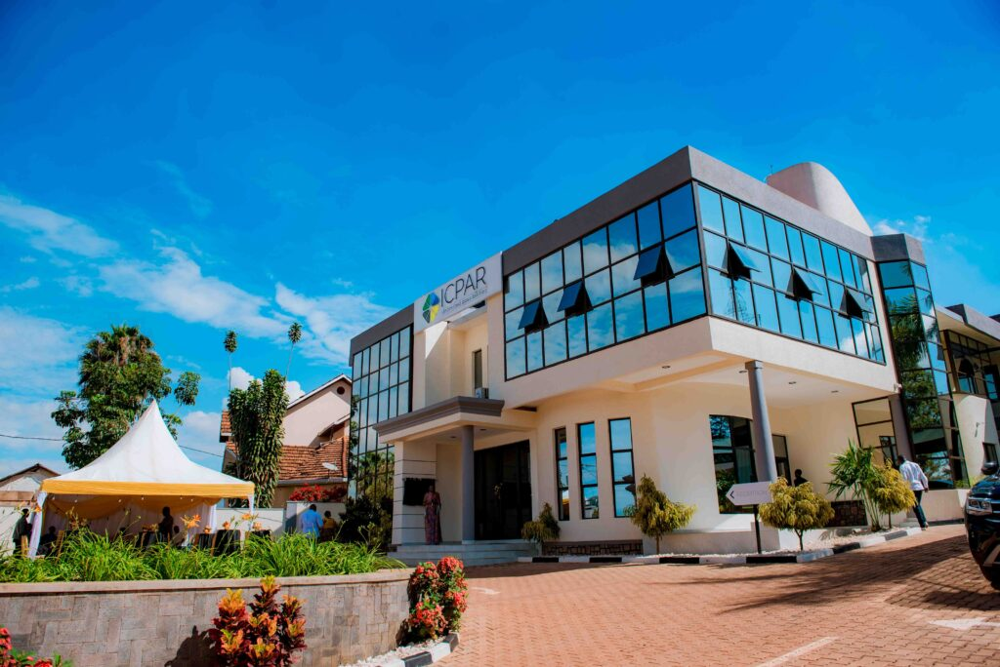

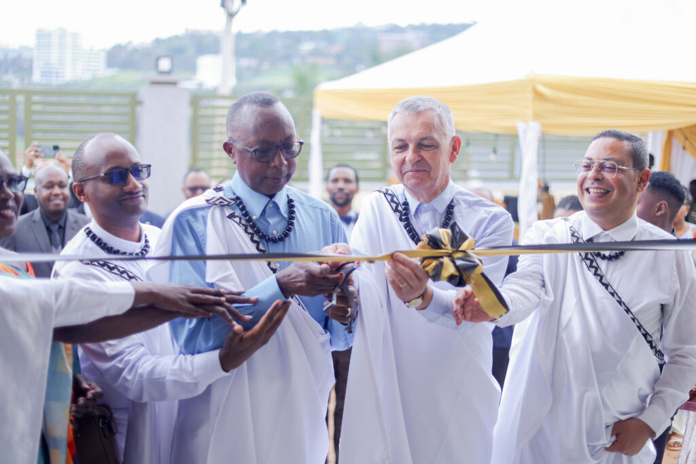

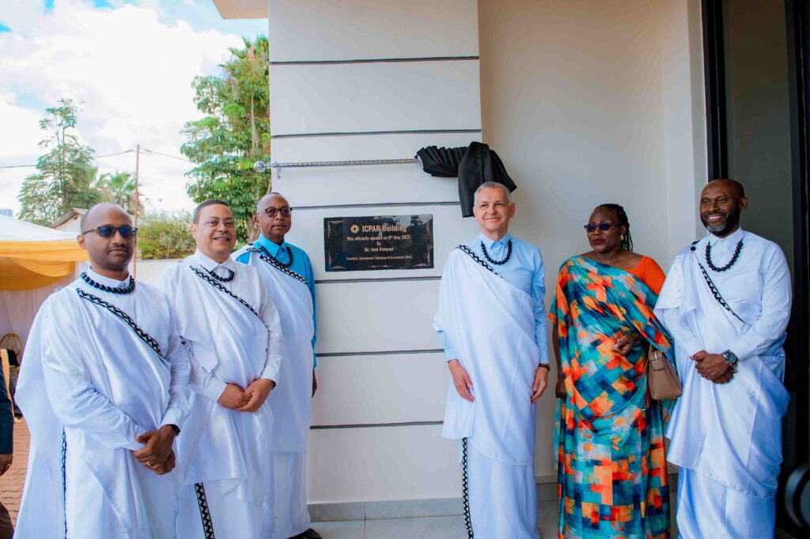

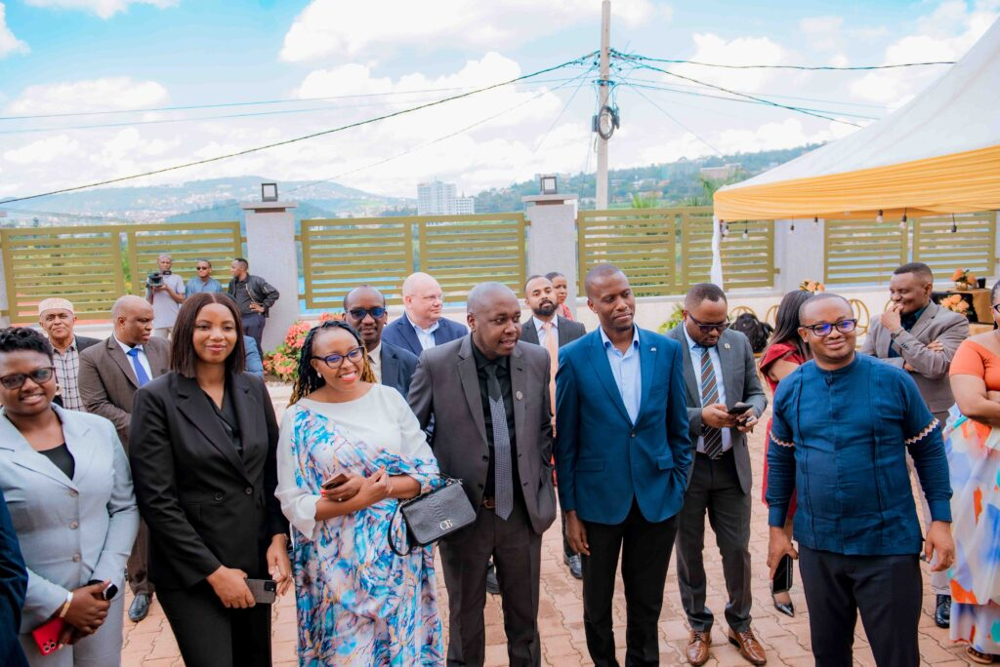

\[caption id="attachment\_32096" align="alignnone" width="1024"\]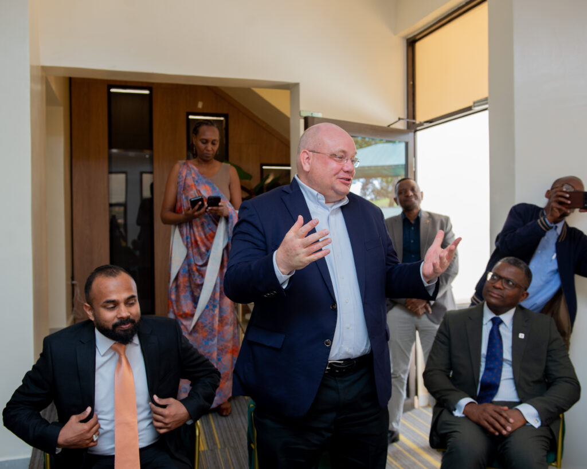 Brian Hock, Founder and CEO, HOCK International\[/caption\]

\[caption id="attachment\_32097" align="alignnone" width="1024"\]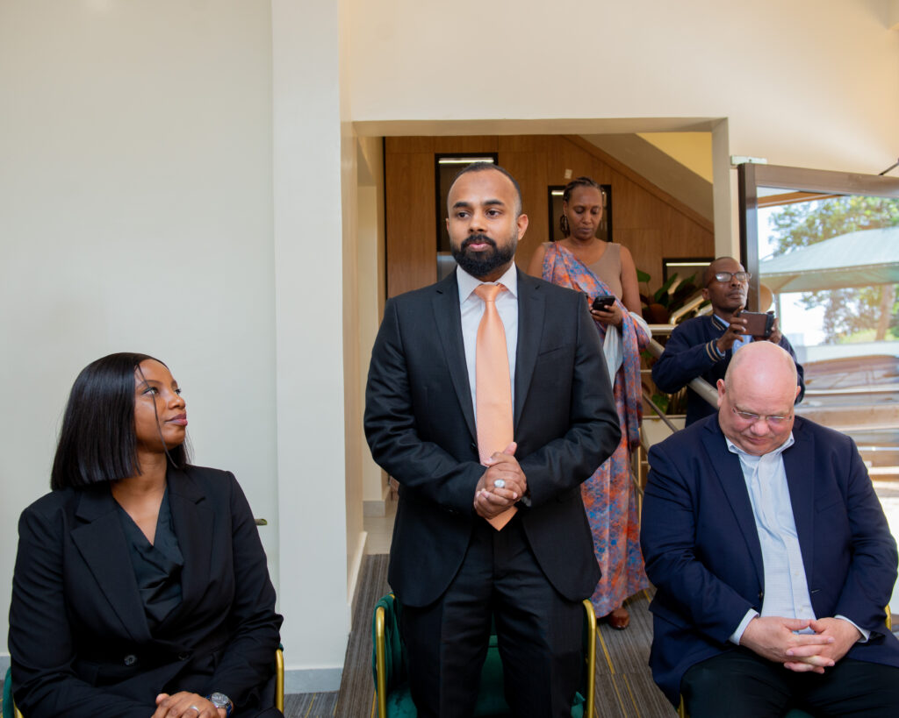 Mansoor Ahamed Pathari, Regional Director of Business - GCC\[/caption\]

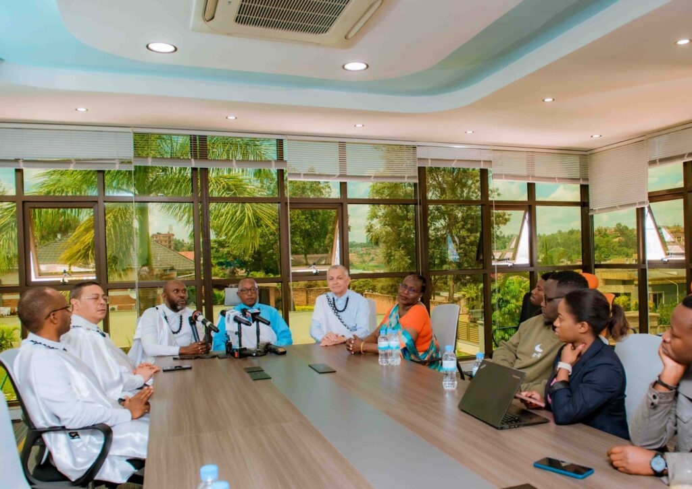

**African Updates**
