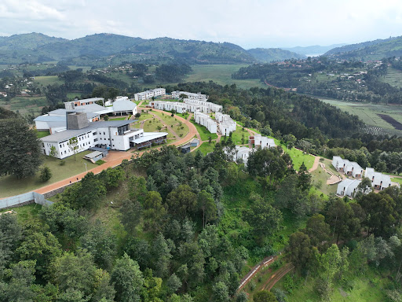

The University of Global Health Equity (UGHE) and the University of Rwanda (UR) have secured places among the top 10 universities in Sub-Saharan Africa, according to the 2024 Times Higher Education (THE) rankings.

This achievement highlights Rwanda’s growing influence in the region’s higher education landscape.

The rankings evaluated 129 universities across 22 countries, focusing on their contributions to addressing regional challenges.

Institutions were assessed using 20 metrics across five categories: resources and finance, access and fairness, student engagement, ethical leadership, and Africa impact.

**UGHE Rises to 4th Place** Founded in 2015 in Butaro, Burera District, with backing from the Rwandan government and funding from the Bill & Melinda Gates Foundation and the Cummings Foundation, UGHE has quickly emerged as a leading institution.

Climbing from 8th place last year to 4th in 2024, it also scored the highest in the region for student engagement, underscoring its commitment to academic excellence and student involvement.

**UR Secures 6th Position** As Rwanda’s largest and oldest higher education institution, the University of Rwanda (UR) ranked 6th, further solidifying the country’s academic reputation.

Formerly the National University of Rwanda (NUR), UR’s notable strides in research, teaching, and social impact were pivotal to its ranking.

South Africa dominated the list, with the University of Johannesburg claiming the top spot, excelling in access, fairness, and resource allocation. The top 10 universities featured institutions from six countries, showcasing the region’s academic diversity and excellence.

**Top 10 Universities in Sub-Saharan Africa (2024):**

1. University of Johannesburg (South Africa)
2. University of Pretoria (South Africa)
3. University of the Witwatersrand (South Africa)
4. University of Global Health Equity (Rwanda)
5. University of Ghana (Ghana)
6. University of Rwanda (Rwanda)
7. SIMAD University (Somalia)
8. Makerere University (Uganda)
9. Ashesi University (Ghana)
10. University of KwaZulu-Natal (South Africa)
