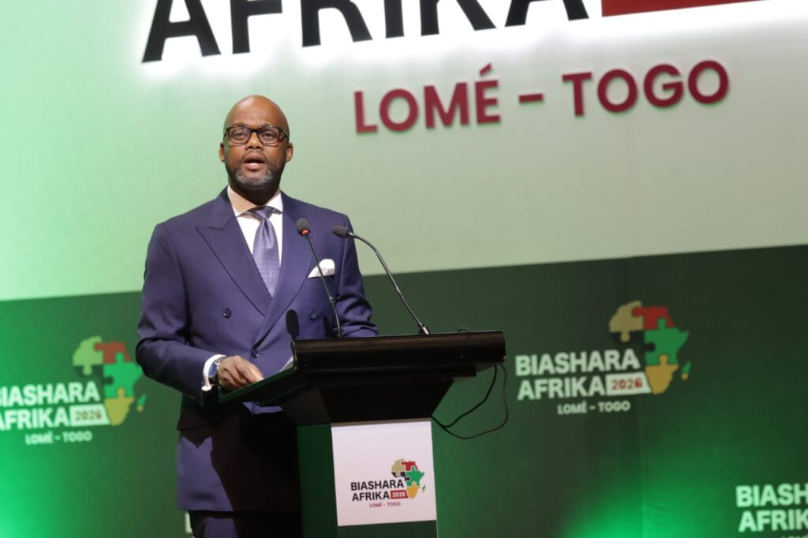

Lomé became the center of Africa’s economic integration conversation on Tuesday as policymakers, trade experts and competition authorities from across the continent opened the inaugural conference on competition policy and law under the theme, _“_Harnessing Competition as a Catalyst for African Market Integration.”

The two-day conference, running from May 19 to May 20, brought together senior officials from across Africa and international institutions at a moment when the continent is pushing to transform the African Continental Free Trade Area from an ambitious agreement into a functioning common market.

Among the high-profile participants were H.E Wamkele Mene, Secretary-General of the AfCFTA Secretariat, Simeon Kofi, Director-General of the ECOWAS Regional Competition Authority, Willard Mwemba, Chief Executive Officer of the COMESA Competition and Consumer Commission, H.E Adefunke Adeyemi Secretary General of African Civil Aviation Commission. Frantisek Ruzicka Deputy Secretary General of the OECD and Togo’s Director-General of Trade, Talime Abe.

The opening ceremony also carried strong political weight as Togo reaffirmed its ambition to position itself as one of the key gateways for African trade integration.

For many delegates, however, the defining moment of the day came from Wamkele Mene’s closing remarks, where he used a simple but powerful metaphor to describe Africa’s long journey toward a unified market.

“I’ve never eaten an elephant before, but I’m told that to eat and finish an elephant, you have to take it one bite at a time.” Mene told delegates.

The phrase quickly became one of the most discussed moments of the inaugural gathering, symbolizing both the scale of Africa’s integration ambitions and the gradual work required to make them a reality.

Throughout his address, Mene insisted that Africa’s competition architecture should not be seen as a bureaucratic expansion but as part of a broader political and economic project aimed at finally dismantling fragmented colonial-era economic systems.

“We want a united continent, we want to make Pan-Africanism a reality and not a slogan.” he said.

He explained that the future continental competition authority envisioned under the AfCFTA protocol would operate independently while complementing national and regional competition bodies rather than replacing them.

“We are not looking to erase national or regional authorities, What we are looking to do is to advance Pan-Africanism.”  Mene stressed.

The AfCFTA, officially launched for trading in 2021, is today considered the world’s largest free trade area by number of participating countries. It aims to connect a market of more than 1.3 billion people with a combined GDP estimated at over 3.4 trillion US dollars. Yet despite the promise, African leaders continue to confront major structural challenges. Intra-African trade still remains far below other regions, estimated at roughly 15 to 18 percent of Africa’s total trade, compared to more than 60 percent within Europe and Asia.

Togo’s Minister of Economy and Finance, Badanam Patoki, also used the conference to defend Africa’s integration ambitions, particularly the free movement of Africans across the continent.

Minister Badanam, described the conference as a historic step toward building an operational African market capable of creating jobs for young people, women and enterprises across the continent. he argued that Africa cannot achieve a true common market while maintaining barriers that continue to restrict movement between African countries.

“Once you are an African, you don’t need a visa to have access to the country,” he said, calling for more African nations to follow policies that facilitate continental mobility. The competition policy and law are very important to promote trade liberalization,” he said. “This should not be compromised by obstacles.”

He further praised Togo’s recent reforms, including the revision of its competition law in October 2025 to align with regional and continental standards.

The conference also highlighted how competition policy is increasingly becoming a strategic tool rather than simply a legal framework. African officials argued that fair competition rules are necessary to prevent abuse of dominance, protect consumers and ensure smaller businesses can participate in the continental market.

The discussions in Lomé come at a time when Africa is under growing pressure to strengthen intra-African trade amid global economic uncertainty, supply chain disruptions and shifting geopolitical alliances.

Experts at the conference noted that stronger regional value chains could help African countries reduce dependency on raw material exports while creating more manufacturing and industrial jobs on the continent.

 

**African Updates**
