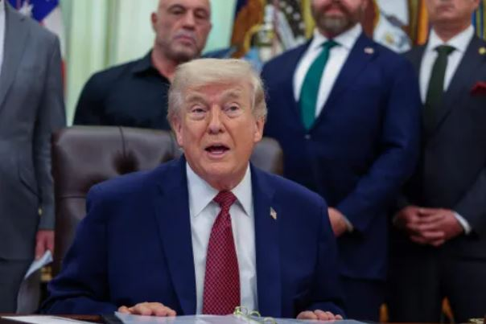

Donald Trump has announced an extension of a fragile ceasefire with Iran, citing a request from Pakistan and stating that he is awaiting what he described as a “unified proposal” from Tehran.

The decision comes as a two-week truce approaches its expiration, with diplomatic prospects appearing increasingly uncertain. Trump said the ceasefire would remain in effect until Iran submits a proposal and negotiations are concluded “one way or the other.”

Despite the pause in active hostilities, Trump confirmed that a U.S. military blockade targeting Iranian ports will remain in place.

Meanwhile, the White House has postponed a planned visit by Vice President JD Vance to Pakistan, where a second round of talks involving Iranian officials had been expected. A spokesperson for Iran’s Foreign Ministry said earlier Tuesday that Tehran has not yet decided whether to participate in the discussions, adding that involvement would depend on whether the talks are considered productive.

The conflict has resulted in significant casualties across multiple countries. Reports indicate at least 3,375 deaths in Iran and more than 2,290 in Lebanon. Additional fatalities include 23 deaths in Israel, along with reported casualties in Gulf Arab states.

Military losses have also been recorded among Israeli and U.S. forces deployed throughout the region.

Amid diplomatic uncertainty, Iranian state television aired footage of hard-line gatherings in Tehran. The broadcast showed members of the Islamic Revolutionary Guard Corps displaying a ballistic missile mounted on a mobile launcher, alongside armed personnel.

The missile, identified in reports as a Qadr-type system, has previously been used in strikes involving cluster munitions.

In a televised statement, Khatam al-Anbiya Central Headquarters warned that any attack would be met with immediate retaliation against pre-designated targets, signaling the possibility of stronger responses against both the United States and Israel.

With diplomatic efforts stalled and military rhetoric intensifying, both sides continue to signal readiness to resume hostilities if no agreement is reached before the ceasefire expires.

**African Updates**
