The hills of Kigali delivered history today as Megan Arens from the Netherlands won the Women’s Junior Individual Time Trial at the 2025 UCI Road World Championships.

The 18-year-old stopped the clock at 25 minutes 47 seconds on the 18.3-kilometre course, which started at BK Arena and ended at the Kigali Convention Centre. The route included steep climbs and a hard cobbled finish on the Côte de Kimihurura, where Arens made the difference.

Spain’s Paula Ostiz Taco, also 18, took silver, finishing 35 seconds slower, while Norway’s Oda Aune Gissinger, 18, claimed bronze just two seconds further back.

Arens, who has already won national titles in the Netherlands, said she had prepared for the tough last climb:

“I saved my energy for the end, and it worked. Winning here in Africa is something I will never forget.” she said;

\[caption id="attachment\_41698" align="alignnone" width="1024"\]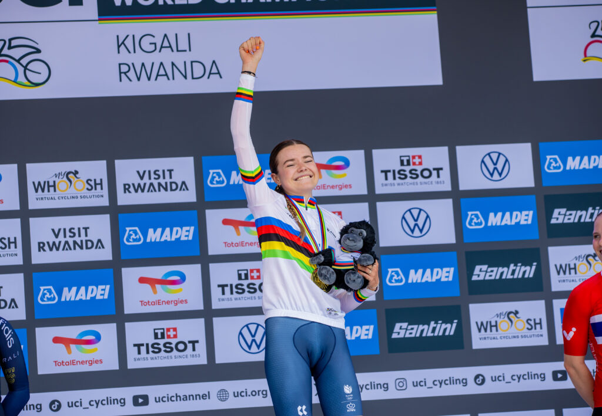 Megan Arens from the Netherlands won the Women’s Junior Individual Time Trial at the 2025 UCI Road World Championships\[/caption\]

When the three riders stood on the podium to receive their medals, the moment was filled with emotions. Arens smiled through tears as the Dutch anthem played, while Ostiz Taco and Gissinger also showed pride and joy, waving to the crowd that cheered loudly inside the Kigali Convention Centre.

This year is the first time the UCI Road World Championships are held in Africa, making Kigali the Centre of global cycling for the week. For local fans, seeing young champions fight for the rainbow jersey on Rwandan roads is a source of pride and hope for African cycling.

Officials say the event will inspire young riders across the continent, where cycling is gaining ground in countries like Rwanda, Eritrea, Ethiopia, and South Africa.

The championships continue in Kigali until Sunday, 28 September 2025, with more races to come and more chances for Africa to show its place in world cycling.

\[caption id="attachment\_41699" align="alignnone" width="1024"\]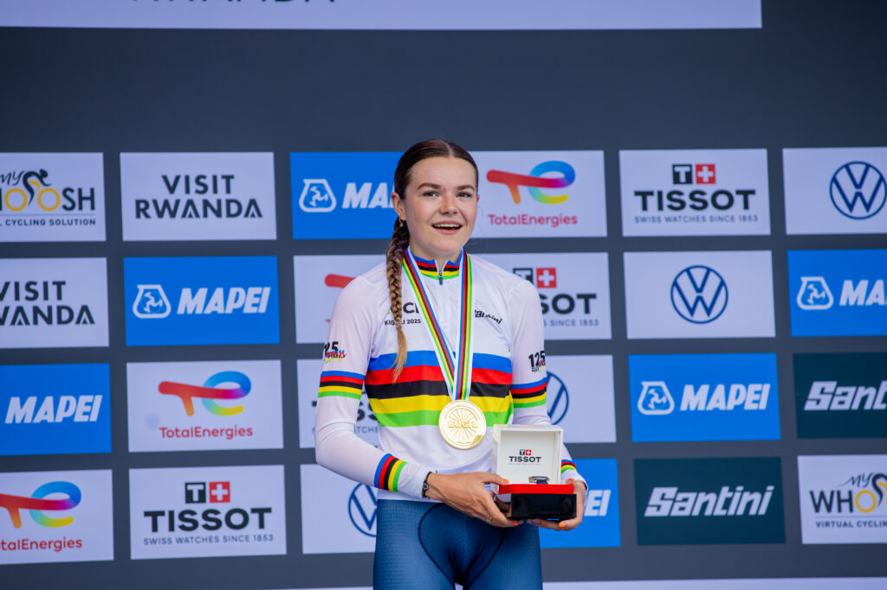 Megan Arens from the Netherlands won the Women’s Junior Individual Time Trial at the 2025 UCI Road World Championships\[/caption\]

\[caption id="attachment\_41704" align="alignnone" width="937"\]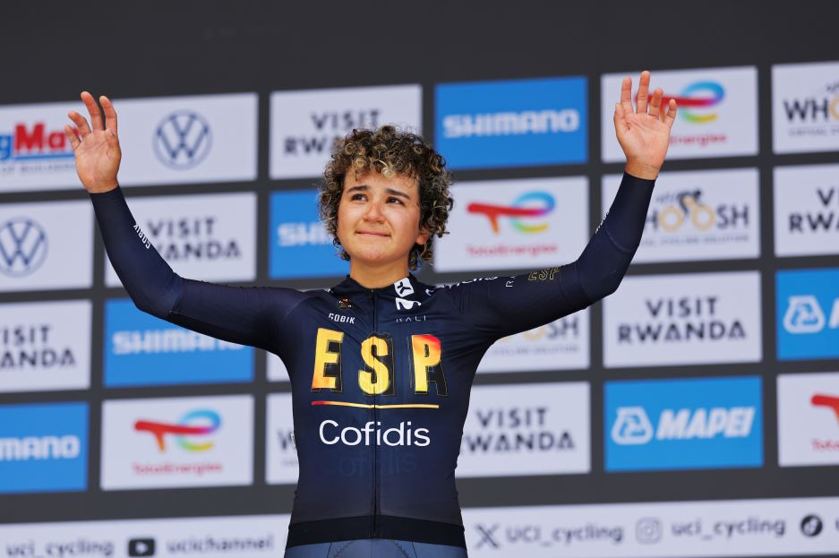 Spain’s Paula Ostiz Taco, also 18, took silver medal\[/caption\]

\[caption id="attachment\_41705" align="alignnone" width="626"\]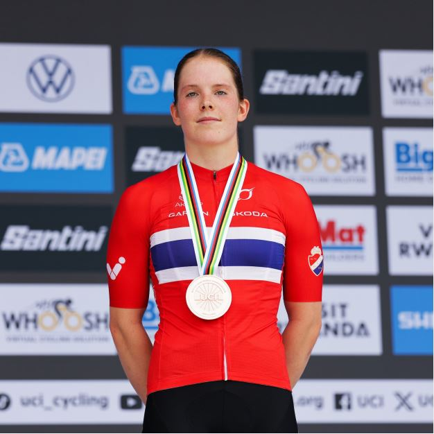 Norway’s Oda Aune Gissinger, 18, claimed bronze medal\[/caption\]

\[caption id="attachment\_41700" align="alignnone" width="1024"\]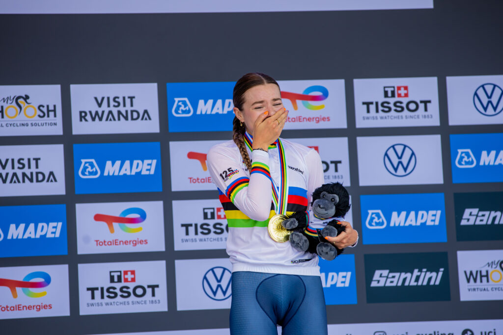 Megan Arens from the Netherlands won the Women’s Junior Individual Time Trial at the 2025 UCI Road World Championships\[/caption\]

\[caption id="attachment\_41701" align="alignnone" width="1024"\]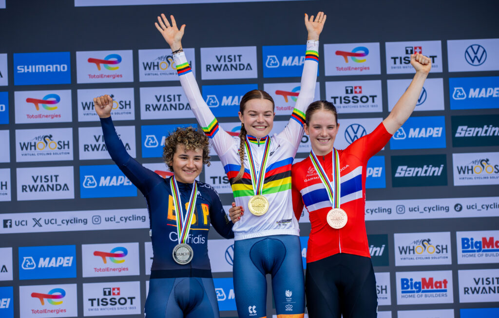 When the three riders stood on the podium to receive their medals, the moment was filled with emotions.\[/caption\]

\[caption id="attachment\_41702" align="alignnone" width="1024"\]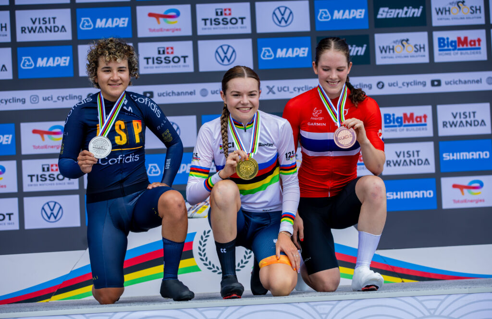 When the three riders stood on the podium to receive their medals, the moment was filled with emotions.\[/caption\]

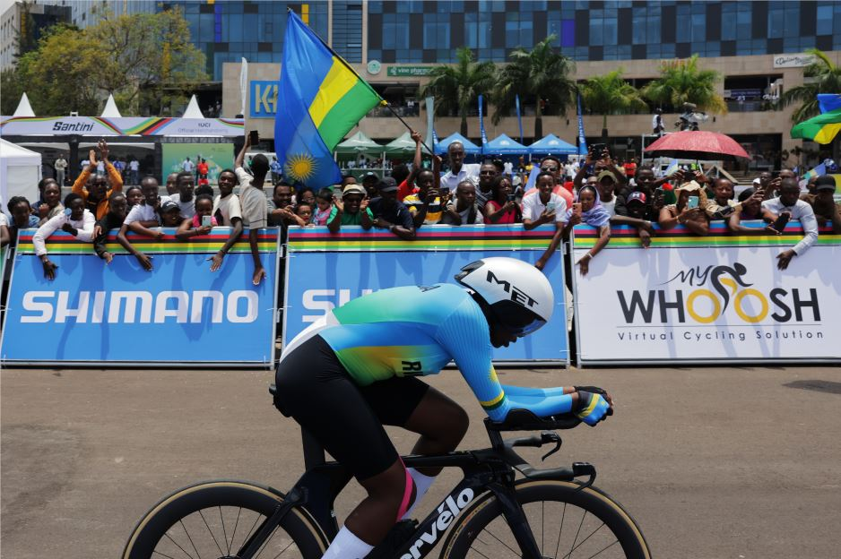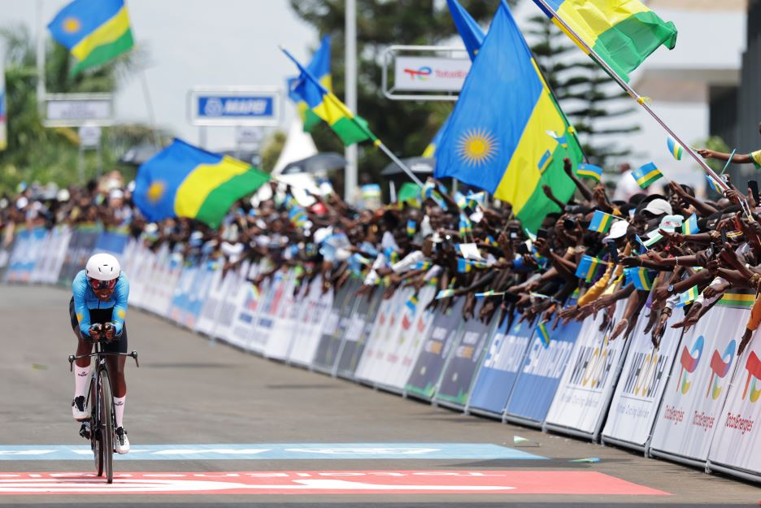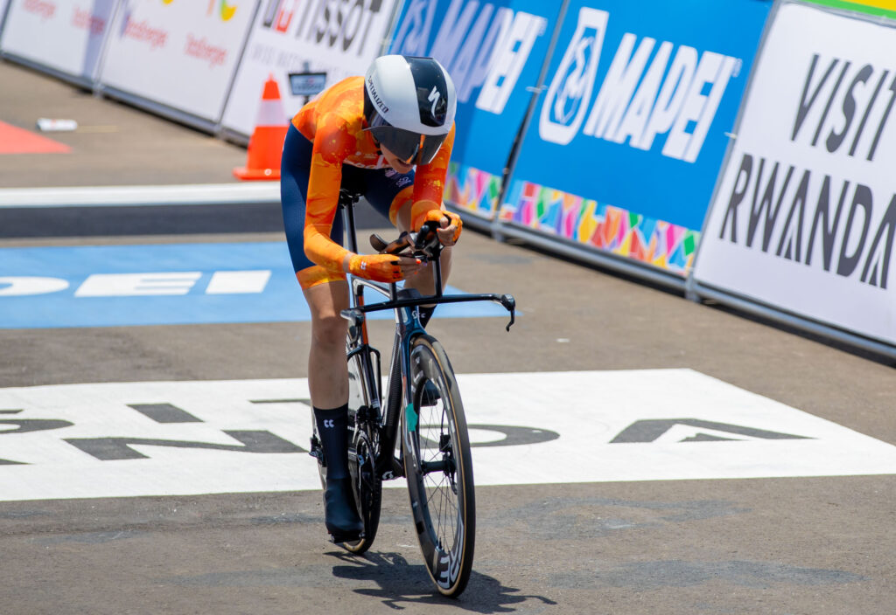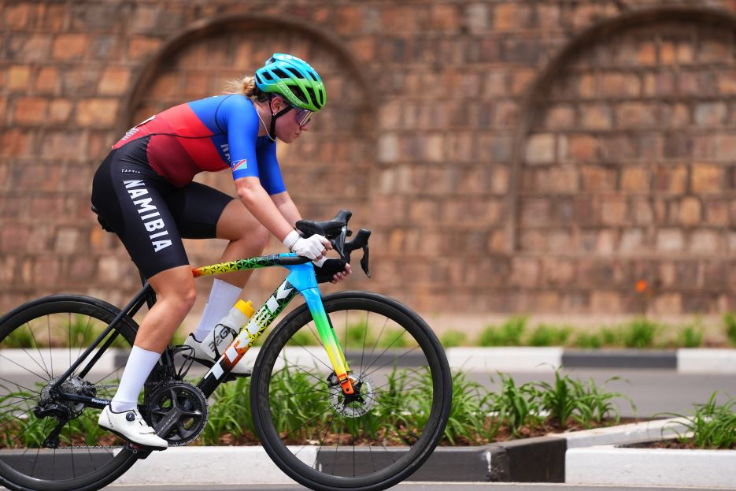 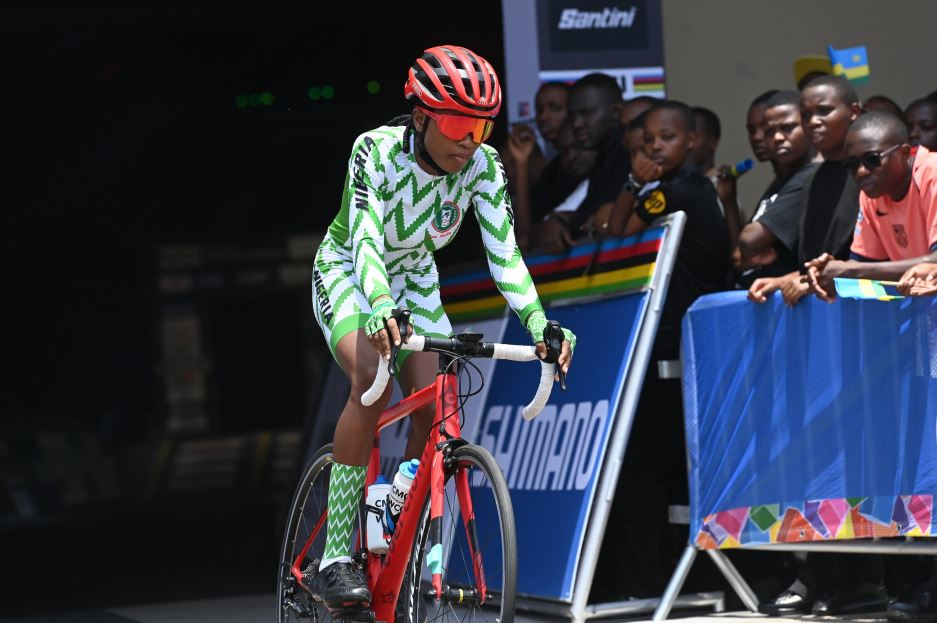 **African Updates**
