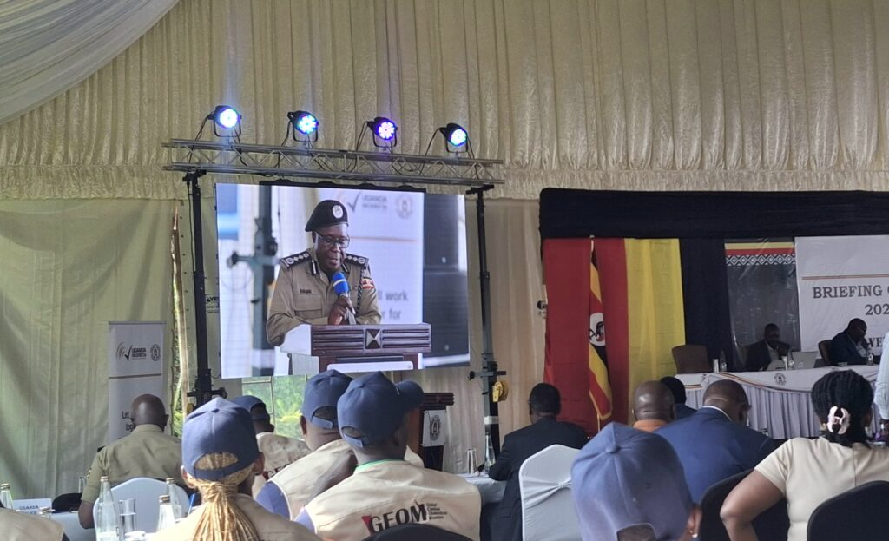

On Monday 12th January 2026, the Uganda Electoral Commission held a briefing with international and local election observers ahead of the presidential and parliamentary elections scheduled for Thursday, January 15, 2026.

The meeting brought together observers from various organizations, including local observer group GEOM (Global Election Observation Mission), the observers from East African Community (EAC) delegation led by its Secretary General Ms. Veronica M. Nduva, Observers from COMESA, the African Union (AU), diplomats representing their countries in Uganda, and officials from other international organizations.

\[caption id="attachment\_42941" align="alignnone" width="1024"\] Observers from the Global Election Observation Mission (GEOM) attended the briefing organized by the Uganda Electoral Commission.\[/caption\] 

Speaking at the meeting, the Chairperson of the Uganda Electoral Commission, Justice Byabakama Mugenyi Simon, said the Commission will use modern technology in the upcoming elections to prevent vote rigging and electoral fraud. He explained that before a voter is given ballot papers, their identity will be verified using biometric technology, either through fingerprint or facial recognition systems.

Voters will receive three ballot papers; one for the President, one for Members of Parliament, and one for the Woman Member of Parliament. Justice Byabakama said vote counting will begin immediately after the polls close and assured observers that strong measures are in place to ensure transparency and prevent vote theft.

He also reminded candidates and political parties that, according to Uganda’s electoral laws, campaign activities must stop 48 hours before election day. He urged all candidates and their supporters to follow the law and avoid actions that could threaten peace and national stability. Election observers were encouraged to freely carry out their duties and report any irregularities through official channels.

Observers were informed that they are allowed to prepare election reports, which must be submitted within six months after the elections.

Justice Byabakama further called on Ugandan citizens to turn up in large numbers to vote, emphasizing that voting is a fundamental democratic right that allows citizens to choose their future leaders.

Security agencies also confirmed their readiness. The Inspector General of Police (IGP), Abbas Byakagaba, said security forces are fully prepared to ensure safety during the election period. He assured observers that peace and security will be maintained across the country.

He added that security officers will be deployed at all polling stations, working together with other agencies to ensure a smooth electoral process. Police will also protect election materials and infrastructure throughout the exercise.

According to official figures, more than 21.6 million voters are expected to participate in the elections, casting their votes at 50,739 polling stations nationwide.

President Yoweri Kaguta Museveni, who has been in power since 1986, is among the candidates seeking re-election. He faces strong competition from Robert Kyagulanyi, popularly known as Bobi Wine. Other presidential candidates include Frank Bulira, Robert Kasibante, Joseph Mabirizi, Nandala Mafabi, Mugisha Muntu, and Mubarak Munyagwa.

**African Updates**
