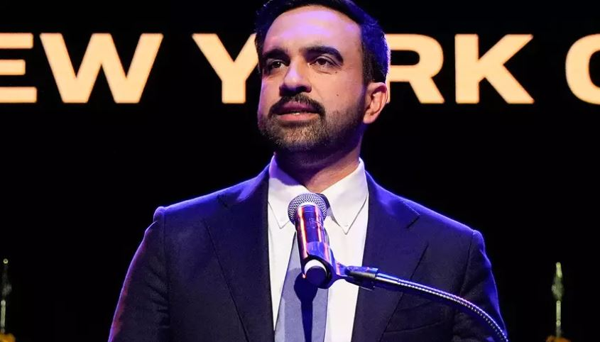

Many Ugandans are celebrating the election of Zohran Mamdani as the new mayor of New York, expressing pride in his Ugandan roots and calling him “one of us.”

Mamdani, 34, was born in Uganda and holds dual nationality. His election has sparked excitement across Uganda, especially among young people who see him as a symbol of hope and inspiration.

Journalist Angelo Izama, who mentored Mamdani during a teenage internship at one of Uganda’s leading newspapers, told the BBC that “there’s a lot of excitement in Uganda about his rise, especially because of his young age.”

Uganda has one of the youngest populations in the world with a median age of just 16.2 years, according to the CIA World Factbook making Mamdani’s success even more meaningful for the country’s youth.

Zohran is the son of Prof Mahmood Mamdani, a renowned Ugandan academic known for his anti-colonial scholarship, and Mira Nair, a world-famous filmmaker.

Izama described Zohran as initially shy during their time together, but absolutely determined to get things done. He added that the mayor remains very fond of Kampala, Uganda’s capital, which he often mentions fondly.

Prof Mahmood Mamdani spent over a decade teaching at Makerere University, Uganda’s oldest and most prestigious university. He met Mira Nair in Kampala while she was researching Mississippi Masala, her hit film about the expulsion of Asians from Uganda under Idi Amin.

Makerere University’s Prof Okello Ogwang told the BBC he felt proud of Zohran’s success: “We have one of us there. It gives me hope that the children we are raising are the hope of this world.”

Abdul Mohamed, a former senior UN and African Union official from Ethiopia, described Mahmood Mamdani as a distinguished scholar of African politics. Having known Zohran since childhood, he said the new mayor had inherited his parents’ commitment to pan-Africanism and courage to think freely.

“Through him, the power and beauty of multi-ethnic and multi-religious identity found its voice,” he told the BBC, urging African youth to “organise, take action, and avoid despair.”

Zohran’s victory has also sparked reactions in South Africa, where the Mamdani family once lived for about three years after Mahmood became Chair of African Studies at the University of Cape Town in the 1990s.

Dr Rashied Omar, imam of Claremont Road Mosque in Cape Town, said Zohran’s early years in South Africa made a lasting impression on his political outlook.

“It is inspiring to see how his early experiences shaped his community-based approach to politics,” Dr Omar said.

The Economic Freedom Fighters (EFF), South Africa’s fourth-largest political party, also celebrated the win, calling it “a transformative moment for the people of New York and a sign that progressive, justice-driven leadership is rising globally.”

For many across the continent, Zohran Mamdani represents a new kind of leadership young, diverse, globally minded, and deeply rooted in Africa’s story.

**African Updates**
