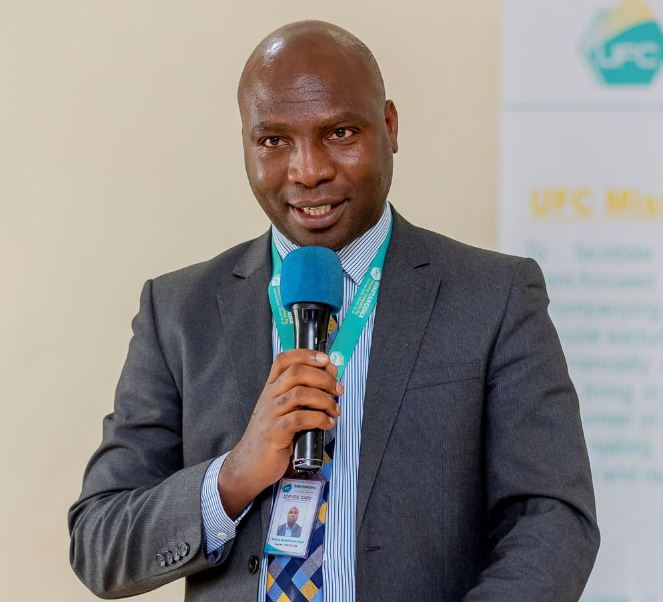

In a quiet but far reaching move, one of Rwanda’s long standing financial institutions is taking steps to resolve a challenge that has lingered for years ensuring that every shareholder is fully recognized and able to claim what is rightfully theirs.

Umutanguha Finance Company Plc (UFC Plc) has announced a nationwide shareholder verification exercise, a process designed to update records and restore full ownership rights to thousands of investors whose details are incomplete or outdated.

The initiative, unveiled on April 14, 2026, marks a significant administrative effort aimed at aligning the institution with national financial regulations while strengthening trust among its investor base.

Speaking during a preparatory meeting, Chief Executive Officer Noël Muhawenimana explained that the exercise is not merely procedural it is essential.

“For some of our shareholders, we do not have complete identification details. Without this, they cannot fully exercise their rights, This program will allow us to correct that.” he said.

\[caption id="attachment\_44551" align="alignnone" width="663"\] Noël Muhawenimana, Chief Executive Officer - Umutanguha Finance Company (UFC) Plc\[/caption\]

The effort follows guidance from the National Bank of Rwanda and existing laws governing financial institutions, both of which require accurate and up to date shareholder records.

At the center of the issue are 13,525 shareholders who, despite holding stakes in the company, lack full access to their ownership rights. The root cause traces back to earlier years when shares were acquired under less strict documentation standards. In some cases, investors purchased shares without formal identification; in others, personal documents such as national IDs have since changed or expired.

To address this, UFC Plc has mapped out a structured registration campaign. The process will be carried out across 17 branches and 41 service sites, out of the company’s total network of 23 branches nationwide.

The exercise is scheduled to begin in Rwanda’s Western Province toward the end of April 2026 before expanding to other regions. Shareholders will be required to present valid identification and supporting documents to confirm their ownership.

Company officials say the decentralized approach is meant to make participation easier, particularly for shareholders in rural areas who may have limited access to central offices.

Beyond the registration drive, the move reflects the broader evolution of Umutanguha Finance.

Founded in 2003 as a savings and credit initiative serving cooperatives, the institution transitioned in 2013 into a fully-fledged shareholder-based finance company. Over the years, it has expanded both its reach and financial capacity.

Recent figures show that in 2024, the company posted a net profit of 325.5 million Rwandan francs, underscoring steady operational performance. Its total assets now stand at over 29.2 billion francs, supported by a share capital exceeding 9 billion francs.

These figures place UFC Plc among the growing tier of domestic financial institutions playing a key role in Rwanda’s inclusive finance agenda.

While the exercise is driven in part by regulatory compliance, its implications extend further. For many shareholders, especially early investors, this process represents an opportunity to reconnect with investments that may have been dormant or inaccessible for years.

It also signals a shift toward stronger corporate governance practices an area increasingly emphasized across Africa’s financial sector.

By ensuring that every shareholder is properly documented and recognized, UFC Plc is not only cleaning up its records but also reinforcing the principle that ownership must be both traceable and protected.

As the registration campaign rolls out, the company is urging all shareholders to take part, emphasizing that participation is the only path to securing full rights, including dividends and voting power.

In a financial landscape where institutions continue to modernize, the story of Umutanguha Finance serves as a reminder growth is not only measured in profits and assets, but also in how well a company accounts for the people behind its capital.

And in this case, thousands of those people are about to be counted properly, and perhaps for the first time.

 

**African Updates**
