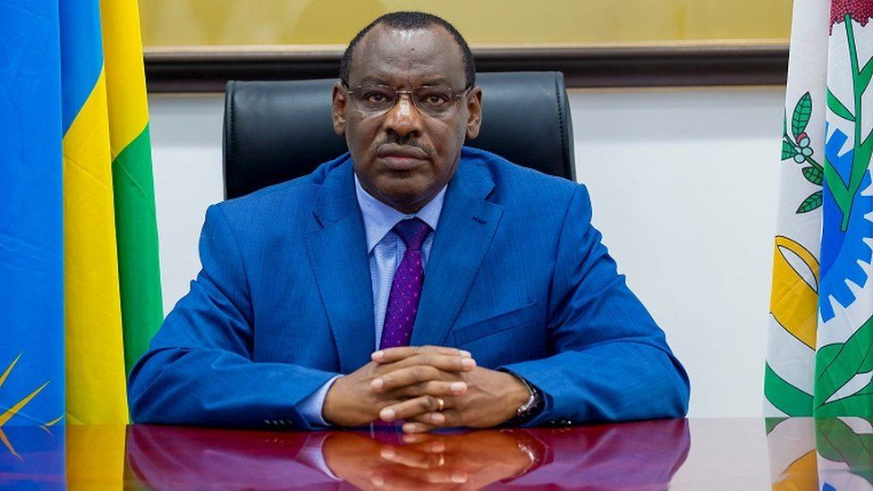
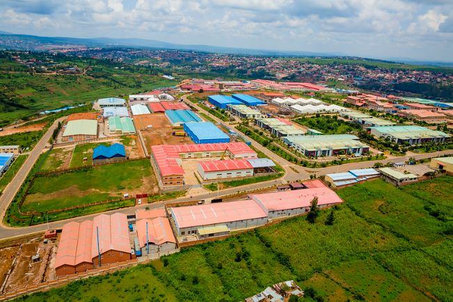
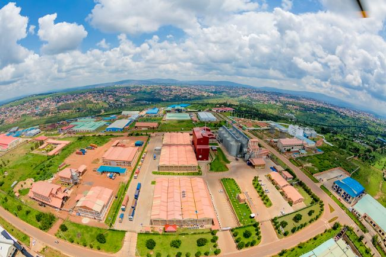

Landlocked countries in Africa, like Rwanda, have historically faced significant hurdles in international trade. Geographic limitations often translate to higher transportation costs, longer transit times, and reduced competitiveness in the global market. However, a new era of opportunity is dawning, fueled by the rise of Special Economic Zones (SEZs) and the implementation of the African Continental Free Trade Area (AfCFTA). These initiatives hold the promise of transforming these disadvantages into springboards for economic growth and diversification.

Special Economic Zones, designated areas within a country with unique economic regulations that differ from the domestic economy, are emerging as crucial catalysts for attracting investment, boosting manufacturing, and fostering innovation. While some SEZs across Africa have thrived, others have struggled. The AfCFTA Secretariat, keenly aware of this disparity, is focused on understanding the key ingredients for success.

"With the entry into force of the AfCFTA, we are now presenting a continental market, a much bigger market opportunity to scale and for economic operators to produce not just for their country or their region, but to produce for the whole continent," stated Wamkele Mene, the Secretary-General of the AfCFTA, during a recent regional conference on SEZs in Djibouti. This continental market, encompassing 1.3 billion people and a combined GDP of over $3 trillion, offers unprecedented opportunities for SEZ-based industries to achieve economies of scale and access a vast consumer base.

\[caption id="attachment\_32053" align="alignnone" width="1024"\] Wamkele Mene, Secretary-General of the AfCFTA\[/caption\]

For landlocked nations like Rwanda, the AfCFTA's emphasis on trade facilitation is particularly significant. The "corridor approach," specifically designed to ease the movement of goods to ports in neighboring countries, is a game-changer. "We have introduced the corridor approach, where countries that are landlocked have ease of access to ports through the trade corridors," explained SG Mene. He cited examples like the corridors connecting Niger to ports in Lomé and Cotonou, and those linking Rwanda and Burundi to the ports of Mombasa and Dar es Salaam.

Rwanda has already recognized the transformative potential of SEZs and has taken proactive steps to leverage them. The Kigali Special Economic Zone, for instance, has attracted investments in sectors ranging from manufacturing to agro-processing, contributing to job creation and export diversification. As Claver Gatete, Rwanda's former Minister of Infrastructure, noted previously, "Our focus has been on creating an enabling environment for businesses to thrive, and the Special Economic Zone is a key component of this strategy."

\[caption id="attachment\_32056" align="alignnone" width="976"\] Mr. Claver Gatete, Rwanda's former Minister of Infrastructure\[/caption\]

Beyond physical infrastructure, the AfCFTA also addresses the critical aspect of trade facilitation through legal instruments. Annexes on transit, customs harmonization, and trade facilitation are designed to ensure "seamless, efficient, cost-effective transit of goods along the trade corridors to the ports," according to SG Mene. These measures aim to reduce the bureaucratic bottlenecks and logistical challenges that have historically plagued landlocked countries.

Furthermore, the digital revolution offers another avenue for landlocked nations to overcome geographical constraints. The AfCFTA's Protocol on Digital Trade seeks to establish a regulatory environment that fosters innovation and the adoption of digital tools for trade. While the AfCFTA Secretariat does not directly operate digital platforms, it focuses on creating the "enabling environment for economic operators to be to innovate and to provide those digital tools that will enable trade to happen." This includes facilitating digital payments and supporting the growth of e-commerce, which can significantly reduce the reliance on physical borders and traditional trade routes.

\[caption id="attachment\_32058" align="alignnone" width="651"\] Special Economic Zone (SEZ) a geographically specified and physically secured area - Kigali, Rwanda\[/caption\]

\[caption id="attachment\_32059" align="alignnone" width="650"\] The Kigali SEZ (KSEZ) was designated and developed to accommodate different types of industries\[/caption\]

The convergence of well-managed Special Economic Zones and the ambitious vision of the AfCFTA presents a powerful pathway for landlocked countries like Rwanda to unlock their economic potential. By attracting investment into strategically located SEZs and leveraging the continent-wide market access and trade facilitation measures offered by the AfCFTA, these nations can transform their geographical challenges into opportunities for sustainable and inclusive growth. The journey will require continued commitment from governments, businesses, and regional bodies, but the destination a more prosperous and interconnected Africa is within reach.  

**African Updates**
