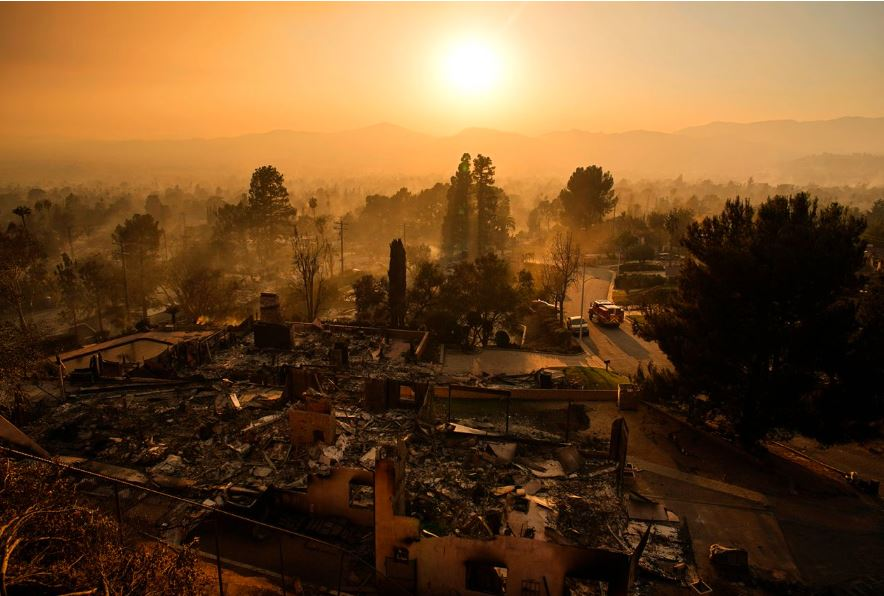
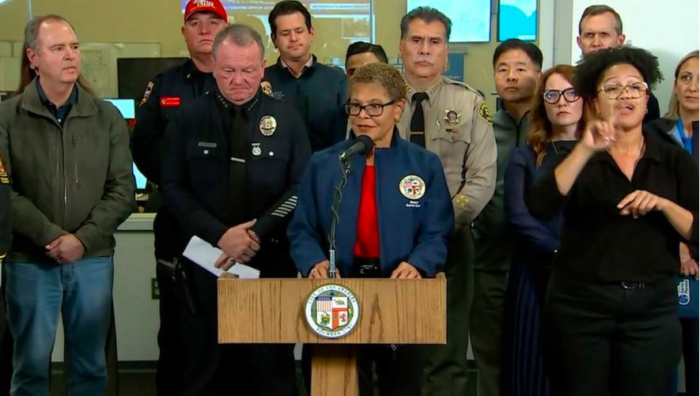
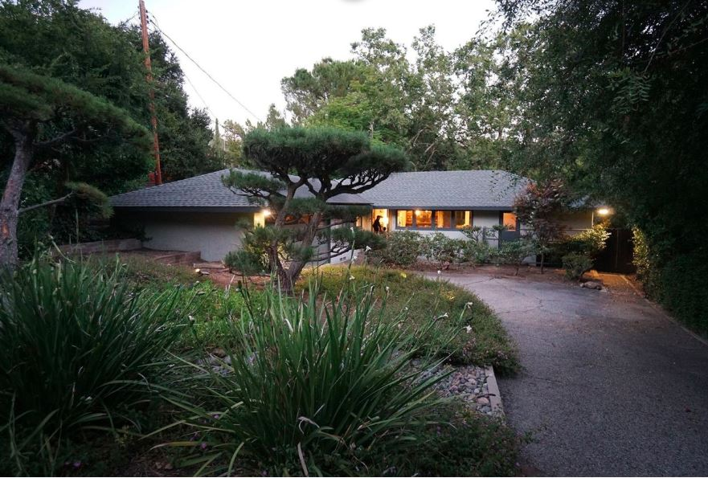
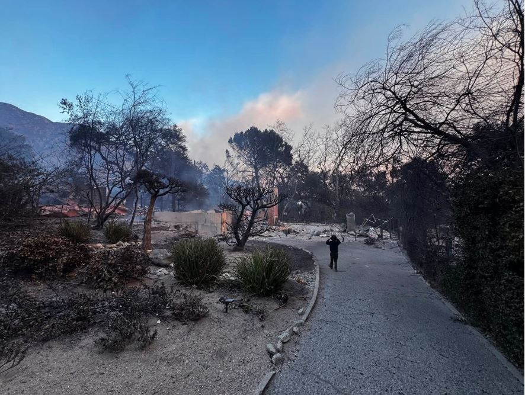
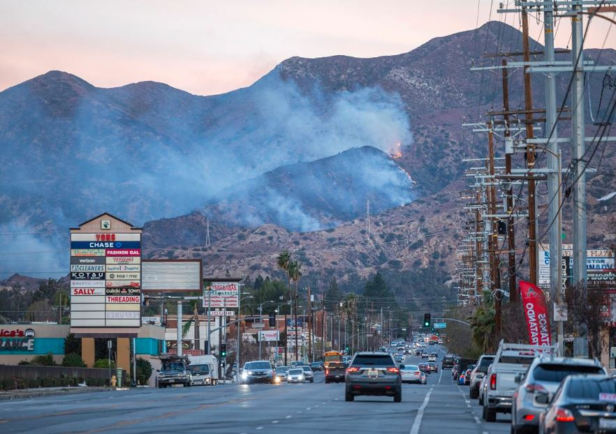
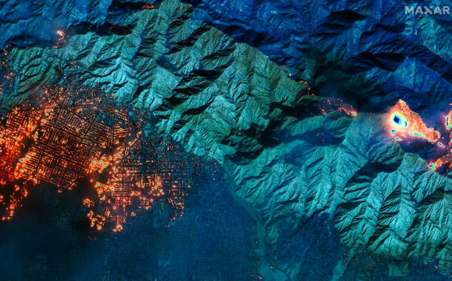

Los Angeles County is currently grappling with a series of devastating wildfires that have left a trail of destruction, claiming at least ten lives and razing entire neighborhoods to the ground. The situation has been exacerbated by an incident where a firefighting aircraft collided with an unauthorized drone, adding to the complexity of the emergency response.

On Thursday, amidst the chaos of the wildfires, an aerial firefighting plane collided with a drone flying over the restricted airspace of the Palisades Fire. The Federal Aviation Administration (FAA) confirmed the incident, stating that the firefighting aircraft managed to land safely but was grounded thereafter. The FAA has launched an investigation into this unauthorized drone activity, emphasizing that flying drones in restricted zones during such emergencies can critically delay fire response efforts, potentially costing lives.

\[caption id="attachment\_31734" align="alignnone" width="884"\] An emergency vehicle drives through a neighborhood devastated by the Eaton Fire, in Altadena, California on January 9.\[/caption\]

The FAA has reminded the public that only those officially involved in the firefighting operations are permitted to fly drones in these areas, with any violations facing immediate enforcement actions. While the exact agency operating the affected firefighting aircraft wasn’t specified, it's known that numerous aircraft from Cal Fire, county fire departments, and government contractors were active in the region. Additionally, eight C-130 military transport planes equipped with Modular Aerial Fire Fighting Systems (MAFFS) have been deployed from various states to assist, according to US Northern Command. These planes can rapidly convert to drop fire retardant, helping to control the spread of the fires.

The Los Angeles County Department of Medical Examiner has reported ten fire-related deaths as of Thursday evening. The identities of the deceased remain undisclosed as notifications to next of kin are pending. This tragic count could rise as more areas become accessible for investigation.

\[caption id="attachment\_31728" align="alignnone" width="885"\] Los Angeles Mayor Karen Bass speaks during a news conference on Thursday, January 9.\[/caption\]

The fires, including the notorious Hurst Fire, have seen some containment success, with the Hurst Fire reaching over one-third containment by Thursday night. However, the battle against these fires is far from over. California’s Governor Gavin Newsom has issued warnings about safety, particularly concerning water quality due to the fires, urging residents not to drink water until cleared by the Los Angeles Department of Water and Power.

The Santa Ana winds, known for fanning the flames, have been a major challenge. Although they weakened, allowing firefighters some progress, they picked up again, complicating efforts. Firefighters are also dealing with new outbreaks, like one near the border of LA and Ventura counties, prompting further evacuations.

\[caption id="attachment\_31729" align="alignnone" width="881"\] Hunter's home before the blaze.\[/caption\]

\[caption id="attachment\_31730" align="alignnone" width="886"\] Jeremy Hunter's home in Altadena, California was destroyed by the Palisades fire.\[/caption\]

The extent of the destruction is vast, with an estimated 10,000 structures lost to the fires, particularly from the Palisades and Eaton Fires. These fires have not only destroyed homes but have also led to widespread evacuations, leaving tens of thousands displaced. The air quality has deteriorated, posing health risks, and the community is facing the dual challenge of immediate survival and long-term recovery.

In response to the devastation, the Los Angeles County has sought assistance from the California National Guard. There's also a stern warning against looters, with law enforcement on high alert to maintain order amidst the chaos.

\[caption id="attachment\_31732" align="alignnone" width="882"\] The Hurst fire burns in the hills above Sylmar, CA on January 8\[/caption\]

For those looking to assist, resources and ways to contribute can be found through platforms like CNN Impact Your World, which directs support to those affected by the fires.

The wildfires in Los Angeles are a stark reminder of nature's fury and the urgent need for preparedness and collective action in the face of such disasters. As the community mourns the loss and begins the long road to recovery, the response from both local and federal agencies showcases a coordinated effort to mitigate further damage and support those in need. With ongoing investigations, containment efforts, and community support, Los Angeles is in the process of healing while still very much in the fight against these relentless fires.

\[caption id="attachment\_31731" align="alignnone" width="879"\] A satelite image shows burning buildings in Altadena, California, on Wednesday, January 8.\[/caption\]

\[caption id="attachment\_31733" align="alignnone" width="882"\] Traci Park speaks in Los Angeles, on September 30, 2024.\[/caption\]

**African Updaates**
