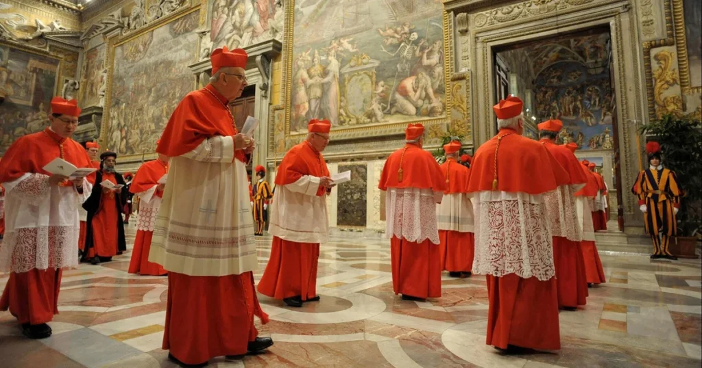
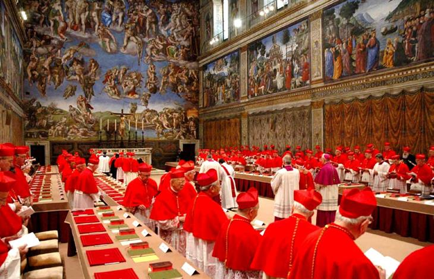

Vatican City — When a pope dies or resigns, a centuries-old process begins behind the Vatican walls. The Catholic Church’s method of choosing a new leader is filled with ritual, secrecy, and tradition. This process not only selects a spiritual head for 1.4 billion Catholics but also appoints a new head of the Vatican City State.

The transition begins with a period called sede vacante_,_ Latin for “the seat being vacant.” This marks the official end of a papacy. A cardinal known as the _camerlengo_ formally confirms the pope’s death, seals his private rooms, and takes charge of the Vatican’s temporal affairs.

Before a new pope can be chosen, all able-bodied cardinals gather in what are called _General Congregations_. These meetings happen in secret. Cardinals talk about the state of the Church and prepare for the upcoming vote.

The conclave_,_ Latin for “with a key” begins no more than 20 days after the papacy ends. Only _cardinal electors_ under the age of 80 may vote. There are currently 135 eligible electors. Most of them were appointed by Pope Francis.

During the conclave, the cardinals are locked inside the Sistine Chapel. All outsiders are barred. The process is solemn. The Latin command _extra omnes_ is spoken, meaning “all out,” ordering non-voters to leave.

Each cardinal casts a secret vote. A group of three cardinals, called _scrutineers_, collects and counts the ballots. A two-thirds majority is required. If no decision is reached, another round of voting takes place. Up to four rounds happen each day.

If a new pope is not elected after many votes, the two top candidates go to a final runoff. Even then, one must receive two-thirds of the votes. The two frontrunners are not allowed to vote in this round.

After each vote, the ballots are burned. Black smoke means no decision. White smoke means a pope has been chosen. Bells also ring to confirm the news.

The dean of the College of Cardinals then asks the elected pope if he accepts. He also asks what name he wishes to use. The world first hears the words Habemus Papam “We have a pope” from the _protodeacon_, who announces the new leader from the balcony of St. Peter’s Basilica.

The new pope receives the fisherman’s ring, symbolizing St. Peter. This tradition reminds the faithful of Jesus’ words to Peter: “You will be a fisher of men.”

The process happens in some of the most sacred Catholic sites. St. Peter’s Basilica, where popes are laid to rest, and the Domus Santa Marta, where cardinals stay during the conclave, both play key roles.

As the Church evolves, many Catholics wonder about the possibility of a pope from Africa. Historically, three early popes including Pope Victor I came from North Africa during the Roman Empire. Since then, none have come from the continent.

If a pope were chosen from Africa today, it would mark a historic return and a powerful symbol. Africa is home to one of the fastest-growing Catholic populations. A pope from Africa could highlight the Church’s global reach and bring new attention to issues affecting the region, including poverty, youth leadership, and interfaith dialogue.

Such a choice would not only honor the Church’s diverse body but also offer fresh perspectives in a world seeking unity and renewal.

**African Updates**
